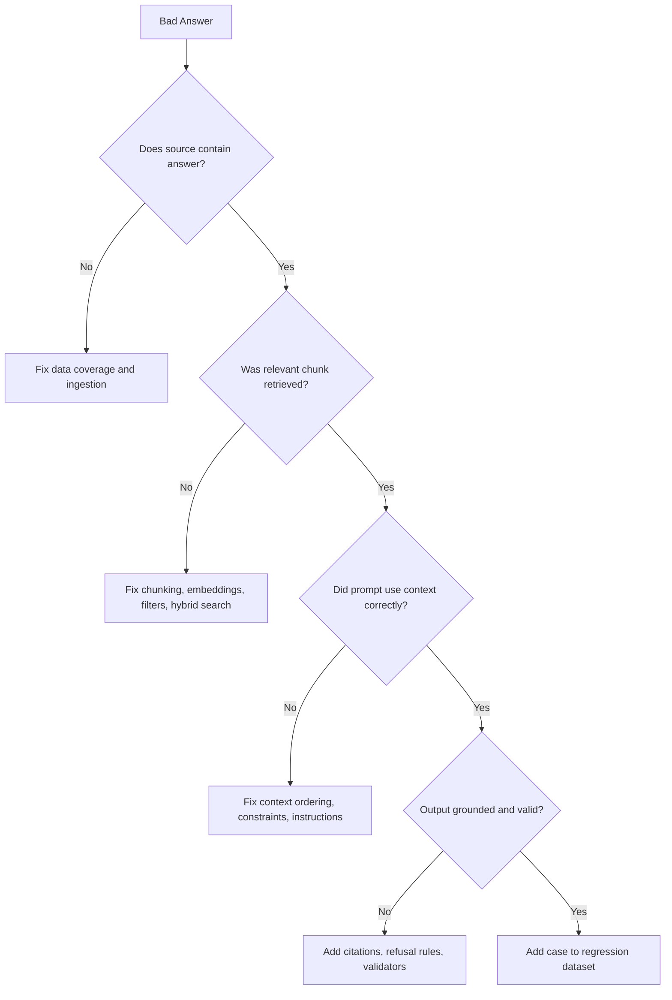

# 01 - RAG Debugging and Quality

This module follows the baseline plan: treat RAG as a full pipeline with measurable stages, not as prompt tuning only.

## Core Principle

Treat RAG issues as pipeline issues, not prompt-only issues.

## Baseline RAG Pipeline

```text
Documents
-> Parsing and cleaning
-> Chunking
-> Embedding
-> Vector index
-> Retrieval and reranking
-> Context injection
-> Grounded generation
-> Citation and validation
-> Evaluation and regression
```

## Debugging Decision Tree



## Failure Modes and Fixes

| Failure Mode | Typical Signal | First Fix |
|---|---|---|
| Missing source data | Retrieval returns irrelevant docs | Improve ingestion coverage |
| Bad chunk boundaries | Partial facts, contradictory answers | Re-chunk by semantic structure |
| Weak retrieval | Low hit rate on known questions | Add hybrid search + reranking |
| Prompt leakage | Hallucinated details | Force source-grounded output |
| No guardrails | Overconfident wrong answers | Add refusal + citation validation |

## Baseline 10-Step Debug Sequence

When asked "How do you debug a bad RAG answer?", use this exact order:

1. Check whether source data contains the answer.
2. Verify parsing and ingestion quality.
3. Check chunking boundaries and chunk size.
4. Inspect retrieved chunks before generation.
5. Review top-k, similarity scores, and metadata filters.
6. Test hybrid retrieval and/or query rewriting.
7. Add reranking where needed.
8. Strengthen grounding and citation constraints.
9. Add refusal behavior for insufficient context.
10. Add the failure to the regression dataset.

## Minimal Quality Scorecard

Track these first:

- Retrieval hit rate
- Context precision
- Context recall
- Faithfulness
- Answer relevance
- Citation accuracy
- Latency p95
- Cost per successful task

## Day-by-Day Alignment

| Day | Use this page for | Deliverable |
|---|---|---|
| Day 3 | Retrieval basics, chunking, top-k tuning | Retrieval experiment notes |
| Day 4 | Minimal grounded RAG architecture | Working QA prototype |
| Day 5 | Failure diagnosis and debug sequence | Root-cause table |
| Day 6 | Long-context retrieval plus summarization | Summarization and citation output |
| Day 7 | Consolidation and timed diagnosis drill | One-page debugging checklist |

## Step-by-Step Mini RAG Build

| Step | Action | Output |
|---|---|---|
| 1 | Parse and normalize a tiny document set | Clean text list |
| 2 | Chunk by semantic boundaries | Chunk array with IDs |
| 3 | Retrieve top chunks for a question | Ranked chunk list |
| 4 | Build a grounded answer from retrieved chunks | Answer with citations |
| 5 | Log failures and classify root cause | Debug artifact for regression |

## Example Code: Minimal Grounded Retrieval Prototype

```python
from dataclasses import dataclass
from collections import Counter


@dataclass
class Chunk:
    chunk_id: str
    text: str
    source: str


def chunk_document(source: str, text: str, chunk_size: int = 40) -> list[Chunk]:
    words = text.split()
    chunks = []
    for index in range(0, len(words), chunk_size):
        chunk_words = words[index:index + chunk_size]
        chunks.append(Chunk(
            chunk_id=f"{source}-{index // chunk_size}",
            text=" ".join(chunk_words),
            source=source,
        ))
    return chunks


def score(query: str, chunk: Chunk) -> int:
    query_terms = Counter(query.lower().split())
    chunk_terms = Counter(chunk.text.lower().split())
    return sum(min(query_terms[term], chunk_terms[term]) for term in query_terms)


def retrieve(query: str, chunks: list[Chunk], top_k: int = 3) -> list[tuple[int, Chunk]]:
    ranked = sorted(((score(query, chunk), chunk) for chunk in chunks), reverse=True, key=lambda item: item[0])
    return [item for item in ranked if item[0] > 0][:top_k]


def grounded_answer(query: str, ranked_chunks: list[tuple[int, Chunk]]) -> dict:
    citations = [chunk.chunk_id for _, chunk in ranked_chunks]
    evidence = " ".join(chunk.text for _, chunk in ranked_chunks)
    answer = f"Question: {query}\nAnswer from evidence: {evidence[:280]}"
    return {"answer": answer, "citations": citations}


documents = {
    "policy": "API keys expire every ninety days. Reset requires identity verification in the security portal.",
    "runbook": "Expired keys must be revoked before a new key is issued. Audit logs should capture the operator and timestamp.",
}

all_chunks = []
for source, text in documents.items():
    all_chunks.extend(chunk_document(source, text))

ranked = retrieve("How do I reset an expired API key?", all_chunks)
print(grounded_answer("How do I reset an expired API key?", ranked))
```

## Example Code: Failure Logging for RAG Debugging

```python
from dataclasses import asdict, dataclass


@dataclass
class FailureRecord:
    question: str
    root_cause: str
    observed_issue: str
    proposed_fix: str
    metric_to_watch: str


record = FailureRecord(
    question="How do I reset an expired API key?",
    root_cause="retrieval",
    observed_issue="Top chunks mention key rotation but not the reset workflow.",
    proposed_fix="Add security portal runbook to index and test hybrid retrieval.",
    metric_to_watch="retrieval_hit_rate",
)

print(asdict(record))
```

??? question "Interview Q: How do you avoid guessing when a RAG answer is wrong?"
    **Model Answer:**
    I inspect the pipeline in order: source coverage, chunking, retrieval artifacts, prompt grounding, and output validation. That prevents me from masking a retrieval defect with a prompt patch.

    **Why this matters:**
    Good candidates debug systematically instead of jumping to random fixes.

??? question "Interview Q: What is the minimum viable RAG evaluation loop?"
    **Model Answer:**
    I keep a small golden set, log retrieved chunks, measure answer quality and citation correctness, and record every fixed failure as a regression case. That gives me a feedback loop I can actually run after changes.

    **Why this matters:**
    This shows you know how to improve quality over time, not just once.

## Interview Talking Frame

Use this sequence when asked "How do you improve RAG quality?":

1. Verify data exists.
2. Inspect retrieval artifacts.
3. Separate retriever issues from generator issues.
4. Apply pipeline fixes before prompt patching.
5. Add regression test coverage.

## Quick Lab (15-20 min)

??? note "RAG quality micro-lab"
    - Pick 5 real questions from your project.
    - For each, log top-5 chunks and final answer.
    - Label each failure as: `coverage`, `retrieval`, `prompt`, or `validation`.
    - Propose one fix and one metric to validate the fix.
    - Add each failure to a small regression set and re-run after fixes.


---

Next: [02 Agentic Workflows and Tools](02-agentic-workflows.md)

--8<-- "_abbreviations.md"


