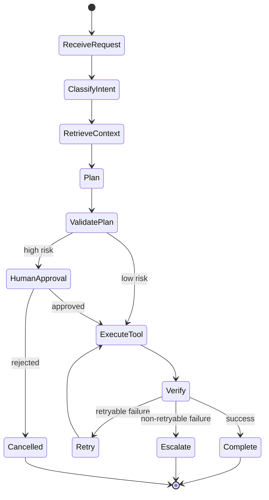

# 02 - Agentic Workflows and Tool Reliability

This module aligns to the baseline priority: hybrid systems that combine deterministic orchestration with constrained LLM reasoning.

## Baseline Position

Use this interview framing:

```text
I use deterministic code for orchestration, validation, retries, permissions, and state transitions,
and use the LLM for reasoning, extraction, generation, and planning where it adds value.
```

## Workflow vs Agent vs Hybrid

| Pattern | Best For | Risk Level | Recommendation |
|---|---|---|---|
| Deterministic workflow | Stable business logic | Low | Use by default |
| Open-ended agent | Dynamic exploration | High | Constrain strongly |
| Hybrid (recommended) | Real production systems | Medium | Deterministic control + LLM reasoning |

## Concepts to Know

- Planning-execution pattern
- ReAct pattern
- State and memory management
- Retry and fallback policies
- Idempotency for side-effecting calls
- Human-in-the-loop approvals
- Multi-agent delegation risks

## Reliability Blueprint



## Tool-Calling Guardrails

Every tool should include:

- Input schema validation
- Permission checks
- Timeouts and retries
- Idempotency key for side effects
- Structured logs with trace IDs

## Day-by-Day Alignment

| Day | Use this page for | Deliverable |
|---|---|---|
| Day 8 | Workflow vs agent and tool contracts | Tool schema set |
| Day 9 | State, memory, and planning | Stateful loop sketch |
| Day 10 | LangGraph-style node and edge thinking | Graph flow draft |
| Day 11 | Multi-agent coordination | Supervisor-worker design |
| Day 12 | Approval gates and rollback paths | Approval workflow |
| Day 13 | Reliability hardening and replay | Failure matrix |
| Day 14 | System design review and consolidation | Architecture brief |

## Step-by-Step Agent Build Flow

| Step | Action | Output |
|---|---|---|
| 1 | Define task scope and when the agent may act | Risk boundary |
| 2 | Model tools as explicit contracts | Tool registry |
| 3 | Add state fields for inputs, decisions, and results | Workflow state object |
| 4 | Insert approval, retry, and escalation edges | Safer control flow |
| 5 | Log every step for replay and review | Traceable run artifact |

## Example Code: Tool Contract and Validator

```python
from dataclasses import dataclass


@dataclass
class ToolRequest:
    tool_name: str
    user_id: str
    payload: dict
    idempotency_key: str


def validate_tool_request(request: ToolRequest) -> None:
    if not request.user_id:
        raise ValueError("user_id is required")
    if not request.idempotency_key:
        raise ValueError("idempotency_key is required")
    if request.tool_name not in {"search_kb", "update_ticket", "cancel_subscription"}:
        raise ValueError("unknown tool")


request = ToolRequest(
    tool_name="cancel_subscription",
    user_id="user-42",
    payload={"subscription_id": "sub-101"},
    idempotency_key="cancel-sub-101-user-42",
)
validate_tool_request(request)
print(request)
```

## Example Code: Stateful Workflow with Retry and Approval

```python
def run_workflow(state: dict) -> dict:
    state["step"] = "classify"
    if state["risk_level"] == "high":
        state["step"] = "await_approval"
        if not state.get("approved"):
            state["status"] = "cancelled"
            return state

    state["step"] = "execute"
    attempts = 0
    while attempts < 2:
        attempts += 1
        if state.get("should_fail_once") and attempts == 1:
            state["last_error"] = "timeout"
            continue
        state["status"] = "completed"
        state["attempts"] = attempts
        return state

    state["status"] = "escalated"
    state["attempts"] = attempts
    return state


initial_state = {
    "risk_level": "high",
    "approved": True,
    "should_fail_once": True,
}
print(run_workflow(initial_state))
```

??? question "Interview Q: Why is a hybrid workflow usually better than a fully autonomous agent?"
    **Model Answer:**
    Hybrid systems keep control logic deterministic while still using the LLM where reasoning helps. That makes retries, permissions, approvals, and debugging much more predictable in production.

    **Why this matters:**
    This is one of the clearest signals that you understand operational reliability.

??? question "Interview Q: What do you log for a tool-calling workflow?"
    **Model Answer:**
    I log the tool selected, validated inputs, approval result, execution status, retry count, and final outcome with a trace ID. That gives me enough information to explain and replay failures later.

    **Why this matters:**
    Observability is a core differentiator between demos and real systems.

## Framework Priority (Baseline-Compatible)

1. LangGraph for stateful controllable workflows
2. LangChain for tools, retrievers, and ecosystem integration
3. CrewAI for role-based collaboration patterns
4. Semantic Kernel and AutoGen/ADK by environment needs

## Interview Deep-Dive Prompts

Practice answering these:

- Why not use a fully autonomous agent?
- How do you prevent tool misuse?
- How do you recover from failed tool calls?
- How do you audit and explain agent behavior?
- When should a workflow remain deterministic instead of agentic?

## Quick Lab (20-30 min)

??? note "Agent reliability micro-lab"
    - Choose one workflow (ticketing, billing, or support).
    - Define 3 tools and their schemas.
    - Add one high-risk action requiring human approval.
    - Simulate one retryable and one non-retryable failure path.


---

Next: [03 Evals, Observability, and Production Readiness](03-evals-observability-production.md)

--8<-- "_abbreviations.md"


