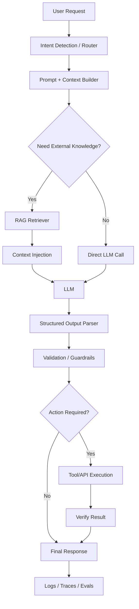
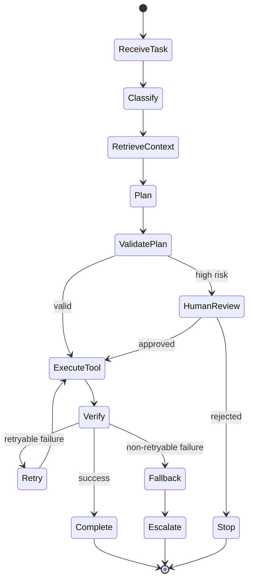
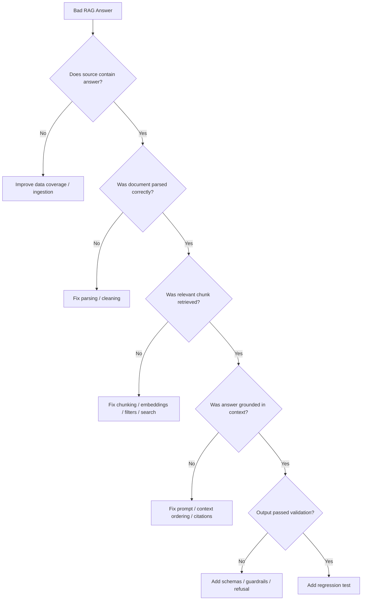

# Learning and Revision Plan for AI Engineer / Agentic AI / LLMOps Interviews

> Reference plan for preparing for AI Engineer, Agent Engineer, GenAI Engineer, LLMOps Engineer, AI Coding Pilot, and Agentic Workflow roles.


Testing whether you can build, debug, evaluate, deploy, and govern production LLM and agentic AI systems.

You should be able to:

- Build LLM applications with Python and/or JavaScript/TypeScript.
- Implement RAG pipelines.
- Build agentic workflows using tools, memory, routing, retries, and state.
- Use orchestration frameworks like LangChain, LangGraph, CrewAI, AutoGen, Semantic Kernel, and Google ADK.
- Deploy to production using APIs, Docker, cloud services, monitoring, evals, and guardrails.
- Use AI coding tools like Cursor, Claude Code, GitHub Copilot, and MCP servers.
- Create engineering standards, playbooks, and quick-start guides.
- Speak like someone who has shipped production systems, not only notebooks.

## The Most Important 20% to Revise

## Tier 1: Must-Master Topics

### LLM Application Architecture

You should be able to design and explain:

- Chatbot architecture
- Summarization system
- Recommendation assistant
- RAG-based enterprise knowledge assistant
- Agentic workflow system
- Multi-agent automation system
- AI coding assistant pilot
- Production LLM orchestration stack

Core Mental Model

```text
User Request
   ↓
Intent Detection / Routing
   ↓
Prompt Builder + Context Builder
   ↓
Retriever / Tools / APIs / Memory
   ↓
LLM Call
   ↓
Structured Output Parser
   ↓
Validation / Guardrails
   ↓
Action Execution
   ↓
Logging / Tracing / Evaluation
   ↓
User Response or Workflow Completion
```

Interview Goal - Be able to explain:

```text
I design LLM apps as production systems with explicit routing, context construction, tool access, 
validation, observability, and evaluation — not as one large prompt.
```

---

### RAG Fundamentals and RAG Quality

RAG Pipeline

```text
Documents
   ↓
Parsing / Cleaning
   ↓
Chunking
   ↓
Embedding
   ↓
Vector Database
   ↓
Query Embedding
   ↓
Retrieval
   ↓
Reranking
   ↓
Context Injection
   ↓
Grounded LLM Answer
   ↓
Citation / Verification / Evaluation
```

#### Topics to Revise

- Chunking strategies
- Embeddings
- Similarity search
- Vector databases: Pinecone, FAISS, Chroma, Weaviate, OpenSearch
- Hybrid search: keyword + vector
- Reranking
- Metadata filtering
- Context window management
- Hallucination reduction
- Retrieval evaluation
- Citations and source grounding

#### Common Interview Question

> Your RAG system gives wrong answers. How do you debug it?

#### Strong Answer Structure

```text
1. Check if the source document contains the answer.
2. Check parsing and document ingestion quality.
3. Check chunking quality and chunk boundaries.
4. Inspect retrieved chunks before the LLM call.
5. Check top-k, similarity scores, and metadata filters.
6. Try hybrid search or query rewriting.
7. Add reranking.
8. Improve prompt grounding and citation requirements.
9. Add refusal behavior when context is insufficient.
10. Add the issue to an eval/regression dataset.
```

---

### Agents and Tool Calling

This is one of the highest-value topics for these roles.

#### Concepts to Know

- What is an agent?
- What is tool calling?
- Difference between workflow and agent
- Planning-execution pattern
- ReAct pattern
- Multi-agent delegation
- A2A communication
- State management
- Memory
- Retries
- Fallbacks
- Idempotency
- Human-in-the-loop
- Guardrails

#### Workflow vs Agent

```text
Workflow:
  Predefined steps. Reliable. Easier to test.

Agent:
  LLM decides next step/tool dynamically. More flexible but less predictable.

Production System:
  Usually hybrid — deterministic workflow + LLM reasoning where needed.
```

#### High-Value Interview Sentence

```text
I prefer hybrid deterministic-plus-LLM systems. 
I use deterministic code for orchestration, validation, retries, permissions, and state transitions,
 while using the LLM for reasoning, extraction, generation, classification, or planning where it adds value.
```

### LangGraph / LangChain / CrewAI / Semantic Kernel

You do not need to master every framework equally, but you need to understand the pattern.

#### Suggested Priority

```text
1. LangGraph — most important for stateful, production-grade workflows.
2. LangChain — common ecosystem for chains, tools, retrievers.
3. CrewAI — multi-agent collaboration.
4. Microsoft Semantic Kernel — enterprise/Microsoft plugin-based orchestration.
5. AutoGen / Google ADK — useful conceptually, especially for multi-agent or GCP contexts.
```

#### Interview Topics

Be able to discuss:

- When to use LangGraph vs LangChain
- How state flows through a graph
- How nodes and edges work
- Conditional routing
- Retries and fallback nodes
- Tool nodes
- Human approval nodes
- Checkpointing
- Conversation state persistence
- Tracing and debugging

### Evaluation and Observability

This is a major difference between academic AI and production GenAI.

#### Evaluation Topics

- Prompt evaluation
- RAG evaluation
- Agent evaluation
- Regression testing
- Golden datasets
- Human review
- LLM-as-judge
- Trace analysis
- Latency/cost monitoring
- Failure taxonomy
- Versioning prompts and models

#### Tools to Know

- LangSmith
- Langfuse
- MLflow
- Weights & Biases
- OpenTelemetry
- Custom logging dashboards

#### RAG Metrics

```text
- Context precision
- Context recall
- Faithfulness
- Answer relevancy
- Citation accuracy
- Retrieval hit rate
- MRR / NDCG
```

#### Agent Metrics

```text
- Task success rate
- Tool-call accuracy
- Number of steps
- Recovery from failure
- Retry rate
- Cost per task
- Latency per task
- Human escalation rate
```

#### Product Metrics

```text
- User retention
- Conversion
- Deflection rate
- Time saved
- CSAT
- Error rate
```

### Production Engineering Fundamentals

These job descriptions repeatedly say:

```text
Not prompt-only.
Not demo-only.
Production systems required.
```

#### Topics to Revise

- API design using FastAPI
- Async Python basics
- Docker
- Cloud deployment: Azure, GCP Cloud Run, Vertex AI
- Queues and background jobs
- Webhooks
- Database basics
- Auth and secrets management
- Rate limits
- Timeouts
- Retries
- Circuit breakers
- Idempotency
- Logging
- Monitoring
- Cost optimization

#### Interview Framing

```text
LLM systems fail in non-deterministic ways, so I design them like distributed systems: observable,
 retryable, testable, versioned, and guarded.
```

### AI Coding Tools, MCP, and Engineering Playbooks

- Cursor IDE
- Claude Code
- GitHub Copilot
- MCP servers
- Context injection
- Coding standards
- Guardrails
- Playbooks

#### AI Coding Pilot Architecture

```text
Developer
   ↓
Cursor / Claude Code / Copilot
   ↓
Project Context
   ↓
MCP Servers
   ↓
Tools:
  - repo search
  - docs search
  - issue tracker
  - codebase index
  - test runner
  - security scanner
  - deployment docs
   ↓
Guardrails:
  - no secrets
  - code review required
  - tests required
  - license compliance
  - secure coding standards
```

#### Topics to Discuss

- What an MCP server does
- Why context injection matters
- Examples of MCP servers
- Security risks
- Access control
- Audit logging
- AI coding playbook creation
- Measuring productivity and quality

---

## 3. Classification of Topics by Importance

## 3.1 Needs Maximum Attention

Spend most of your time here.

```text
1. LLM app architecture
2. RAG implementation and debugging
3. Agent workflows
4. Tool calling/function calling
5. LangGraph/LangChain
6. State management and memory
7. Production deployment
8. Evaluation frameworks
9. Observability and tracing
10. Guardrails and reliability
11. Python backend engineering
12. API integrations
13. Model routing and cost/latency tradeoffs
14. Prompt engineering for production
15. AI coding tools and MCP
```

---

## 3.2 Technically Challenging Concepts

These can differentiate you in interviews.

```text
1. Multi-agent orchestration
2. A2A communication
3. LangGraph state-machine design
4. Agent failure recovery
5. Idempotent tool execution
6. RAG evaluation
7. Query rewriting and reranking
8. Multi-LLM routing
9. Cost/latency optimization
10. Guardrails and policy enforcement
11. Prompt/version regression testing
12. Long-context management
13. Human-in-the-loop workflows
14. Async/event-driven automation
15. Production LLMOps
```

---

## 3.3 Important but Secondary

Know these, but do not over-invest initially.

```text
1. Fine-tuning
2. Multimodal AI
3. vLLM / TensorRT-LLM / Ollama
4. Kubernetes
5. Streamlit
6. CrewAI
7. AutoGen
8. Semantic Kernel
9. Azure/GCP service specifics
10. OpenSearch details
11. MLflow/W&B deep usage
12. Prompt libraries
13. Model benchmarking
14. Responsible AI frameworks
15. Content generation pipelines
```

---

## 3.4 Superficial / Buzzword Topics

These may appear in job descriptions but are less likely to be deeply tested for most roles.

```text
1. Quantum-classical hybrid AI
2. Federated learning
3. AI ethics committees
4. Advanced model interpretability
5. Deep transformer architecture math
6. Published ML research
7. Edge AI
8. Low-code/no-code AI platforms
9. Advanced fine-tuning theory
10. MLOps for traditional ML if unrelated to LLMOps
```

---

## 4. Four-Week Learning and Revision Plan

This plan assumes you already know AI/ML basics and need interview-focused industry readiness.

---

## Week 1: LLM App Architecture + RAG

## Goal

Become confident designing, explaining, and debugging RAG-based LLM applications.

---

## Day 1: LLM System Design Basics

Revise:

- Chatbot architecture
- Prompt pipeline
- Context builder
- Model gateway
- Output parser
- Guardrails
- Logs and traces

Practice:

```text
Design an enterprise chatbot over internal documents.
```

---

## Day 2: RAG Pipeline

Revise:

- Document loaders
- Chunking
- Embeddings
- Vector stores
- Retrieval
- Reranking
- Grounded generation

Build or revise:

```text
PDF/docs → chunks → embeddings → vector DB → retriever → answer with citations
```

---

## Day 3: RAG Debugging

Focus on failure modes:

- Retrieval miss
- Bad chunking
- Hallucination
- Stale documents
- Weak embeddings
- Poor metadata
- Context overload
- Conflicting documents

Prepare an answer for:

```text
How would you improve RAG answer quality?
```

---

## Day 4: Prompt Engineering for Production

Revise:

- System prompts
- Developer instructions
- Few-shot examples
- Structured output
- JSON schemas
- Refusal behavior
- Context compression
- Prompt versioning

Key framing:

```text
Prompt engineering in production is instruction design + context design + output constraints + evaluation.
```

---

## Day 5: Vector DBs and Search

Revise:

- FAISS
- Pinecone
- Chroma
- Weaviate
- OpenSearch
- Metadata filtering
- Hybrid search
- Reranking

Interview-level understanding is enough.

---

## Day 6: Mini System Design Practice

Prepare 3 architectures:

```text
1. Retail product assistant using POS/CRM/e-commerce data
2. Learning assistant with memory and adaptive questioning
3. Internal engineering knowledge assistant
```

---

## Day 7: Revision and Mock Interview

Prepare concise answers:

```text
- What is RAG?
- How do you debug RAG?
- How do you evaluate RAG?
- When would you fine-tune instead of using RAG?
- How do you reduce hallucination?
```

---

## Week 2: Agents, LangGraph, Tool Calling, A2A

## Goal

Become strong in agentic workflow interviews.

---

## Day 8: Agent Basics

Revise:

- Agent vs chain vs workflow
- Tool calling
- ReAct
- Planner-executor
- Reflection
- Memory
- State

Key interview line:

```text
Agents are useful when the path is dynamic, but production reliability often requires constraining them with deterministic workflows.
```

---

## Day 9: Tool Calling and Function Calling

Revise:

- Tool schemas
- JSON arguments
- Tool validation
- Tool result injection
- Error handling
- Permission checks
- Dry-run mode

Prepare example:

```text
User asks to cancel subscription
→ agent identifies intent
→ checks user identity
→ calls subscription API
→ verifies cancellation
→ logs action
→ confirms result
```

---

## Day 10: LangGraph

Focus heavily here.

Understand:

- Nodes
- Edges
- Conditional edges
- State
- Checkpointing
- Retries
- Human approval
- Tool node
- Error node

Practice explaining:

```text
Start
 → classify task
 → retrieve context
 → call tool
 → verify result
 → if failed retry/escalate
 → final response
```

---

## Day 11: Multi-Agent / A2A Patterns

Revise:

- Manager-worker
- Planner-executor
- Critic-reviewer
- Specialist agents
- Debate pattern
- Delegation
- Shared state
- Message passing

Know the risks:

- Infinite loops
- Conflicting instructions
- Tool misuse
- High cost
- Latency
- Poor observability

---

## Day 12: Automation Systems

Very important for these job descriptions.

Revise:

- Triggers
- Workflow engines
- Browser automation
- API integrations
- Webhooks
- Queues
- State transitions
- Retry policies
- Idempotency

Core pattern:

```text
Trigger
 → classify
 → plan
 → execute tool/API call
 → verify
 → retry/fallback
 → notify/log
```

---

## Day 13: Guardrails

Revise:

- Input validation
- Output validation
- PII protection
- Prompt injection defense
- Tool permissioning
- Rate limits
- Human approval
- Policy checks
- Secure secrets handling

---

## Day 14: Mock Agent System Design

Practice:

```text
1. Build an AI agent that handles customer subscription changes.
2. Build a browser automation agent for internal operations.
3. Build a learning tutor agent with memory and quizzes.
```

---

## Week 3: Production LLMOps, Evaluation, Cloud, AI Coding Tools

## Goal

Shift from “I can build demos” to “I can own production AI systems.”

---

## Day 15: LLM Observability

Revise:

- Traces
- Spans
- Prompt logs
- Tool call logs
- Latency
- Cost
- Token usage
- Failure rates
- User feedback

Tools:

```text
- LangSmith
- Langfuse
- MLflow
- Weights & Biases
- OpenTelemetry
```

---

## Day 16: Evaluation

Revise deeply.

Types of evals:

```text
1. Unit tests for deterministic code
2. Prompt regression tests
3. RAG retrieval tests
4. LLM answer quality tests
5. Agent task completion tests
6. Human review
7. Online A/B tests
```

Prepare example:

```text
I would create a golden dataset of representative queries, expected source documents, acceptable answer patterns, and refusal cases. Then I would run evals on every prompt/model/retriever change.
```

---

## Day 17: Cost, Latency, and Reliability

Revise:

- Caching
- Smaller models
- Model routing
- Batch calls
- Streaming
- Prompt compression
- Context pruning
- Timeouts
- Retry with backoff
- Fallback providers

Interview answer:

```text
For simple classification I would use a cheaper/faster model; for complex reasoning I would route to a stronger model. I would track cost per successful task, not just cost per token.
```

---

## Day 18: Cloud Deployment

Revise:

### Azure

- Azure OpenAI
- Azure AI Search
- App Service
- Functions
- Container Apps
- Key Vault
- Monitor

### GCP

- Vertex AI
- Cloud Run
- Cloud Functions
- Pub/Sub
- Secret Manager
- Cloud Logging

### Generic

- Docker
- CI/CD
- Env variables
- Secrets
- Autoscaling
- API gateway

---

## Day 19: AI Coding Tools + MCP

Focus on:

- Cursor
- Claude Code
- GitHub Copilot
- MCP servers
- Context injection
- Repo-aware coding
- Test generation
- Refactoring
- Documentation generation
- Secure usage standards

Prepare one good story:

```text
I would run an AI coding pilot by selecting a small engineering team, defining use cases like test generation, refactoring, documentation, and bug fixing, setting guardrails around secrets/security/code review, measuring productivity and defect rate, and publishing playbooks based on what works.
```

---

## Day 20: Engineering Playbooks

Prepare templates for:

- Prompt standards
- RAG implementation checklist
- Agent workflow checklist
- Tool-calling checklist
- Evaluation checklist
- AI coding assistant usage guide
- Security and governance standards

---

## Day 21: Revision

Mock questions:

```text
- How do you monitor LLM apps?
- How do you prevent prompt injection?
- How do you evaluate agents?
- How do you reduce LLM cost?
- How do you deploy a LangGraph app?
```

---

## Week 4: Portfolio, Interview Stories, System Design

## Goal

Convert your knowledge into interview-ready proof.

---

## Day 22–24: Build or Polish One Portfolio Project

### Best Project Option

```text
Production-Style Agentic RAG Workflow
```

Must include:

- Python FastAPI backend
- LangGraph orchestration
- RAG with vector DB
- Tool calling
- Memory/state
- Structured output
- Evals
- Logging/tracing
- Guardrails
- Docker
- README
- Architecture diagram

Example project:

```text
AI Operations Assistant

Capabilities:
- Answers internal policy questions using RAG
- Opens tickets through API tool
- Summarizes user issue
- Classifies urgency
- Routes to correct team
- Verifies ticket creation
- Logs trace
- Runs eval tests
```

This one project can support almost every job description.

---

## Day 25: Prepare STAR Stories

Create 6 interview stories:

```text
1. Built an LLM/RAG app
2. Debugged a production issue
3. Improved latency/cost
4. Improved answer quality
5. Designed evaluation framework
6. Used AI tools to accelerate engineering
```

Use this structure:

```text
Situation:
Task:
Action:
Result:
Metrics:
Tradeoffs:
What I would improve:
```

---

## Day 26: System Design Practice

Practice these:

```text
1. Design a customer-support AI agent.
2. Design a learning tutor with memory.
3. Design a retail GenAI assistant.
4. Design a multi-agent workflow for business automation.
5. Design an AI coding assistant pilot for an enterprise team.
6. Design a RAG system for compliance documents.
```

---

## Day 27: Framework Comparison Revision

| Framework | Best For | Interview Talking Point |
|---|---|---|
| LangChain | Chains, tools, retrievers | Broad ecosystem |
| LangGraph | Stateful workflows | Best for controllable agents |
| CrewAI | Role-based multi-agent systems | Good for collaborative agents |
| AutoGen | Conversational multi-agent research/prototypes | Flexible agent conversations |
| Semantic Kernel | Enterprise/Microsoft integration | Good for plugin-based orchestration |
| Google ADK | Google agent development ecosystem | Useful for GCP/Vertex contexts |

---

## Day 28: Final Mock Interview

Practice answering in 2–3 minutes:

```text
- Tell me about an LLM system you built.
- How do you design reliable agents?
- How do you debug bad RAG answers?
- How do you evaluate prompt changes?
- How do you handle tool-call failures?
- How do you reduce latency and cost?
- How do you use Cursor/Claude Code safely in enterprise?
- How would you design an MCP-based coding pilot?
```

---

## 5. Interview Cheat Sheet by Topic

## RAG

```text
A good RAG system is not just vector search plus prompt. It needs document processing, chunking strategy, embedding selection, metadata filtering, hybrid search, reranking, grounded answer generation, citations, eval datasets, and continuous monitoring.
```

---

## Agents

```text
For production agents, I avoid fully open-ended autonomy. I define explicit states, allowed tools, validation rules, retry limits, fallback paths, and observability. The LLM reasons inside controlled boundaries.
```

---

## Tool Calling

```text
Every tool call should have a schema, permission boundary, validation layer, timeout, retry policy, idempotency key where needed, and logging.
```

---

## Evaluation

```text
I would not rely only on manual testing. I would build golden test sets, run regression tests on prompt/model/retriever changes, inspect traces, and track production metrics like task success rate, hallucination rate, cost, latency, and human escalation.
```

---

## Prompt Engineering

```text
Prompt engineering in production is really instruction design, context design, output contract design, and evaluation. Prompts should be versioned and tested like code.
```

---

## AI Coding Tools

```text
For Cursor or Claude Code pilots, I would define approved workflows, configure context access through MCP, prevent secrets exposure, require code review and tests, measure productivity and quality, and publish repeatable playbooks.
```

---

## 6. Suggested Depth of Preparation

## Deep Preparation Required

Spend 60–70% of time here:

```text
- Python backend development
- FastAPI
- RAG
- LangGraph
- Tool calling
- Agent state management
- Eval frameworks
- Logging/tracing
- Guardrails
- Deployment basics
```

---

## Medium Preparation Required

Spend 20–25% of time here:

```text
- CrewAI
- AutoGen
- Semantic Kernel
- Azure/GCP services
- MCP
- AI coding tools
- Vector DB comparisons
- Multi-LLM routing
- Prompt versioning
```

---

## Light Preparation Required

Spend 5–10% of time here:

```text
- Fine-tuning
- Multimodal AI
- vLLM/Ollama
- Kubernetes
- Responsible AI governance
- Model internals
- Federated learning
- Interpretability
```

---

## 7. Recommended Portfolio Projects

## Project 1: Agentic RAG Assistant

Must include:

- RAG pipeline
- LangGraph
- Vector DB
- Tool calling
- Structured output
- Eval set
- Logging
- Docker

---

## Project 2: AI Coding Pilot Playbook

Deliverables:

- Cursor/Claude Code workflow guide
- MCP server setup notes
- Security guardrails
- Prompt templates
- Code review checklist
- Productivity measurement framework

---

## Project 3: Multi-Agent Automation System

Example:

```text
User request:
“Process refund request.”

Agents:
- Intake agent
- Policy agent
- Payment agent
- Verification agent
- Notification agent

Workflow:
trigger → classify → retrieve policy → call payment API → verify → notify → log
```

---

## 8. One-Page Priority Roadmap

If you only have 10 days:

```text
Days 1–2: RAG implementation and debugging
Days 3–4: LangGraph agents, state, tools, retries
Day 5: Evaluation and observability
Day 6: Guardrails, prompt injection, production reliability
Day 7: Cloud deployment, FastAPI, Docker
Day 8: AI coding tools, Cursor, Claude Code, MCP
Day 9: System design mock interviews
Day 10: Portfolio README + STAR stories
```

---

## 9. What to Avoid Over-Studying

Given your AI/ML background, avoid spending too much time on:

- Deriving attention equations
- Traditional ML algorithms
- CNN/RNN theory
- Academic NLP benchmarks
- Research paper summaries
- Generic ML model training
- Notebook-only experimentation
- Deep math of transformers

For these roles, interviewers care more about:

```text
Can you ship an LLM system?
Can you debug it?
Can you evaluate it?
Can you make it reliable?
Can you reduce cost and latency?
Can you integrate it with real tools/APIs?
Can you explain tradeoffs clearly?
```

---

## 10. Best Final Preparation Strategy

Your goal should be to sound like this:

```text
I understand LLMs, but more importantly, I know how to build production-grade AI systems around them: orchestration, tools, memory, RAG, evals, guardrails, observability, deployment, and cost/reliability tradeoffs.
```

Strong study order:

```text
1. LangGraph + RAG
2. Tool calling + stateful workflows
3. Evals + observability
4. Production reliability
5. AI coding tools + MCP
6. Cloud deployment
7. Portfolio and interview stories
```

That is the practical 20% that gives the highest interview ROI.

---

## 11. Mermaid Diagrams for Quick Revision

## 11.1 Production LLM App Architecture



## 11.2 Agentic Workflow Reliability Pattern



## 11.3 RAG Debugging Tree



---

## 12. Final Checklist

```markdown
- [ ] I can design a RAG system end-to-end.
- [ ] I can debug RAG quality failures.
- [ ] I can explain agent vs workflow vs chain.
- [ ] I can design a LangGraph-style stateful workflow.
- [ ] I can explain tool calling, validation, and retries.
- [ ] I can discuss evals, golden datasets, and regression tests.
- [ ] I can explain LLM observability and tracing.
- [ ] I can discuss latency/cost tradeoffs and model routing.
- [ ] I can explain deployment with FastAPI, Docker, Azure/GCP basics.
- [ ] I can discuss Cursor, Claude Code, Copilot, MCP, and guardrails.
- [ ] I have at least one portfolio project mapped to these roles.
- [ ] I have STAR stories ready for production, debugging, evals, and ownership.
```
