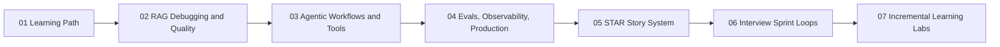

# AI Engineer Reference Modules: Build, Debug, Explain

> **Pre-reading:** [Daily Learning Plan](../02-learning-revision-plan/index.md) · [Foundations Overview](index.md)

---

This section is the reusable reference layer for the site. The day-by-day execution now lives in the learning revision plan, while these pages hold the durable deep dives, worked examples, and reusable interview prep modules.

Use the daily plan when you want to know what to do next. Use these reference modules when you want the fuller explanation, example code, or lab pattern behind that day.

## What This Section Covers

| Module type | What you get |
|---|---|
| Technical modules | RAG, agent workflows, and production-readiness deep dives |
| Interview modules | STAR story conversion and timed mock-loop practice |
| Retention modules | Incremental labs and a day-to-material mapping table |

## Reference Module Sequence

| Step | Module | Purpose |
|---|---|---|
| 1 | [01 RAG Debugging and Quality](01-rag-debugging-quality.md) | Build a pipeline-first debugging habit. |
| 2 | [02 Agentic Workflows](02-agentic-workflows.md) | Learn safer tool orchestration and control patterns. |
| 3 | [03 Evals, Observability, Production](03-evals-observability-production.md) | Turn experiments into measurable release decisions. |
| 4 | [04 STAR Story System](04-star-story-system.md) | Convert technical work into credible interview stories. |
| 5 | [05 Interview Sprints and Mock Loops](05-interview-sprints-and-mock-loops.md) | Rehearse delivery under time pressure. |
| 6 | [06 Incremental Learning Labs](06-incremental-learning-labs.md) | Lock retention with short build-and-explain drills. |

## Who This Is For

Use this if you are targeting AI Engineer, Agent Engineer, GenAI Engineer, or LLMOps roles where interviewers test build-debug-deploy ownership.

## Path Overview

## Recommended Order

| When you need... | Start here |
|---|---|
| A quick map of the whole system | [Foundations Overview](index.md) |
| A deep technical block for Weeks 1 to 3 | [01](01-rag-debugging-quality.md), then [02](02-agentic-workflows.md), then [03](03-evals-observability-production.md) |
| Interview conversion for Week 4 | [04](04-star-story-system.md), then [05](05-interview-sprints-and-mock-loops.md) |
| Reinforcement and artifact creation | [06](06-incremental-learning-labs.md) and [07](07-daily-material-map.md) |

## How This Connects to the Daily Plan

| Daily-plan layer | Best companion here |
|---|---|
| Week 1 daily pages | [01 RAG Debugging and Quality](01-rag-debugging-quality.md) |
| Week 2 daily pages | [02 Agentic Workflows](02-agentic-workflows.md) |
| Week 3 daily pages | [03 Evals, Observability, Production](03-evals-observability-production.md) |
| Week 4 daily pages | [04 STAR Story System](04-star-story-system.md) and [05 Interview Sprints and Mock Loops](05-interview-sprints-and-mock-loops.md) |
| Retention across all weeks | [06 Incremental Learning Labs](06-incremental-learning-labs.md) and [07 Daily Material Map](07-daily-material-map.md) |

> **Pre-reading:** [Daily Learning Plan](../02-learning-revision-plan/index.md) · [Foundations Overview](index.md) · [06 Incremental Learning Labs](06-incremental-learning-labs.md)

---

This page turns the 28-day schedule into a usable study path. For each day, it points you to the exact supporting material, the example code to adapt, and the artifact you should produce by the end of the session.

## Week 1 - Foundations, RAG, and Retrieval

| Day | Focus | Primary material | Code or lab to use | End-of-day artifact |
|---|---|---|---|---|
| 1 | LLM pipeline map and model basics | [Foundations Overview](index.md) | Prompt Builder and Token Budget | System diagram |
| 2 | Prompting patterns and guardrails | [Foundations Overview](index.md) | Prompt Builder and Token Budget | Prompt template library |
| 3 | Embeddings and retrieval basics | [01 RAG Debugging and Quality](01-rag-debugging-quality.md) | Minimal Grounded Retrieval Prototype | Chunking experiment note |
| 4 | RAG architecture and grounding | [01 RAG Debugging and Quality](01-rag-debugging-quality.md) | Minimal Grounded Retrieval Prototype | Grounded QA script |
| 5 | RAG quality debugging | [01 RAG Debugging and Quality](01-rag-debugging-quality.md) | Failure Logging for RAG Debugging | Root-cause table |
| 6 | Multimodal and long-context strategies | [Foundations Overview](index.md) | Long-Context Map-Reduce Scaffold | Long-doc summary scaffold |
| 7 | Consolidation and retrieval drill | [06 Incremental Learning Labs](06-incremental-learning-labs.md) | Lab A or Lab B | One-page debugging checklist |

## Week 2 - Agents, LangGraph, and Reliability

| Day | Focus | Primary material | Code or lab to use | End-of-day artifact |
|---|---|---|---|---|
| 8 | Agentic patterns and tool calling | [02 Agentic Workflows](02-agentic-workflows.md) | Tool Contract and Validator | Tool schema set |
| 9 | Planning, memory, and state management | [02 Agentic Workflows](02-agentic-workflows.md) | Stateful Workflow with Retry and Approval | State transition sketch |
| 10 | LangGraph fundamentals | [02 Agentic Workflows](02-agentic-workflows.md) | Stateful Workflow with Retry and Approval | Node-edge graph draft |
| 11 | Multi-agent coordination | [02 Agentic Workflows](02-agentic-workflows.md) | Supervisor-worker adaptation of workflow example | Multi-agent handoff design |
| 12 | Human-in-the-loop and approvals | [02 Agentic Workflows](02-agentic-workflows.md) | Stateful Workflow with Retry and Approval | Approval gate path |
| 13 | Reliability hardening for agents | [02 Agentic Workflows](02-agentic-workflows.md) + [06 Incremental Learning Labs](06-incremental-learning-labs.md) | Tool Reliability Sprint | Failure matrix |
| 14 | Consolidation and design review | [02 Agentic Workflows](02-agentic-workflows.md) + [06 Incremental Learning Labs](06-incremental-learning-labs.md) | Lab C output review | Architecture brief |

## Week 3 - Evals, Observability, and Production

| Day | Focus | Primary material | Code or lab to use | End-of-day artifact |
|---|---|---|---|---|
| 15 | Eval strategy and datasets | [03 Evals, Observability, and Production](03-evals-observability-production.md) | Tiny Eval Dataset and Gate | Starter eval set |
| 16 | Automated eval pipelines | [03 Evals, Observability, and Production](03-evals-observability-production.md) | Tiny Eval Dataset and Gate | Release gate policy |
| 17 | Observability and tracing | [03 Evals, Observability, and Production](03-evals-observability-production.md) | Structured Trace Record | Trace example |
| 18 | Safety and policy controls | [03 Evals, Observability, and Production](03-evals-observability-production.md) | Observability Checklist plus safety notes | Safety middleware checklist |
| 19 | Deployment, scaling, and SLOs | [03 Evals, Observability, and Production](03-evals-observability-production.md) | Release gate plus reliability checklist | SLO and rollout note |
| 20 | Postmortems and continuous improvement | [03 Evals, Observability, and Production](03-evals-observability-production.md) | Release gate retrospective | Postmortem draft |
| 21 | Readiness review | [03 Evals, Observability, and Production](03-evals-observability-production.md) + [06 Incremental Learning Labs](06-incremental-learning-labs.md) | Lab D and readiness checklist | Production scorecard |

## Week 4 - Portfolio, Stories, and Mock Loops

| Day | Focus | Primary material | Code or lab to use | End-of-day artifact |
|---|---|---|---|---|
| 22 | Role targeting and competency mapping | [04 STAR Story System](04-star-story-system.md) | Role-to-Evidence Matrix | Competency matrix |
| 23 | STAR story bank | [04 STAR Story System](04-star-story-system.md) | Story Card template | Six story draft |
| 24 | Portfolio assembly and narrative | [04 STAR Story System](04-star-story-system.md) | Story Card plus case-study framing | Case-study outline |
| 25 | Technical interview drills | [05 Interview Sprint Loops](05-interview-sprints-and-mock-loops.md) | 90-Second Drill Runner | Drill score sheet |
| 26 | Behavioral and cross-functional communication | [05 Interview Sprint Loops](05-interview-sprints-and-mock-loops.md) | Example Scorecard and stakeholder rewrite | Behavioral answer sheet |
| 27 | Full mock loop and feedback integration | [05 Interview Sprint Loops](05-interview-sprints-and-mock-loops.md) + [06 Incremental Learning Labs](06-incremental-learning-labs.md) | Lab E and mock loop | Revision log |
| 28 | Final synthesis and launch plan | [05 Interview Sprint Loops](05-interview-sprints-and-mock-loops.md) | Step-by-Step Mock Loop Runbook | Two-week interview calendar |

## How to Use This Map

| Step | Action |
|---|---|
| 1 | Open the current day in the learning plan. |
| 2 | Come here and open the mapped playbook module. |
| 3 | Run the code snippet or lab that matches the day. |
| 4 | Save the listed artifact so the session produces evidence. |
| 5 | Convert that artifact into one interview bullet before you stop. |

??? question "Interview Q: How do you turn a study plan into proof of capability?"
    **Model Answer:**
    I pair every study day with an artifact such as a script, a trace, an eval table, or a story card. That way the plan produces evidence I can reuse in interviews and portfolio discussion.

    **Why this matters:**
    Interview readiness depends on repeatable artifacts, not just reading completion.

??? question "Interview Q: Why map days to specific modules instead of reading broadly?"
    **Model Answer:**
    Mapping each day to one module reduces context switching and makes progress measurable. It also ensures that every study session ends with a concrete artifact instead of a vague sense of coverage.

    **Why this matters:**
    Focused repetition is easier to sustain and easier to explain in interviews.

--8<-- "_abbreviations.md"

