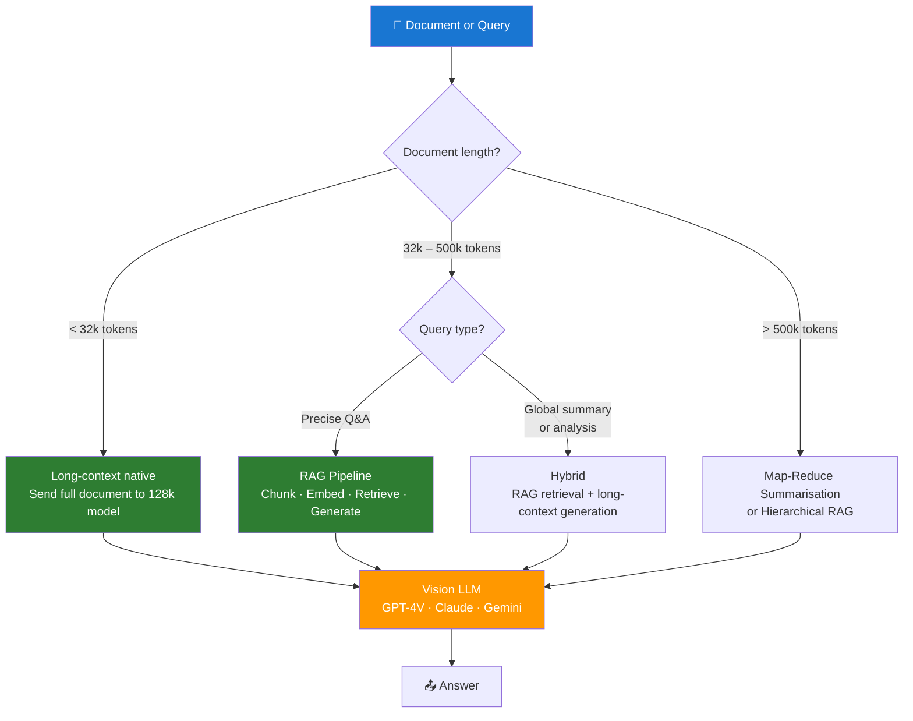

# Day 6 — Multimodal and Long-Context Strategies — Learn & Revise

> **Level:** 🟡 Intermediate
> **Pre-reading:** [Week 1 Overview](./index.md) · [Learning and Revision Plan](../index.md)

---

## 🎯 What You'll Master Today

Most real-world documents aren't clean text — they include images, charts, tables, and scanned pages. And as models grow larger context windows, the set of valid architectural choices changes. Today you'll learn what multimodal models can do, how to handle documents that exceed any single context window, and the critical "lost in the middle" problem that affects every long-context application. You'll leave with a clear decision framework for when to use RAG vs native long-context, and how to combine both for multimodal documents.

---

## 📖 Core Concepts

### What Multimodal Means

**Multimodal** refers to models and systems that can process more than one type of input — for example, images and text together, or audio and text. In the context of LLM applications, the most common multimodal capability today is **vision**: the ability to process images as part of the prompt.

**GPT-4V** (GPT-4 with Vision), **GPT-4o**, **Claude 3 Opus/Sonnet**, and **Gemini 1.5 Pro** all support image + text input. You send an image URL or base64-encoded image alongside your text prompt, and the model responds as if it can see the image.

What vision models can do:
- Read text in images (OCR-equivalent, but context-aware)
- Describe visual content: charts, diagrams, photographs
- Answer questions about what's shown in the image
- Extract structured data from tables or forms in images
- Compare images

What they cannot do reliably:
- Precise pixel-level counting or measurements
- Complex spatial reasoning (e.g., "how many pixels between these two elements?")
- Reading very small or low-resolution text

### Long-Context Models — What Changes at Scale

Context window sizes have grown dramatically:

| Model | Context Window | Token Cost |
|---|---|---|
| GPT-3.5 Turbo | 16k tokens | Low |
| GPT-4 Turbo | 128k tokens | Medium |
| GPT-4o | 128k tokens | Medium-low |
| Claude 3.5 Sonnet | 200k tokens | Medium |
| Gemini 1.5 Pro | 1,000,000 tokens (1M) | Low per token |
| Gemini 1.5 Flash | 1,000,000 tokens (1M) | Very low |

A 128k context window can fit roughly a 100-page document. A 1M window can fit an entire codebase. This sounds like it eliminates the need for RAG — but it doesn't, for several reasons:

1. **Cost** — Filling a 128k window costs 128× more than an 8k call. At scale this is prohibitive.
2. **Latency** — More tokens in = longer time to first token and longer generation.
3. **The "lost in the middle" problem** — Model quality degrades when key information is not at the beginning or end of a long context.
4. **Precision** — RAG retrieves *only* the relevant 3–5 chunks; long-context sends everything. A focused context often produces better answers.

### The "Lost in the Middle" Problem

Research (Liu et al., 2023) demonstrated that LLMs systematically perform *worse* when the information needed to answer a question is positioned in the middle of a long context, compared to when it's at the beginning or end. The model pays more attention to tokens near the start and end of its context window.

**Practical implications:**

- When assembling multiple retrieved chunks, put the highest-relevance chunk first (or last) in the context block
- When using a very long context (>32k tokens), consider a "sandwich" structure: put important context at both the beginning and end
- If using a 128k+ context, seriously consider whether RAG would produce better results by focusing the model on only the relevant passages

!!! warning "Long context ≠ perfect recall"
    Even Gemini 1.5 Pro with its 1M token window has been shown to miss information placed in the middle of very long contexts on some benchmarks. Never assume a model can reliably use everything it's given.

### Strategies for Long Documents

| Strategy | When to Use | Tradeoffs |
|---|---|---|
| **Chunking + RAG** | Documents > 32k tokens; precise answers needed; cost-sensitive | Best precision and cost; requires good retrieval |
| **Long-context native** | Documents ≤ 128k; entire document context is important; latency acceptable | Simple pipeline; no retrieval; higher cost |
| **Map-Reduce summarisation** | Summarising very long documents; no specific Q&A needed | Works at any length; loses fine-grained detail |
| **Hierarchical RAG** | Very large corpora; multi-hop reasoning needed | Complex to build; best for enterprise scale |
| **Hybrid (RAG + long-context)** | Complex queries requiring both precise retrieval and broad context | Most powerful; highest cost and complexity |

**Map-Reduce** for summarisation: split the document into chunks, summarise each chunk independently (the "map" step), then summarise the summaries (the "reduce" step). Repeat if needed. This works at any document length and avoids context limits entirely.

### Multimodal RAG — Embedding Images

For document corpora that contain images (product catalogs, technical manuals with diagrams, scanned forms), you have two options:

**Option 1 — Extract text from images first (pipeline approach):**
- Use OCR (e.g., AWS Textract, Google Document AI, or Tesseract) or a vision model to extract text from images
- Embed the extracted text as normal chunks
- Simple; works with any embedding model; loses visual layout information

**Option 2 — Embed images directly (multimodal embedding):**
- Use a multimodal embedding model (e.g., OpenAI's CLIP, Google's Vertex AI multimodal embeddings) that produces vectors for both text and images
- Store image embeddings alongside text embeddings
- At query time, embed the query as text; retrieve both text chunks and relevant images
- Pass retrieved images + text to a vision LLM for generation
- More complex but preserves visual information (charts, diagrams, scanned handwriting)

### Cost and Latency Implications of Very Long Contexts

Sending 128k tokens per query has serious implications at scale:

| Metric | 8k context | 128k context | Ratio |
|---|---|---|---|
| **Input token cost (GPT-4T)** | $0.08 | $1.28 | 16× |
| **Time to first token** | ~0.5s | ~3–8s | 6–16× |
| **Tail latency (P95)** | ~2s | ~15–30s | 7–15× |

**Practical rule:** Use long-context native only when the entire document is necessary for the answer (e.g., contract analysis, code review) and the volume is low. For high-volume Q&A, RAG is almost always the right choice.

---

## 🗺️ Architecture / How It Works



---

## ⚡ Key Facts — Quick Revision Table

| Concept | One-Line Definition | Why It Matters |
|---|---|---|
| **Multimodal** | Model that processes multiple input types (e.g., image + text) | Enables document QA over scanned, visual, or mixed content |
| **Vision model** | LLM that can see and reason about images | GPT-4V, Claude 3, Gemini 1.5 — all support this natively |
| **Context window** | Maximum tokens a model can process in one call | Hard limit; exceeding it truncates input or raises an error |
| **Lost in the middle** | Model accuracy drops for info positioned mid-context | Always put most-relevant content first (or last) |
| **Map-Reduce** | Summarise chunks, then summarise summaries | Only reliable way to summarise arbitrarily long documents |
| **Multimodal RAG** | Retrieve both text chunks and images; generate with vision LLM | Handles mixed documents like manuals, catalogs |
| **OCR** | Optical Character Recognition — extract text from images | Pre-processing step to use standard text embedding with image-heavy docs |
| **Hybrid search** | BM25 + dense vector retrieval merged with RRF | Especially useful when documents use precise technical terms |
| **Contextual compression** | Extract only the relevant sentence from a chunk | Reduces context noise in long-context scenarios |
| **Prompt caching** | Reuse static prefix tokens across calls | Cuts cost by 50–90% for repeated system prompts or base documents |

---

## 🔬 Deep Dive — Calling GPT-4V with an Image

Vision models accept images as part of the message content. Here's how to call GPT-4V with a real image:

```python
import openai
import base64
from pathlib import Path

client = openai.OpenAI()

def encode_image(image_path: str) -> str:
    """Encode local image to base64 string."""
    with open(image_path, "rb") as f:
        return base64.b64encode(f.read()).decode("utf-8")

def ask_about_image(image_path: str, question: str) -> str:
    """Send an image + question to GPT-4V and return the answer."""
    base64_image = encode_image(image_path)
    extension = Path(image_path).suffix.lstrip(".")  # "png", "jpg", etc.

    response = client.chat.completions.create(
        model="gpt-4o",  # or "gpt-4-turbo" — both support vision
        messages=[
            {
                "role": "system",
                "content": (
                    "You are a document analysis assistant. "
                    "Answer questions about the image accurately. "
                    "If you cannot read something clearly, say so rather than guessing."
                ),
            },
            {
                "role": "user",
                "content": [
                    {
                        "type": "image_url",
                        "image_url": {
                            "url": f"data:image/{extension};base64,{base64_image}",
                            "detail": "high",  # "low" for faster/cheaper; "high" for text-dense images
                        },
                    },
                    {
                        "type": "text",
                        "text": question,
                    },
                ],
            },
        ],
        max_tokens=500,
        temperature=0.1,
    )
    return response.choices[0].message.content


# Example usage
answer = ask_about_image(
    "invoice_scan.png",
    "What is the total amount due on this invoice, and what is the payment due date?"
)
print(answer)
```

!!! tip "Use `detail: high` for document images"
    GPT-4V's `detail: low` mode downsamples the image aggressively. For documents with text, tables, or fine-grained data, use `detail: high`. Low detail costs ~85 tokens per image; high detail costs 85–1,105 tokens depending on image size.

!!! note "URL vs base64"
    You can also pass a publicly accessible image URL instead of base64: `"url": "https://example.com/image.png"`. Use base64 for private images or when you can't host images publicly.

### Map-Reduce Summarisation Pattern

```python
import openai

client = openai.OpenAI()

def chunk_text(text: str, chunk_size: int = 3000) -> list[str]:
    """Simple word-based chunking for summarisation (use token-based in production)."""
    words = text.split()
    return [" ".join(words[i:i+chunk_size]) for i in range(0, len(words), chunk_size)]

def summarise_chunk(chunk: str) -> str:
    """Map step: summarise a single chunk."""
    response = client.chat.completions.create(
        model="gpt-4o-mini",  # cheaper model for map step
        messages=[
            {"role": "system", "content": "Summarise the following text in 3–5 bullet points. Be concise and factual."},
            {"role": "user", "content": chunk},
        ],
        max_tokens=300,
        temperature=0.1,
    )
    return response.choices[0].message.content

def reduce_summaries(summaries: list[str], original_question: str = "") -> str:
    """Reduce step: synthesise all chunk summaries into a final answer."""
    combined = "\n\n---\n\n".join(summaries)
    prompt = (
        f"The following are summaries of sections of a long document.\n\n{combined}\n\n"
        f"{'Answer this question based on the summaries: ' + original_question if original_question else 'Produce a coherent final summary.'}"
    )
    response = client.chat.completions.create(
        model="gpt-4-turbo",  # stronger model for final synthesis
        messages=[
            {"role": "system", "content": "You are a senior analyst. Synthesise the section summaries into a clear, coherent answer."},
            {"role": "user", "content": prompt},
        ],
        max_tokens=600,
        temperature=0.1,
    )
    return response.choices[0].message.content

def map_reduce(long_text: str, question: str = "") -> str:
    chunks = chunk_text(long_text, chunk_size=3000)
    print(f"Processing {len(chunks)} chunks...")
    summaries = [summarise_chunk(c) for c in chunks]
    return reduce_summaries(summaries, question)

# Example
with open("long_report.txt") as f:
    text = f.read()

answer = map_reduce(text, "What were the main findings of the report?")
print(answer)
```

---

## 🧪 Practice Drills

| Lab | Task | Step-by-Step Guidance | Deliverable |
|---|---|---|---|
| **Long Doc Summariser** | Build map-reduce summarisation for one long document | 1. Find or create a document >10,000 words. 2. Implement the `map_reduce()` function above. 3. Test with a factual question about the document. 4. Compare output quality at chunk sizes 1k, 2k, 3k words. 5. Compare using gpt-4o-mini vs gpt-4-turbo for the reduce step. | Summary plus intermediate chunk outputs; quality comparison table |
| **PDF to Vision QA** | Answer questions about a scanned/image-heavy document | 1. Find a PDF with images or tables (e.g., an invoice, a product manual). 2. Extract individual pages as images (use `pdf2image` library). 3. Send each page to GPT-4V with your question. 4. Aggregate answers. 5. Validate against the known correct answers. | Notebook or script with 5 validated question-answer pairs |

---

## 💬 Interview Q&A

??? question "When would you use a 128k context model instead of RAG?"
    **Model Answer:**
    I'd use a long-context native approach when three conditions are met: (1) the *entire document* is relevant to the query, not just a few passages — for example, legal contract review where clause interactions matter, or code review where the whole codebase context is needed; (2) the document length is manageable within the context window — under 100k tokens; (3) query volume is low enough that per-call cost is acceptable. For everything else — high-volume Q&A, corpora larger than a single model's context window, cost-sensitive applications, or queries that need precise retrieval from a large corpus — RAG is the right choice. The two approaches aren't mutually exclusive: a hybrid pattern uses RAG to retrieve the most relevant sections, then sends them to a long-context model for deeper reasoning.

    **Why this matters:**
    Interviewers expect you to make context-aware architectural decisions, not default to one approach for everything.

??? question "What is the 'lost in the middle' problem and how do you mitigate it?"
    **Model Answer:**
    The "lost in the middle" problem is a documented failure mode where LLMs perform significantly worse at using information that's positioned in the middle of a long context, compared to information at the beginning or end. Research by Liu et al. (2023) showed this effect even with models claiming to support 128k token contexts. The model's attention mechanism effectively prioritises recent tokens (end of context) and the beginning of the input, while deprioritising the middle. I mitigate this in three ways: (1) **Reorder chunks** — put the highest-relevance retrieved chunk first and second-highest last; (2) **Limit context size** — don't inject 10 chunks when 3 are sufficient; more chunks means more middle; (3) **Use contextual compression** — extract only the relevant sentences from each chunk before injection, reducing the "distance" between relevant pieces.

    **Why this matters:**
    This is a counterintuitive and well-documented LLM failure that many candidates don't know about. Knowing it demonstrates production-level depth.

??? question "How would you build a multimodal document QA system for a corpus of product manuals with diagrams?"
    **Model Answer:**
    My architecture would have two phases. In the **ingestion phase**: (1) parse each manual page by page using a PDF processing library; (2) for text-only pages, extract text and embed as standard chunks; (3) for image-heavy pages, run them through GPT-4V to extract a structured text description of diagrams, tables, and captions — then embed those descriptions as chunks with an `image_page` metadata tag; (4) store image page numbers alongside the extracted description so I can retrieve the original image later. In the **query phase**: (1) embed the query and retrieve the top-k most relevant chunks; (2) if any retrieved chunk has `image_page` metadata, fetch the original page image; (3) assemble a multimodal prompt: retrieved text chunks + retrieved images; (4) pass to GPT-4o or Claude 3 for generation with citation. This pattern preserves visual information without requiring a multimodal embedding model.

    **Why this matters:**
    Multimodal RAG architecture is an increasingly common production requirement. This answer demonstrates you can design it from first principles.

---

## ✅ End-of-Day Checklist

| Item | Status |
|---|---|
| Can explain what multimodal means and name 3 vision-capable models | ☐ |
| Can describe the "lost in the middle" problem with mitigation strategies | ☐ |
| Can choose between RAG, long-context native, and map-reduce for a given scenario | ☐ |
| GPT-4V code example written and understood | ☐ |
| Map-Reduce Summariser lab completed | ☐ |
| PDF to Vision QA lab completed | ☐ |
| One 60-second interview answer recorded | ☐ |
| One weak area logged for revision | ☐ |

--8<-- "_abbreviations.md"
