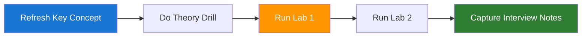

# Day 8 - Agentic patterns and tool calling

🟡 Intermediate

Pre-reading: [Week 2 Overview](./index.md) · [Learning and Revision Plan - Daily System](../index.md)

This page gives you one focused execution unit for today. You will align theory with implementation so your interview answers are backed by practical evidence and repeatable workflow habits.

## Learning Objectives

| Objective | Why it matters in interviews |
|---|---|
| Differentiate workflow vs autonomous agents | Demonstrates production-level reasoning and execution. |
| Design safe tool interfaces | Demonstrates production-level reasoning and execution. |
| Implement basic function calling | Demonstrates production-level reasoning and execution. |

## What to Learn

| Topic | Focus for today |
|---|---|
| Planner-executor loop basics | Understand enough to explain tradeoffs clearly. |
| Tool schema design principles | Understand enough to explain tradeoffs clearly. |
| Error handling for tool failures | Understand enough to explain tradeoffs clearly. |
| When not to use agents | Understand enough to explain tradeoffs clearly. |

## Theory to Practice

| Practice drill | Expected output |
|---|---|
| Define tools for search, calc, and retrieval | Short working note or runnable artifact. |
| Run an agent on constrained tasks | Short working note or runnable artifact. |
| Add tool timeout and retries | Short working note or runnable artifact. |

## Labs to Practice

| Lab | Task | Deliverable |
|---|---|---|
| Tool Contract Design | Design 5 tool schemas with clear input-output contracts | JSON schema set with examples |
| Function Call Bot | Build agent that selects and calls tools for user tasks | CLI demo and trace logs |

## Today's Material

| Start here | Why today |
|---|---|
| [Daily Material Map](../../../05-ai-engineer-playbook/08-daily-material-map.md) | Shows the exact Week 2 sequence and artifact for Day 8. |
| [03 Agentic Workflows](../../../05-ai-engineer-playbook/03-agentic-workflows.md) | Use the workflow-vs-agent framing and tool contract example. |
| [Week 2 Agent Reliability Lab](../../../06-mini-projects/02-week-2-agent-reliability-lab.md) | Follow the Day 8 modification guidance before running labs. |

## Starter Code and Assets

| Asset | Use it for |
|---|---|
| [week02_agent_reliability_lab.py](../../../06-mini-projects/code/week02_agent_reliability_lab.py) | Start from the validation and tool-request baseline. |
| [03 Agentic Workflows](../../../05-ai-engineer-playbook/03-agentic-workflows.md) | Compare the code path with the guardrail checklist. |

## Daily Execution Flow

??? question "Interview Q: What did you improve today and why?"
    **Model Answer:**
    I improved reliability by making one measurable change to the pipeline and validating it with a focused test set. I can explain the baseline issue, the change, and the observed impact in quality, latency, or cost.

    **Why this matters:**
    Interviewers look for evidence-driven improvement, not generic claims.

??? question "Interview Q: How does Day 8 connect to production outcomes?"
    **Model Answer:**
    The work done today reduces operational risk and improves repeatability. It gives me artifacts like traces, configs, and evaluation notes that I can use to justify architecture choices.

    **Why this matters:**
    Strong candidates connect technical activity to reliability, user experience, and business impact.

## End-of-Day Checklist

| Item | Status |
|---|---|
| Theory drills completed | ☐ |
| Both labs run and documented | ☐ |
| One 60-second interview answer recorded | ☐ |
| One weak area logged for revision | ☐ |

--8<-- "_abbreviations.md"
