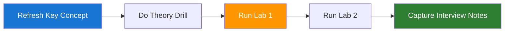

# Day 10 - LangGraph fundamentals

🟡 Intermediate

Pre-reading: [Week 2 Overview](./index.md) · [Learning and Revision Plan - Daily System](../index.md)

This page gives you one focused execution unit for today. You will align theory with implementation so your interview answers are backed by practical evidence and repeatable workflow habits.

## Learning Objectives

| Objective | Why it matters in interviews |
|---|---|
| Model workflows as graph nodes and edges | Demonstrates production-level reasoning and execution. |
| Implement conditional routing | Demonstrates production-level reasoning and execution. |
| Use retries and fallback paths | Demonstrates production-level reasoning and execution. |

## What to Learn

| Topic | Focus for today |
|---|---|
| LangGraph core concepts | Understand enough to explain tradeoffs clearly. |
| Node state and message passing | Understand enough to explain tradeoffs clearly. |
| Branching and loop control | Understand enough to explain tradeoffs clearly. |
| Graph debugging techniques | Understand enough to explain tradeoffs clearly. |

## Theory to Practice

| Practice drill | Expected output |
|---|---|
| Create a small graph with 4 nodes | Short working note or runnable artifact. |
| Add route conditions by confidence | Short working note or runnable artifact. |
| Capture run traces for each edge | Short working note or runnable artifact. |

## Labs to Practice

| Lab | Task | Deliverable |
|---|---|---|
| First Graph Workflow | Build graph for query classify-retrieve-answer flow | Runnable graph script |
| Fallback Branching | Add fallback branch for low-confidence retrieval | Trace output with branch decisions |

## Today's Material

| Start here | Why today |
|---|---|
| [Daily Material Map](../../../05-ai-engineer-playbook/08-daily-material-map.md) | Shows the exact Week 2 sequence and artifact for Day 10. |
| [03 Agentic Workflows](../../../05-ai-engineer-playbook/03-agentic-workflows.md) | Translate the workflow example into nodes, edges, retries, and approval branches. |
| [Week 2 Agent Reliability Lab](../../../06-mini-projects/02-week-2-agent-reliability-lab.md) | Treat the script steps as your graph nodes before drawing the flow. |

## Starter Code and Assets

| Asset | Use it for |
|---|---|
| [week02_agent_reliability_lab.py](../../../06-mini-projects/code/week02_agent_reliability_lab.py) | Map each code step to a graph node and each condition to an edge. |
| [03 Agentic Workflows](../../../05-ai-engineer-playbook/03-agentic-workflows.md) | Use the reliability blueprint as the target shape. |

## Daily Execution Flow

??? question "Interview Q: What did you improve today and why?"
    **Model Answer:**
    I improved reliability by making one measurable change to the pipeline and validating it with a focused test set. I can explain the baseline issue, the change, and the observed impact in quality, latency, or cost.

    **Why this matters:**
    Interviewers look for evidence-driven improvement, not generic claims.

??? question "Interview Q: How does Day 10 connect to production outcomes?"
    **Model Answer:**
    The work done today reduces operational risk and improves repeatability. It gives me artifacts like traces, configs, and evaluation notes that I can use to justify architecture choices.

    **Why this matters:**
    Strong candidates connect technical activity to reliability, user experience, and business impact.

## End-of-Day Checklist

| Item | Status |
|---|---|
| Theory drills completed | ☐ |
| Both labs run and documented | ☐ |
| One 60-second interview answer recorded | ☐ |
| One weak area logged for revision | ☐ |

--8<-- "_abbreviations.md"
