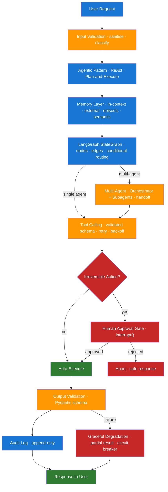

# Day 14 — Week 2 Consolidation and Graph Design Review

> **Level:** 🟡 Intermediate
> **Pre-reading:** [Week 2 Overview](./index.md) · [Learning Plan](../index.md)

---

## 🎯 Purpose of Today

Week 2 covered six interconnected topics — agentic patterns, memory and planning, LangGraph, multi-agent coordination, human-in-the-loop, and reliability hardening. Today you pull everything together: revise every concept through tables and a unified diagram, work through a full end-to-end design drill, and track the misconceptions most likely to trip you up in interviews.

---

## 🗺️ Week 2 Concept Map

```mermaid
mindmap
  root((Week 2))
    Agentic Patterns
      Chain vs Agent
      ReAct Loop
      Tool Calling
      Tool Schema Design
      Workflow vs Autonomous
    Planning and Memory
      4 Memory Types
      State Management
      Plan-and-Execute
      Context Window Management
      ConversationSummaryMemory
    LangGraph
      StateGraph
      Nodes and Edges
      Conditional Edges
      TypedDict State Schema
      CheckpointSaver
      interrupt and resume
    Multi-Agent
      Orchestrator-Subagent
      Peer-to-Peer
      Hierarchical
      Handoff Protocol
      Failure Propagation
    HITL
      Action Classification
      Approval Gates
      Audit Trail
      interrupt()
      Command(resume)
    Reliability
      7 Threats
      Retry and Backoff
      Loop Detection
      Input Validation
      Output Validation
      Graceful Degradation
      Observability
```

---

## 📐 Architecture Recap — Unified View



---

## ⚡ Core Concepts Quick Revision — Master Table

| Concept | Definition | When It Matters | Common Pitfall |
|---|---|---|---|
| **Agent** | LLM that decides its next action at each step | Any task where steps depend on runtime discovery | Defaulting to agent when a chain would suffice |
| **Chain** | Fixed sequence of LLM calls defined at design time | Structured, predictable tasks | Making it too rigid to handle edge cases |
| **ReAct** | Thought → Action → Observation loop until Final Answer | Standard agent reasoning pattern | Not setting a max-step limit |
| **Tool calling** | Model emits structured JSON request; host executes it | Every agentic application | Forgetting that the model never executes code directly |
| **Tool schema** | Name + description + parameter types for a tool | Determines how often the model calls the tool correctly | Vague descriptions causing wrong tool selection |
| **Workflow agent** | Agent with mostly predetermined steps | Lower-risk, auditable pipelines | Over-engineering with full autonomy when workflow suffices |
| **In-context memory** | Active context window content | Current conversation and immediate tool results | Token overflow from accumulating too much history |
| **External memory** | Database or store persisting across sessions | Long-term personalisation and state | Forgetting to handle read/write failures gracefully |
| **Episodic memory** | Summaries of past agent runs | Learning from previous task outcomes | Storing too much; retrieving too little |
| **Semantic memory** | Vector store queried on demand | Large knowledge bases too big for context | Stale embeddings returning outdated information |
| **State drift** | Agent state becoming inconsistent over a long run | Long multi-step tasks | Using implicit state (prompt string) instead of explicit TypedDict |
| **Plan-and-Execute** | Separate planner + executor agents | Multi-step tasks with independent sub-steps | Using a weak model for planning (planner should be strongest) |
| **StateGraph** | LangGraph class holding nodes, edges, and state schema | Every LangGraph application | Forgetting to call `compile()` before `invoke()` |
| **Conditional edge** | Edge whose target is chosen by a routing function | Agent loops, branching workflows | Missing the default/fallback key in the routing map |
| **CheckpointSaver** | Saves state after every node for resume/fault tolerance | Long-running and interruptible workflows | Using `MemorySaver` in production (state lost on restart) |
| **Orchestrator/Subagent** | Central agent delegates to specialist subagents | Most production multi-agent systems | Orchestrator passing its full context to every subagent (expensive) |
| **Handoff protocol** | Structured task + context transfer between agents | Every multi-agent transition | Passing the entire conversation history instead of trimmed context |
| **HITL** | Human approval gate before irreversible actions | Delete, deploy, send-mass actions, compliance | Putting HITL on every action (kills usability) |
| **interrupt()** | LangGraph function that pauses graph execution | HITL implementation in LangGraph | Forgetting to configure a CheckpointSaver before using interrupt |
| **Prompt injection** | Adversarial instructions embedded in retrieved content | Any agent that processes external content | Assuming retrieved content is safe to trust unconditionally |
| **Exponential backoff** | Retry with increasing wait + random jitter | Any external API call that may fail transiently | Retrying auth failures (waste) or not adding jitter (thundering herd) |
| **Graceful degradation** | Return partial results or safe fallback on failure | All production agent systems | Letting one tool failure crash the entire run |
| **Loop detection** | Detecting repeated tool calls with same args | ReAct agents on ambiguous tasks | Relying only on max-steps (misses alternating 2-tool loops) |
| **Audit trail** | Immutable append-only log of all agent actions and decisions | Any system with HITL or regulatory requirements | Letting the agent modify its own audit records |

---

## 🔬 End-to-End Drill — Design an Automated Code Review Agent

**Scenario**: Your team wants to build an agent that automatically reviews GitHub pull requests. The agent should: (1) fetch the PR diff, (2) run static analysis tools, (3) consult internal coding standards docs, (4) write review comments, (5) optionally request changes or approve. The system must be reliable, auditable, and have a human gate before posting any public comments.

### Model Walkthrough

**Step 1 — Choose the agentic pattern**

This is a multi-step task where steps are known upfront (fetch → analyse → consult docs → draft → gate → post). A **plan-and-execute** pattern fits well. The planner generates the step list; executor agents handle each step. Alternatively, a single ReAct agent with 5 tools works for simpler cases — but a planner adds auditability.

**Step 2 — Design the tool set**

| Tool | Description | Reversibility |
|---|---|---|
| `fetch_pr_diff(pr_id)` | Fetches the diff text for a PR | Reversible (read-only) |
| `run_linter(code: str)` | Runs ESLint/Pylint on a code snippet | Reversible (read-only) |
| `search_coding_standards(query)` | Semantic search over internal docs | Reversible (read-only) |
| `draft_review_comment(diff, issues)` | LLM call to draft a review | Reversible (draft, not posted) |
| `post_review_comment(pr_id, comment, decision)` | Posts comment to GitHub; requests changes or approves | **Irreversible** |

**Step 3 — Design the LangGraph StateGraph**

```
START → fetch_diff_node → linter_node → docs_retrieval_node → draft_node → hitl_gate_node → post_node → END
```

State schema:

```python
class PRReviewState(TypedDict):
    pr_id: str
    diff: str
    lint_issues: list[str]
    relevant_standards: list[str]
    draft_comment: str
    human_decision: str | None  # "approve_post", "reject", "edit"
    edited_comment: str | None
    result: str
    audit_log: list
    step_count: int
```

**Step 4 — Memory architecture**

- **In-context**: the diff, lint results, retrieved standards, and draft (total ~8k tokens max — should fit).
- **Semantic memory**: vector store of coding standards docs, queried in `docs_retrieval_node`.
- **External memory**: store past reviews per author/repo so the agent learns recurring issues.
- **Episodic**: summary of the last 5 reviews — lets the agent note "this author frequently misuses async/await".

**Step 5 — HITL gate**

`post_review_comment` is irreversible (public comment on GitHub). Gate it with `interrupt()`:

- The `hitl_gate_node` calls `interrupt()`, exposing the draft comment and a summary of issues.
- The reviewer approves, rejects, or edits the draft via a Slack bot or web UI.
- On approval, the graph resumes and calls `post_node`.

**Step 6 — Reliability hardening**

- `fetch_pr_diff`: retry 3× with backoff; if GitHub API is down, return a partial result.
- `run_linter`: 5-second timeout; on timeout, skip linting and note in the draft "linting unavailable".
- `search_coding_standards`: if the vector store returns 0 results, continue with general principles — do not fail.
- Max steps: 20 (generous for this pipeline).
- Audit log: every node appends an entry; `post_node` writes the final decision and GitHub comment URL.

**Step 7 — Observability**

Wrap in LangSmith tracing. Track: total run time per PR, lint tool latency, retrieval hit rate, HITL approval rate (what % of drafts are approved as-is vs edited). A high edit rate signals the draft node needs a better prompt.

---

## 💬 Interview Q&A

??? question "Describe end-to-end how you would design a reliable multi-step agent for a high-stakes task."
    Start with tool design: enumerate every action, classify by reversibility, and design typed schemas for each. Next choose a coordination pattern — orchestrator/subagent if steps require different expertise, plan-and-execute if steps are known upfront. Model the workflow as a LangGraph StateGraph with an explicit TypedDict state schema. Add a HITL gate (`interrupt()`) before any irreversible tool, backed by a CheckpointSaver so the graph can resume. Wrap every tool call in retry + backoff + timeout. Validate all tool inputs and outputs with Pydantic. Cap the agent at a max step limit and implement loop detection. Instrument with LangSmith for tracing. Design an append-only audit trail covering every proposed and executed action.

??? question "What is the difference between LCEL, LangGraph, and raw Python for agent orchestration?"
    **LCEL** (LangChain Expression Language) uses `|` pipes to compose linear, acyclic chains — best for simple prompt → LLM → output pipelines with no branching or state. **LangGraph** adds a typed state object, cycles (loops), conditional branching, checkpointing, and `interrupt()`/resume — it is the right choice for agent loops, multi-agent routing, and HITL. **Raw Python** offers full control with no framework overhead — best when you need custom parallelism, non-standard state management, or want to avoid the LangChain dependency entirely. In practice, most production agentic systems use LangGraph for orchestration and LCEL inside individual nodes.

??? question "How do token costs compound in multi-agent systems and how do you control them?"
    Each agent call consumes tokens proportional to its context. In a 3-subagent system, if the orchestrator passes its full state (1k tokens) to each subagent, that is 3k tokens just for handoffs per orchestration round — before any actual work. With 10 orchestration rounds, that is 30k tokens in overhead alone. Controls: (1) **context trimming** — pass only the fields each subagent needs; (2) **model tiering** — use GPT-4o for orchestration, GPT-4o-mini for simpler subagents; (3) **caching** — cache retrieval and search results for identical queries; (4) **parallelism** — run independent subagents concurrently with `asyncio.gather` to reduce wall-clock time without increasing token cost.

??? question "When is a plan-and-execute agent better than a ReAct agent?"
    Plan-and-execute is better when: (1) the task decomposes into ordered, mostly independent steps that can be enumerated upfront; (2) you want the user to review and approve the plan before execution starts; (3) you can use a cheaper model for execution steps (the planner is the only expensive call); or (4) you need a structured, auditable step-by-step log. ReAct is better when each step's content depends on the result of the previous one, so a full plan cannot be written upfront — for example, open-ended research where the next tool to call depends on what the last search returned.

??? question "What are the mandatory elements of a production-grade agent audit trail?"
    Five mandatory elements: (1) **append-only storage** — INSERT only, no UPDATE or DELETE on audit records; (2) **action timestamp at proposal** — when the agent decided, not just when it executed; (3) **full action parameters** — tool name, all arguments, not just a summary; (4) **human identity on every HITL decision** — who approved/rejected, not just the outcome; (5) **outcome and error details** — what happened after the decision, including any rollback or failure. Optional but strongly recommended: reversibility class per action, and a causal chain linking each action to the original user request.

---

## 🐛 Weak Spots Tracker

| Common Misconception | Incorrect Mental Model | Correct Mental Model |
|---|---|---|
| "Agents are just long chains" | The extra steps are the only difference | The difference is *who decides the next step* — developer for chains, LLM for agents |
| "Tool calling means the model runs code" | The LLM executes the function itself | The model emits a structured request; the *host* executes it |
| "ReAct always works if you give enough steps" | More iterations = better results | Without a max-step limit, more iterations = higher cost + infinite loop risk |
| "In-context memory is fine for long sessions" | The context window is large enough | Context windows are finite; without summarisation, old context gets truncated |
| "Plan-and-execute is always better than ReAct" | Planning upfront is always more efficient | ReAct is better for exploratory tasks where each step depends on the previous result |
| "HITL is only needed for dangerous tools" | Safety is the only reason | HITL is also needed for compliance, trust-building, and early-deployment validation |
| "Shared state in LangGraph is the same as message passing" | They are both ways to share data | Shared state is synchronous and coupled; message passing is async and decoupled |
| "LangGraph interrupt() works without a CheckpointSaver" | The graph just pauses automatically | Without a CheckpointSaver, interrupt raises an error — there is nowhere to save state |
| "Prompt injection only affects untrusted user inputs" | Only user messages can inject | Retrieved documents, web pages, and tool results can all contain injections |
| "Graceful degradation means catching all exceptions" | A try/except is enough | Graceful degradation requires returning *useful partial results* + circuit breakers, not just suppressing errors |

---

## ✅ End-of-Week Checklist

| Item | Status |
|---|---|
| Can draw the unified Week 2 architecture diagram from memory | ☐ |
| Can define all 24 terms in the Master Table without notes | ☐ |
| Completed the code review agent design drill | ☐ |
| Reviewed all 5 interview Q&A blocks and can answer each in ≤90 seconds | ☐ |
| Identified top 3 weak spots from the tracker | ☐ |
| Scheduled 30-min revision session for identified weak spots | ☐ |
| All 6 Day 8–13 end-of-day checklists are fully ticked | ☐ |

--8<-- "_abbreviations.md"
