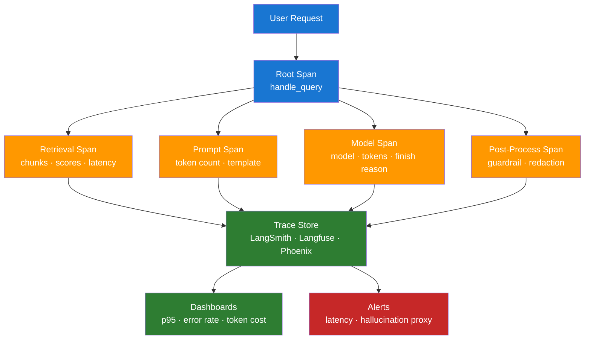

# Day 17 — Observability and Tracing — Learn & Revise

> **Level:** 🔴 Advanced
> **Pre-reading:** [Week 3 Overview](./index.md) · [Learning Plan](../index.md)

---

## 🎯 What You'll Master Today

When an LLM feature behaves unexpectedly in production, you need to know exactly where in the pipeline the failure occurred — retrieval, prompt construction, model inference, or post-processing. Today you will learn the three pillars of observability, how to instrument an LLM pipeline with traces and spans, and which tools (LangSmith, Arize Phoenix, Langfuse) make this practical. By the end you will be able to debug a slow or incorrect LLM response by reading a trace.

---

## 📖 Core Concepts

### The Three Pillars of Observability

| Pillar | What it captures | LLM example |
|---|---|---|
| **Logs** | Discrete events with timestamps and context | "Query received: 'What is RAG?' at 14:03:22, user_id=abc123" |
| **Metrics** | Numeric aggregates over time | P95 latency = 3.2s, token usage = 1,240/request, error rate = 0.4% |
| **Traces** | End-to-end request journeys broken into spans | User input → retrieval (210ms) → prompt build (12ms) → model (1,840ms) → post-process (45ms) |

Logs are rich but hard to aggregate. Metrics are easy to alert on but hide root causes. Traces are the most powerful for LLM debugging — they show you exactly which step was slow or wrong.

### LLM-Specific Tracing

A trace is a tree of **spans**, each representing one unit of work. For a RAG request the span tree looks like:

```
Root span: handle_query (2,107ms)
  ├── retrieve_documents (210ms)
  │     retrieval_score: 0.82, chunks_returned: 3
  ├── build_prompt (12ms)
  │     prompt_tokens: 1,240
  ├── model_inference (1,840ms)
  │     model: gpt-4o, completion_tokens: 187, finish_reason: stop
  └── post_process (45ms)
        guardrail_pass: true
```

Tracing lets you answer: "Was the model slow, or was retrieval slow?" and "What exact prompt did the model receive?"

### What to Instrument

Every production LLM pipeline should instrument the following on every request:

| Signal | Where to capture | Why |
|---|---|---|
| **Latency per step** | Each span | Identifies bottleneck step (model vs retrieval) |
| **Token usage** | Model span | Drives cost attribution and context-length alerts |
| **Retrieval scores** | Retrieval span | Low scores indicate poor query-document match |
| **Model metadata** | Model span | Model name, temperature, finish reason, stop reason |
| **Input/output** | Root span | Required for debugging incorrect answers |
| **Error type** | Any span | Rate-limit errors vs timeout vs validation errors |

!!! warning "Be careful with input/output logging"
    Logging full prompts and answers creates PII risk. Use field-level redaction on user inputs before writing to your trace store, or use a tool like Presidio to scrub PII before logging.

### LangSmith — Tracing for LangChain Apps

LangSmith is LangChain's hosted observability platform. It automatically traces every LangChain and LangGraph run when you set two environment variables. Each run appears in the LangSmith UI as a tree of steps with latency, token counts, inputs, and outputs at each node.

**What LangSmith shows:**

- Full chain trace with every LLM call, tool call, and retrieval step
- Token usage and cost per step
- Input/output at every node (including intermediate chain steps)
- Run comparison — diff two runs side by side
- Feedback annotations — attach thumbs-up/down from your UI

**Setup:**

```python
import os
os.environ["LANGCHAIN_TRACING_V2"] = "true"
os.environ["LANGCHAIN_API_KEY"] = "ls-..."
os.environ["LANGCHAIN_PROJECT"] = "my-rag-app"
# All subsequent LangChain calls are automatically traced
```

### Tool Comparison — LangSmith vs Arize Phoenix vs Langfuse

| Feature | LangSmith | Arize Phoenix | Langfuse |
|---|---|---|---|
| **Host** | Managed (LangChain) | Local / managed | Self-hosted / managed |
| **Framework integration** | LangChain, LangGraph native | OpenTelemetry, generic | SDK for any framework |
| **LLM eval built-in** | Yes (RAGAS-style) | Yes | Yes |
| **Dataset management** | Yes | Yes | Yes |
| **Cost** | Paid tiers; free dev plan | Open source | Open source / paid cloud |
| **Best for** | LangChain-heavy stacks | Vendor-agnostic, local dev | Self-hosted, data privacy |

Use LangSmith if your stack is primarily LangChain. Use Langfuse if you want full data ownership or a non-LangChain stack. Use Arize Phoenix for local debugging without any cloud dependency.

### Alerts and Dashboards

Alert on signals that indicate user-facing harm, not just system health:

| Metric | Alert condition | What it means |
|---|---|---|
| **Error rate** | > 1% over 5 minutes | Model calls failing — users get no answer |
| **P95 latency** | > 5s for 5 minutes | Responses too slow — users abandon |
| **Token usage per request** | > 90% of context window | Risk of truncation and quality degradation |
| **Hallucination proxy** | Faithfulness < 0.7 (sampled) | Model fabricating answers — highest risk |
| **Retrieval score** | Mean score < 0.5 over 100 requests | Index degraded or query distribution shifted |

The hallucination proxy is the hardest to alert on in real-time because scoring requires an LLM judge. A practical approach is to score a 1% sample continuously and alert if the rolling 1-hour average drops below threshold.

---

## 🗺️ Architecture / How It Works



---

## ⚡ Key Facts — Quick Revision Table

| Concept | One-Line Definition | Why It Matters |
|---|---|---|
| Trace | End-to-end record of one request broken into spans | Pinpoints which step caused a failure |
| Span | One unit of work within a trace (retrieval, model, etc.) | Carries latency, inputs, outputs, metadata |
| P95 latency | The 95th-percentile response time | Better SLO signal than mean; catches tail slowness |
| LangSmith | LangChain's managed tracing platform | Zero-config tracing for LangChain stacks |
| Langfuse | Open-source observability for any LLM stack | Best for self-hosted or non-LangChain stacks |
| Arize Phoenix | Local-first LLM observability | No cloud dependency; great for local dev |
| Hallucination proxy | Sampled faithfulness score from production | Real-time quality signal without full eval |
| Token usage alert | Alert when usage approaches context limit | Prevents silent truncation and quality drop |
| Retrieval score | Similarity score of retrieved chunks | Low score = poor retrieval = likely bad answer |
| Error rate alert | Alert when model call failure rate exceeds threshold | Direct user-facing availability signal |

---

## 🔬 Deep Dive

### LangSmith Tracing + Custom Span Annotation

```python
import os
from langchain_openai import ChatOpenAI
from langchain_core.prompts import ChatPromptTemplate
from langsmith import Client, traceable
from langsmith.run_helpers import get_current_run_tree

# Enable tracing
os.environ["LANGCHAIN_TRACING_V2"] = "true"
os.environ["LANGCHAIN_API_KEY"] = "ls-your-key-here"
os.environ["LANGCHAIN_PROJECT"] = "rag-production"

client = Client()
llm = ChatOpenAI(model="gpt-4o-mini", temperature=0)


@traceable(name="retrieve_documents")
def retrieve_documents(query: str) -> list[str]:
    """Stub retrieval — replace with real vector DB call."""
    # Attach custom metadata to the current span
    run = get_current_run_tree()
    if run:
        run.extra = {
            "retrieval_scores": [0.91, 0.87, 0.74],
            "index_name": "prod-knowledge-base",
        }
    return [
        "RAG combines retrieval with generation to ground LLM outputs.",
        "Faithfulness measures whether the answer only uses retrieved facts.",
        "Context precision measures what fraction of retrieved chunks were relevant.",
    ]


@traceable(name="generate_answer")
def generate_answer(question: str, contexts: list[str]) -> str:
    context_str = "\n\n".join(contexts)
    prompt = ChatPromptTemplate.from_messages([
        ("system", "Answer using only the provided context. Say 'I don't know' if the context is insufficient."),
        ("human", "Context:\n{context}\n\nQuestion: {question}"),
    ])
    chain = prompt | llm
    response = chain.invoke({"context": context_str, "question": question})
    return response.content


@traceable(name="handle_query", run_type="chain")
def handle_query(query: str) -> str:
    contexts = retrieve_documents(query)
    answer = generate_answer(query, contexts)

    # Attach outcome metadata to root span
    run = get_current_run_tree()
    if run:
        run.extra = {
            "answer_length_tokens": len(answer.split()),
            "contexts_used": len(contexts),
        }
    return answer


# Run and observe in LangSmith UI
if __name__ == "__main__":
    result = handle_query("What is faithfulness in RAG evaluation?")
    print(result)
    print("\nView trace at: https://smith.langchain.com")
```

**Reading the trace:** Open LangSmith → your project → latest run. You will see the `handle_query` root span with two child spans: `retrieve_documents` and `generate_answer`. Each span shows latency, token usage, and your custom metadata (retrieval scores, index name).

---

## 🧪 Practice Drills

### Drill 1 — Instrument Your RAG Pipeline

1. Add `LANGCHAIN_TRACING_V2=true` and your LangSmith API key to your environment.
2. Wrap each stage of your RAG pipeline in a `@traceable` decorator (retrieve, build_prompt, generate).
3. Run 5 queries and open LangSmith — verify all spans appear with correct latencies.
4. Identify your slowest span. Is it retrieval or model inference?

### Drill 2 — Build a Latency Dashboard

1. In LangSmith, open your project and switch to the "Metrics" view.
2. Set up a chart: P95 latency by day, filtered to `run_type=chain`.
3. Identify if latency has a pattern (time of day, query length correlation).
4. Set a P95 alert threshold of 5 seconds.

### Drill 3 — Hallucination Proxy Monitoring

1. After running 20+ queries, export the run data from LangSmith as JSON.
2. For a 10% sample, manually check faithfulness (does the answer only use retrieved context?).
3. Record your spot-check faithfulness rate.
4. Document: "My production faithfulness proxy is X% based on manual spot-check of N samples."

---

## 💬 Interview Q&A

??? question "How would you trace a slow LLM request to find the bottleneck?"
    I would open the trace for the slow request in LangSmith (or Langfuse if self-hosted) and look at the span tree. Each span shows its own latency, so I can immediately see whether the bottleneck is retrieval, prompt construction, model inference, or post-processing. Retrieval slowness usually points to a slow vector DB query — I would check index health and query complexity. Model inference slowness usually means a large context window or high load on the inference endpoint — I would check token counts and move to a faster model for latency-sensitive queries. If it is the first time I am seeing slowness, I compare the trace to the P95 baseline to confirm it is an outlier.

??? question "What is LangSmith and what does it show?"
    LangSmith is LangChain's observability platform. When you set `LANGCHAIN_TRACING_V2=true`, every LangChain run is automatically traced and sent to LangSmith. You can see the full span tree for each request — every LLM call, tool invocation, retrieval step — with latency, token counts, inputs, and outputs at each node. It also supports dataset management, run comparisons, and human feedback annotations. For non-LangChain stacks, Langfuse and Arize Phoenix provide equivalent functionality via OpenInference or OpenTelemetry instrumentation.

??? question "What metrics would you alert on for a production RAG system?"
    My primary alert set is: error rate above 1% over 5 minutes (model calls failing), P95 latency above 5 seconds for 5 minutes (users experiencing timeouts), and token usage above 90% of context window on more than 10% of requests (risk of truncation). For quality, I run a continuous 1% sample through a faithfulness judge and alert if the rolling hourly average drops below 0.7 — this is my hallucination proxy. I also alert on retrieval score dropping below 0.5, which indicates index degradation or a query distribution shift.

---

## ✅ End-of-Day Checklist

| Item | Status |
|---|---|
| Can explain logs, metrics, and traces and what each captures for LLMs | ☐ |
| Can describe the span tree for a RAG request | ☐ |
| Can explain what LangSmith shows and how to set it up | ☐ |
| Can compare LangSmith, Langfuse, and Arize Phoenix | ☐ |
| Can list 5 metrics to alert on in production | ☐ |
| LangSmith tracing working locally with custom span annotations | ☐ |
| Latency dashboard or chart created | ☐ |
| All 3 interview answers rehearsed out loud | ☐ |

--8<-- "_abbreviations.md"
