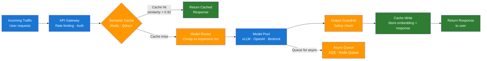

# Day 19 — Deployment, Scaling, and SLOs — Learn & Revise

> **Level:** 🔴 Advanced
> **Pre-reading:** [Week 3 Overview](./index.md) · [Learning Plan](../index.md)

---

## 🎯 What You'll Master Today

Getting an LLM feature into production is more than choosing an API key. Today you will learn the deployment options available (managed APIs vs self-hosted inference), how to define SLOs that actually reflect user experience, scaling and caching strategies that handle traffic spikes without exploding costs, and how to route expensive model calls intelligently. By the end you will be able to design the deployment architecture for a production LLM feature end to end.

---

## 📖 Core Concepts

### Deployment Options — Tradeoffs

| Option | Latency | Cost | Control | Best for |
|---|---|---|---|---|
| **OpenAI API** | Medium (200–800ms) | Pay-per-token | Low | Rapid prototyping, general-purpose apps |
| **Azure OpenAI** | Medium | Pay-per-token | Medium | Enterprise compliance, data residency |
| **AWS Bedrock** | Medium | Pay-per-token | Medium | AWS-native stacks, multi-model access |
| **vLLM on Kubernetes** | Low (50–200ms) | Infra + GPU | High | High-throughput, open models, cost at scale |
| **TGI on Kubernetes** | Low | Infra + GPU | High | Hugging Face model serving, quantisation |

**vLLM** uses PagedAttention to dramatically increase throughput (up to 24x vs naive serving) by managing the KV cache as paged memory. It is the standard choice for self-hosting open models (Llama 3, Mistral, Qwen) at scale.

**TGI** (Text Generation Inference) is Hugging Face's inference server. It supports tensor parallelism, quantisation (GPTQ, AWQ), and continuous batching. Use it when your model is a Hugging Face hosted model and you want tight integration with the HF ecosystem.

!!! note "Managed API vs self-hosted decision"
    For most teams, managed APIs are the right choice until monthly API spend exceeds ~$5k/month, at which point self-hosted inference with open models starts to pay off. Factor in GPU infrastructure costs, DevOps overhead, and the latency advantage of self-hosting.

### SLOs for LLM Systems

An SLO (Service Level Objective) is a target value for a reliability or quality metric. For LLM systems, four categories matter:

| SLO Category | Example Target | Measurement |
|---|---|---|
| **Availability** | 99.5% uptime (< 3.6 hrs downtime/month) | % of requests that return a non-error response |
| **Latency** | P95 < 5s, P50 < 2s | Measured end-to-end at the API gateway |
| **Error rate** | < 0.5% of requests return a 5xx error | Count of failed model calls / total requests |
| **Quality** | Faithfulness > 0.75 on weekly eval sample | RAGAS score on 1% production sample |

Quality SLOs are unique to LLM systems — traditional SLOs only cover availability and latency. Define quality SLOs before launch and tie them to eval pipeline gates.

An **SLA** (Service Level Agreement) is the contractual version of an SLO — the penalty-bearing commitment to customers. SLOs are internal targets; SLAs are external contracts. Always set your SLO tighter than your SLA (e.g., SLO = 99.5% availability, SLA = 99.0%).

### Scaling Patterns

**Horizontal scaling:** Add more replicas of your inference service behind a load balancer. Works well for stateless pipelines. Each replica handles independent requests. Scale based on request rate or GPU utilisation.

**Request batching:** Group multiple requests into a single model inference call. Increases throughput at the cost of individual request latency. vLLM does this automatically via continuous batching — incoming requests fill the batch as previous ones complete.

**Async processing:** For non-real-time use cases (document processing, report generation), put requests in a queue (SQS, Redis Queue) and process them asynchronously. The API returns a job ID immediately; the client polls for the result. This decouples request rate from inference capacity.

### Cold Start and Warm Pool Strategies

A cold start occurs when a new inference replica needs to load a model before it can serve requests. For a 7B parameter model, this takes 30–120 seconds — unacceptable for a production request.

**Mitigation strategies:**

| Strategy | How it works | Tradeoff |
|---|---|---|
| **Warm pool** | Keep N replicas always running, even at zero load | Pays idle GPU cost 24/7 |
| **Predictive scaling** | Scale up before expected traffic (e.g., 08:00 daily) | Requires traffic pattern analysis |
| **Model caching** | Cache model weights on persistent disk, not in memory (restart is fast) | Disk I/O still adds ~10–30s |
| **Serverless GPU** | Providers (Modal, RunPod) keep models warm across tenants | Higher per-call cost but no idle cost |

For production SLOs with P95 < 5s, always maintain a minimum of 2 warm replicas. Never let replica count drop to zero.

### Cost Management — Token Budgets and Model Tiering

LLM costs scale linearly with token usage. Three levers reduce cost without degrading user experience:

**1. Model tiering (routing):** Use a fast, cheap model (GPT-4o-mini, Haiku) for simple queries and reserve the expensive model (GPT-4o) for complex ones. A router classifier decides which tier to use based on query complexity. This can cut API costs by 60–80% on mixed-complexity workloads.

**2. Token budgets:** Set a hard cap on prompt + completion tokens per request. Use `max_tokens` in the API call. Truncate retrieved context to fit the budget. Alert when > 10% of requests hit the cap (indicates chunking or retrieval is producing oversized prompts).

**3. Prompt caching:** OpenAI and Anthropic offer prompt caching — if the same prefix (system prompt + static context) appears in multiple requests, only pay for the first token processing. This is particularly effective for RAG systems where the system prompt is large and reused.

### Caching Strategies

Caching reduces model calls for repeated or near-identical queries:

| Strategy | How it works | Hit rate | Best for |
|---|---|---|---|
| **Exact-match cache** | Hash the prompt; return cached response on match | Low (5–15%) | Identical repeated queries (FAQs) |
| **Semantic cache** | Embed the query; find cached responses within cosine distance threshold | Medium (20–40%) | Paraphrased versions of the same question |
| **TTL policy** | Expire cache entries after N hours | — | Time-sensitive content (news, prices) |

A semantic cache uses a vector store (Redis with RediSearch, Qdrant, or Pinecone) to store `(query_embedding, response)` pairs. On each request, embed the query and find the nearest cached entry — if similarity > 0.92, return the cached response.

---

## 🗺️ Architecture / How It Works



---

## ⚡ Key Facts — Quick Revision Table

| Concept | One-Line Definition | Why It Matters |
|---|---|---|
| SLO | Internal target value for a reliability or quality metric | Defines what "good" means before you ship |
| SLA | Contractual customer-facing commitment (penalty-backed) | Legal obligation; set looser than SLO |
| P95 latency | 95th-percentile response time across all requests | Captures tail latency users actually experience |
| vLLM | High-throughput inference server using PagedAttention | 24x throughput improvement vs naive serving |
| TGI | Hugging Face inference server with quantisation support | Best for HF ecosystem and model variants |
| Warm pool | Minimum replicas kept running to avoid cold starts | Prevents cold-start latency in production |
| Model tiering | Route cheap/simple queries to a smaller, faster model | 60–80% cost reduction on mixed workloads |
| Semantic cache | Cache keyed on query embedding similarity, not exact text | 20–40% cache hit rate on paraphrased queries |
| Exact-match cache | Cache keyed on exact prompt hash | Best for repeated FAQ-style queries |
| Token budget | Hard cap on tokens per request via `max_tokens` | Prevents runaway costs and context overflow |

---

## 🔬 Deep Dive

### Python Semantic Cache with Redis + Sentence Transformers

```python
import json
import numpy as np
import redis
from sentence_transformers import SentenceTransformer

# ---------- Setup ----------
redis_client = redis.Redis(host="localhost", port=6379, decode_responses=False)
embedder = SentenceTransformer("all-MiniLM-L6-v2")

CACHE_KEY_PREFIX = "llm_cache:"
SIMILARITY_THRESHOLD = 0.92
CACHE_TTL_SECONDS = 3600  # 1 hour

# ---------- Helpers ----------
def embed(text: str) -> np.ndarray:
    return embedder.encode(text, normalize_embeddings=True)

def cosine_similarity(a: np.ndarray, b: np.ndarray) -> float:
    return float(np.dot(a, b))  # Vectors are already normalised

def get_all_cache_keys() -> list[str]:
    return [k.decode() for k in redis_client.keys(f"{CACHE_KEY_PREFIX}*")]

# ---------- Cache operations ----------
def cache_lookup(query: str) -> str | None:
    """Return cached response if a semantically similar query exists."""
    query_emb = embed(query)
    best_similarity = 0.0
    best_response = None

    for key in get_all_cache_keys():
        entry_bytes = redis_client.get(key)
        if not entry_bytes:
            continue
        entry = json.loads(entry_bytes)
        cached_emb = np.array(entry["embedding"])
        sim = cosine_similarity(query_emb, cached_emb)
        if sim > best_similarity:
            best_similarity = sim
            best_response = entry["response"]

    if best_similarity >= SIMILARITY_THRESHOLD:
        print(f"Cache hit (similarity={best_similarity:.3f})")
        return best_response
    return None

def cache_store(query: str, response: str) -> None:
    """Store a query-response pair in the semantic cache."""
    query_emb = embed(query)
    key = f"{CACHE_KEY_PREFIX}{hash(query)}"
    entry = {
        "query": query,
        "embedding": query_emb.tolist(),
        "response": response,
    }
    redis_client.setex(key, CACHE_TTL_SECONDS, json.dumps(entry))
    print(f"Cache stored for: '{query[:50]}...'")

# ---------- LLM call stub ----------
def call_llm(query: str) -> str:
    """Replace with your actual OpenAI / vLLM call."""
    return f"[Model response] RAG stands for Retrieval-Augmented Generation. It combines a retrieval step with LLM generation to ground responses in external documents."

# ---------- Cache-aware query handler ----------
def handle_query(query: str) -> str:
    # 1. Check semantic cache
    cached = cache_lookup(query)
    if cached:
        return cached

    # 2. Cache miss — call model
    response = call_llm(query)

    # 3. Store in cache for future similar queries
    cache_store(query, response)
    return response

# ---------- Demo ----------
if __name__ == "__main__":
    queries = [
        "What is RAG?",
        "Can you explain Retrieval-Augmented Generation?",  # Should hit cache
        "How does retrieval augmented generation work?",    # Should hit cache
        "What is the capital of France?",                  # Should miss cache
    ]

    for q in queries:
        print(f"\nQuery: {q}")
        response = handle_query(q)
        print(f"Response: {response[:80]}...")
```

**Expected behaviour:** The second and third queries ("Can you explain RAG?" and "How does RAG work?") should hit the cache with high similarity scores (> 0.92) because they are semantically equivalent to "What is RAG?". The fourth query about France will miss.

!!! tip "Production Redis setup"
    In production, use the RediSearch module with HNSW vector indexing instead of linear scan. This scales the cache lookup to millions of entries with sub-millisecond latency.

---

## 🧪 Practice Drills

### Drill 1 — Define SLOs for a Hypothetical Product

1. Choose a product scenario (customer support chatbot, internal knowledge base, code assistant).
2. Define 4 SLOs for it: availability target, P95 latency target, error rate target, quality target.
3. Justify each number — why is P95 < 5s acceptable for this use case? Why not P95 < 2s?
4. Write the SLO as a one-paragraph document: "We define success as..."

### Drill 2 — Run the Semantic Cache

1. Start a Redis instance locally: `docker run -p 6379:6379 redis`.
2. Run the semantic cache script above.
3. Send the 4 test queries and verify cache hit/miss behaviour.
4. Lower the similarity threshold to 0.85 and observe how many more queries hit the cache — does this feel safe?

### Drill 3 — Model Tiering Router

1. Write a function `route_query(query: str) -> str` that returns `"gpt-4o-mini"` for short, factual queries (< 20 words, no multi-step reasoning) and `"gpt-4o"` for complex ones.
2. Use a simple heuristic first (word count + presence of "compare", "analyse", "explain in detail").
3. Test it on 10 queries and verify the routing makes sense.
4. Estimate the cost saving: if 70% of queries go to mini (10x cheaper), what is the blended cost reduction?

---

## 💬 Interview Q&A

??? question "What SLOs would you set for a production LLM feature?"
    I would define four SLO categories. Availability: 99.5% of requests return a non-error response, measured over a rolling 7-day window. Latency: P95 end-to-end response time below 5 seconds, P50 below 2 seconds. Error rate: fewer than 0.5% of requests return a 5xx error. Quality: faithfulness above 0.75 on a weekly RAGAS sample of 1% of production traffic. Thresholds depend on the use case — a customer-facing chatbot needs stricter latency SLOs than an internal document summariser. I always set internal SLO targets 10–20% tighter than any customer-facing SLA.

??? question "How do you reduce LLM API costs in production?"
    Three main levers: (1) Semantic caching — embed each query and return a cached response when similarity exceeds 0.92. This achieves 20–40% cache hit rates on real workloads and eliminates those model calls entirely. (2) Model tiering — route simple, short queries to a fast cheap model (GPT-4o-mini is ~10x cheaper than GPT-4o) and reserve the expensive model for complex reasoning. On mixed workloads this cuts costs by 60–80%. (3) Token budgets — set hard limits via `max_tokens`, truncate retrieved context to the prompt budget, and enable prefix caching for large system prompts that repeat across requests. Together these can reduce API costs by 70–90% compared to naive per-request model calls.

??? question "What is the difference between exact-match and semantic caching?"
    Exact-match caching hashes the full prompt string and returns a cached response only on an identical match. It has very low hit rates (5–15%) because users rarely ask the same question in exactly the same words. Semantic caching embeds the query into a vector and finds the nearest cached response by cosine similarity — if similarity exceeds a threshold (typically 0.92), the cached response is returned. This catches paraphrased versions of the same question and achieves 20–40% hit rates. The tradeoff is that semantic caching requires a vector store and embedding computation on every request, whereas exact-match is a simple hash lookup. The similarity threshold is critical — too low and you serve wrong cached answers; too high and you get minimal hit rate.

---

## ✅ End-of-Day Checklist

| Item | Status |
|---|---|
| Can compare deployment options (OpenAI API, Azure, Bedrock, vLLM, TGI) | ☐ |
| Can define availability, latency, error rate, and quality SLOs | ☐ |
| Can explain the difference between SLO and SLA | ☐ |
| Can explain warm pool and cold start mitigation | ☐ |
| Can explain model tiering and token budget strategies | ☐ |
| Can explain exact-match vs semantic caching tradeoffs | ☐ |
| Semantic cache script run locally with hit/miss verified | ☐ |
| SLOs written for a hypothetical product | ☐ |
| All 3 interview answers rehearsed out loud | ☐ |

--8<-- "_abbreviations.md"
