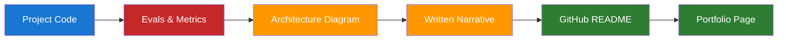

# Day 24 — Portfolio Assembly and Project Narrative — Learn & Revise

> **Level:** 🔴 Advanced
> **Pre-reading:** [Week 4 Overview](./index.md) · [Learning Plan](../index.md)

---

## 🎯 What You'll Master Today

A strong AI engineering portfolio is not a collection of notebooks — it is a curated body of evidence that demonstrates judgment, not just execution. Today you will learn how reviewers actually assess AI portfolios, what narrative structure makes a project memorable, which artifacts signal production experience, and how to structure a GitHub repo so it communicates quality before anyone reads a line of code. By end of day you will have a narrative template you can apply to every project in your portfolio.

---

## 📖 Core Concepts

### What Makes a Strong AI Engineer Portfolio

Reviewers spend 5–10 minutes on a portfolio. They are not reading for comprehension — they are scanning for signals. The signals that matter most:

| Signal | What It Demonstrates | Weak Version |
|---|---|---|
| Evaluation results | Rigorous thinking about quality | "Model works well" with no metrics |
| Production artifacts | Real deployment experience | Notebook-only projects |
| Architecture diagrams | System thinking and tradeoff awareness | "Please see the code for details" |
| Tradeoff discussion | Senior engineering judgment | "I used RAG because it's popular" |
| Postmortem or lessons learned | Intellectual honesty and growth mindset | Nothing about what went wrong |

The strongest AI portfolios answer three questions without being asked: "Did this work?", "How do you know?", and "What would you do differently?"

### Project Narrative Structure

Every project in your portfolio should have a written narrative following this five-part structure:

1. **Problem** — What was the business or user problem? Why did it matter? What was the cost of not solving it?
2. **Approach** — What solution did you choose and why? What alternatives did you consider?
3. **Tradeoffs** — What did your approach sacrifice? What constraints drove those decisions?
4. **Result** — What happened? What metric changed and by how much?
5. **What I'd do differently** — What would you change with hindsight? This signals growth mindset and senior thinking.

The "What I'd do differently" section is the most differentiating. Most candidates omit it. Senior engineers always have one.

### Which Artifacts to Highlight

Rank artifacts by evidential weight:

| Artifact | Evidential Weight | Notes |
|---|---|---|
| Production metrics dashboard screenshot | Very High | Shows real deployment and measurement |
| Eval results table (RAGAS, human ratings) | Very High | Shows you can measure quality rigorously |
| Architecture diagram with component rationale | High | Shows system design thinking |
| Postmortem document | High | Shows production operations experience |
| Annotated pull request / code review | Medium | Shows engineering process |
| Jupyter notebook with clean narrative | Medium | Shows analysis skill but not production |
| GitHub repo with good README | Medium | Prerequisite, not differentiator |

Prioritise the top two tiers. Production metrics and eval results are the hardest for a candidate to fake and the most credible to reviewers.

### GitHub Repo Structure for AI Projects

What a reviewer checks in the first 60 seconds:

1. **README** — Is there a clear problem statement, architecture overview, and results section?
2. **Eval or results directory** — Is there a benchmark or evaluation output? Numbers?
3. **Requirements or environment file** — Is this reproducible?
4. **Code structure** — Is there a sensible separation between data, model, evaluation, and serving layers?
5. **Commit history** — Does it show iterative development or a single dump?

A repo with a clean README and an `evals/` directory with results speaks louder than 3,000 lines of undocumented code.

### Written Narrative vs Live Demo

| Format | When to Use | When to Avoid |
|---|---|---|
| Written narrative (README, blog post) | Async review, take-home assignments, portfolio links | When the interviewer wants to see you think live |
| Live demo | Onsite sessions, portfolio walk-throughs | When the system has latency or reliability issues |
| Architecture walkthrough (verbal) | System design interviews, panel interviews | When the audience is non-technical |
| Code walkthrough | Technical screen, pair programming session | When the code is not production-quality |

For most async AI engineering applications, a one-page written narrative + architecture diagram + results table will outperform a live demo.

---

## 🗺️ Strategy Map



---

## ⚡ Key Facts — Quick Revision Table

| Concept | One-Line Definition | Why It Matters |
|---|---|---|
| Portfolio signal | Evidence artifact that communicates a specific competency | Reviewers scan for signals, not content |
| Project narrative | Five-part structure: Problem, Approach, Tradeoffs, Result, Lessons | Makes a project memorable and senior-looking |
| Evidential weight | How credible an artifact is to a technical reviewer | Production metrics > notebooks |
| Tradeoff discussion | Explicit statement of what your approach sacrificed | Signals senior engineering judgment |
| "What I'd do differently" | Honest reflection on hindsight improvements | The most differentiating and most omitted section |
| Eval results table | Table of quality metrics from a rigorous benchmark | The strongest signal of AI engineering maturity |
| Architecture diagram | Visual representation of system components and data flow | Shows system design thinking |
| Postmortem | Document describing a failure and its root cause | Signals production operations experience |
| Reproducibility | Ability to re-run the project from a clean environment | Signals engineering craft |
| Commit history | Git log showing iterative development | Distinguishes ongoing work from a one-time dump |

---

## 🔬 Deep Dive with Examples

### Sample Project README Structure

The following structure applies to any AI engineering project:

```markdown
# Project Name — One-Line Description

## Problem
[2–3 sentences describing the business or user problem and why it mattered]

## Architecture
[Mermaid diagram or image of the system architecture]

## Approach
[3–4 sentences explaining the chosen solution, what alternatives were considered,
and why this approach was selected]

## Results

| Metric | Baseline | After |
|---|---|---|
| Recall@10 | 62% | 87% |
| P95 Latency | 4.2s | 1.8s |
| Hallucination rate | 18% | 3.2% |

## Evaluation Methodology
[How you measured the results: eval set size, labelling process, metrics used]

## Tradeoffs
[What does this approach sacrifice? What constraints drove those decisions?]

## What I'd Do Differently
[1–3 concrete improvements with hindsight]

## Quickstart
[Reproducible setup instructions: environment, data, run commands]
```

### Worked Example: Project Narrative for a RAG System

**Problem:** Support agents at a B2B SaaS company could not find answers quickly enough in a 40,000-page documentation corpus. Average handle time for documentation-related queries was 8 minutes. A new agent was struggling to onboard because the search tool was ineffective.

**Approach:** I built a hybrid retrieval system combining BM25 for lexical matching and a dense embedding model for semantic matching, fused using RRF. I chose this over a pure dense approach because the corpus contained many product codes and named entities where BM25 has a systematic advantage.

**Tradeoffs:** The hybrid system required maintaining two indexes — a BM25 inverted index and a vector store. This added operational complexity and a small latency penalty (approx. 80ms) compared to a single-index approach. I accepted this because the quality improvement was material and the latency budget had headroom.

**Result:** Recall@10 improved from 62% to 87%. Support agent adoption increased from 12% to 61% over the following month. Average handle time dropped from 8 minutes to 5.2 minutes.

**What I'd do differently:** I would invest earlier in building a synthetic evaluation dataset using the documentation itself, rather than waiting for failed queries to emerge in production. Earlier eval coverage would have let me run ablation studies faster and ship the first version with higher confidence.

---

## 🧪 Practice Drills

**Drill 1 — Portfolio Audit (30 minutes)**

1. List every project in your current portfolio (GitHub repos, blog posts, notebooks).
2. For each, score it against: Does it have a problem statement? Measurable results? A tradeoff discussion? A lessons-learned section?
3. Identify the top two projects by score — these are your featured projects.
4. Identify the biggest gap in your third-ranked project and plan how to address it today.

**Drill 2 — Write a Project Narrative (45 minutes)**

1. Pick your top-ranked project.
2. Write the five-part narrative: Problem, Approach, Tradeoffs, Result, What I'd Do Differently.
3. Keep each section to 3–5 sentences maximum.
4. Read it aloud — it should sound like something a senior engineer would say, not a press release.

**Drill 3 — README Upgrade (30 minutes)**

1. Open the GitHub README for your best project.
2. Add or improve: problem statement, results table, evaluation methodology section, quickstart instructions.
3. Verify the results table contains at least two numeric metrics.

---

## 💬 Interview Q&A

??? question "Walk me through your most complex AI project."
    I'll walk you through a knowledge assistant I built for a B2B SaaS company's support team running on a 40,000-page documentation corpus. The problem was that agents were ignoring the tool because retrieval quality was too low — recall@10 at baseline was 62%. I ran an error analysis on 200 failed queries, identified three root causes, and designed a hybrid BM25 plus dense retrieval system fused with RRF, combined with improved chunking. The complexity came from validating each change independently before combining them — I built a RAGAS-based eval pipeline against a 300-question test set to isolate each intervention's contribution. Recall reached 87% after six weeks. What made this complex was the operational piece: maintaining two indexes in production required a synchronised update pipeline so the BM25 and vector stores stayed consistent after documentation updates. With hindsight, I would invest earlier in synthetic eval data generation to speed up the ablation study phase.

??? question "How do you show production experience in a portfolio?"
    The clearest signals are production metrics and operational artifacts. If I have a dashboard screenshot showing latency, error rates, or quality metrics over time, I include it. If I have a postmortem from a production incident, I include a sanitised version with the root cause analysis and the fix. I also make eval methodology visible — not just "the model performed well" but "here is the 300-question test set, the metrics I measured, and the regression threshold I gated on." If a project was a prototype and never went to production, I say so explicitly and describe what production deployment would have required. Honesty about scope signals maturity more than inflated claims.

??? question "What would you do differently if you rebuilt this project today?"
    For the knowledge assistant, I would invest in building a synthetic evaluation dataset before writing any retrieval code. In the actual project I waited for production failures to accumulate before building the eval set, which meant the first six weeks of development had no quantitative feedback loop. Using LLM-assisted question generation from the documentation itself, I could have had a 500-question eval set ready in two hours. That would have let me run a proper ablation study on retrieval configurations from day one, rather than relying on manual spot-checking early in the project.

---

## ✅ End-of-Day Checklist

| Item | Status |
|---|---|
| Portfolio audit completed — top 2 projects identified | ☐ |
| Five-part narrative written for top project | ☐ |
| README upgraded with results table and eval methodology | ☐ |
| Tradeoff discussion present in at least one project | ☐ |
| "What I'd do differently" written for top project | ☐ |
| Drafted answers for all three interview Qs above | ☐ |

--8<-- "_abbreviations.md"
