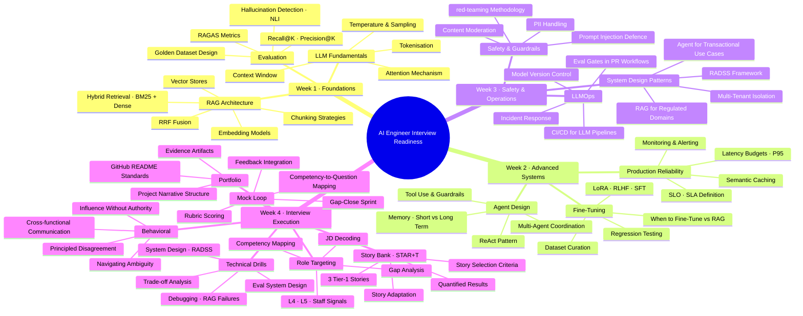

# Day 28 — Final Synthesis and Interview Launch Plan — Learn & Revise

> **Level:** 🔴 Advanced
> **Pre-reading:** [Week 4 Overview](./index.md) · [Learning Plan](../index.md)

---

## 🎯 What You'll Master Today

Day 28 is the capstone of your 28-day preparation. Today you will consolidate everything — all four weeks — into a structured launch plan. This article contains a complete 28-day concept map, a 50-row master revision glossary, a structured AI Engineer Interview Blueprint summarising every question category with model answers, a day-of launch template, and five final interview Q&A blocks for the hardest questions you will face. By end of day you are ready to interview.

---

## 🗺️ 28-Day Concept Map

---

## 📖 Master Revision Glossary — 50 Terms

| Term | Definition | Week Introduced | Key Context |
|---|---|---|---|
| RAG | Retrieval-Augmented Generation — grounding LLM output in retrieved documents | Week 1 | Core architecture pattern for knowledge-grounded AI systems |
| Chunking | Splitting source documents into fixed or semantic units before indexing | Week 1 | Chunk boundary quality is a major driver of retrieval accuracy |
| Embedding | Dense vector representation of text for similarity search | Week 1 | Model choice affects retrieval quality significantly |
| FAISS | Facebook AI Similarity Search — vector index library | Week 1 | ANN search for large-scale retrieval |
| BM25 | Probabilistic term-frequency ranking function for lexical search | Week 1 | Handles named entities and exact matches that dense retrieval misses |
| Hybrid retrieval | Combining BM25 and dense retrieval before fusion | Week 1 | Standard practice for production RAG |
| RRF | Reciprocal Rank Fusion — merging ranked lists without tuning a weight | Week 1 | Default fusion method for hybrid retrieval |
| HNSW | Hierarchical Navigable Small World — graph-based ANN index | Week 1 | Fast, high-recall approximate nearest-neighbour search |
| Recall@K | Fraction of relevant documents found in top-K results | Week 1 | Primary retrieval quality metric |
| RAGAS | Evaluation framework measuring faithfulness, answer relevance, context precision | Week 1 | Standard offline eval framework for RAG systems |
| Faithfulness | RAGAS metric measuring whether the answer is supported by retrieved context | Week 1 | The primary hallucination detection metric in RAGAS |
| Answer relevance | RAGAS metric measuring whether the answer addresses the question | Week 1 | Null answers score high on faithfulness — relevance prevents this |
| NLI | Natural Language Inference — classifying premise-hypothesis relationships | Week 1 | Used for sentence-level hallucination detection in production |
| Golden dataset | Fixed set of queries with human-labelled ground truth answers | Week 1 | Must be locked before experimentation to prevent cherry-picking |
| Context precision | RAGAS metric measuring signal-to-noise ratio in retrieved context | Week 1 | Low precision means retrieved chunks contain noise that confuses the LLM |
| ReAct | Reasoning + Acting — agent pattern alternating thought and tool use | Week 2 | Standard pattern for tool-using LLM agents |
| Tool use | LLM selecting and calling external functions with structured arguments | Week 2 | Extends LLM capability to real-world actions |
| Max iterations | Hard limit on agent reasoning steps to prevent infinite loops | Week 2 | Required safety control for any production agent |
| Semantic cache | Cache keyed on embedding similarity rather than exact query text | Week 2 | Reduces LLM inference cost for semantically similar queries |
| P95 latency | 95th percentile response time — the tail-end of the latency distribution | Week 2 | Standard SLO metric for production AI APIs |
| SLO | Service Level Objective — internal latency and availability target | Week 2 | Internal target; SLA is the customer-facing commitment |
| SLA | Service Level Agreement — contractual uptime and performance commitment | Week 2 | Governs penalties if the service fails to meet thresholds |
| LoRA | Low-Rank Adaptation — parameter-efficient fine-tuning by adding rank-decomposed weight matrices | Week 2 | Reduces fine-tuning cost significantly vs full parameter training |
| RLHF | Reinforcement Learning from Human Feedback — fine-tuning using a reward model trained on human preferences | Week 2 | Used to align LLM output with human preferences |
| SFT | Supervised Fine-Tuning — training on input-output pairs with cross-entropy loss | Week 2 | First stage in most RLHF pipelines |
| CoT | Chain-of-Thought prompting — eliciting step-by-step reasoning before answering | Week 2 | Improves accuracy on multi-step reasoning questions |
| HyDE | Hypothetical Document Embedding — generating a hypothetical answer to improve retrieval query | Week 2 | Improves retrieval for questions where the answer style differs from the corpus |
| Prompt injection | Attack where malicious input overrides the system prompt instructions | Week 3 | Major security threat for customer-facing LLM applications |
| red-teaming | Adversarial testing by simulating attacker or misuse behaviour | Week 3 | Required before production deployment of any public-facing AI system |
| PII | Personally Identifiable Information — data that can identify an individual | Week 3 | Must be masked or removed before logging or fine-tuning |
| Content moderation | Classifying and blocking outputs that violate policy | Week 3 | Output-level guard required for most customer-facing systems |
| Eval gate | Automated quality check in CI/CD that blocks deployment on regression | Week 3 | Standard LLMOps practice for prompt and model changes |
| LLM-as-judge | Using an LLM to evaluate the quality of another LLM's output | Week 3 | Cost-effective eval for dimensions where human labels are expensive |
| HITL | Human-in-the-Loop — routing low-confidence outputs to human review | Week 3 | Required for high-stakes domains where errors have serious consequences |
| A/B testing | Controlled experiment routing traffic to two variants to measure impact | Week 3 | Used to validate prompt changes or model upgrades in production |
| RADSS | Requirements, Architecture, Data, Scale, Safety — system design interview framework | Week 4 | Ensures completeness across all dimensions of an LLM system design answer |
| JD | Job Description — document describing the requirements of an open role | Week 4 | Analysing JDs reveals the competency rubric for the interview |
| Competency cluster | Group of related skills tested by a set of interview questions | Week 4 | Mapping your evidence to clusters ensures full interview coverage |
| L4 | Mid-level engineering level — solves defined problems, explains work clearly | Week 4 | Minimum bar for individual contributor AI engineering roles |
| L5 | Senior engineering level — scopes ambiguity, influences cross-team, makes tradeoffs | Week 4 | Target level for most "senior AI engineer" postings |
| STAR+T | Situation, Task, Action, Result + Technical depth — interview story framework | Week 4 | The +T layer pre-empts "how did you measure that?" follow-up questions |
| Story bank | Curated set of 5–6 tier-1 interview stories covering all competency clusters | Week 4 | Each story should answer 3–5 different question types with adaptation |
| Gap analysis | Mapping the delta between required competency and your current evidence | Week 4 | Directs prep hours to where they have highest interview impact |
| Project narrative | Five-part structure: Problem, Approach, Tradeoffs, Result, Lessons | Week 4 | Makes portfolio projects memorable to technical reviewers |
| Principled disagreement | Expressing a technical objection with evidence, constraint acknowledgment, and an alternative | Week 4 | L5-level expected behaviour; silent compliance is the failure mode |
| RFC | Request for Comment — written document presenting a technical position for review | Week 4 | Formal engineering channel for principled disagreement |
| Influence without authority | Changing technical direction through persuasion and data without mandate authority | Week 4 | Core L5 behavioral competency |
| Recovery phrase | Scripted verbal response to use when you stumble in an interview | Week 4 | "Let me take a moment to organise my thinking on that" |
| Mock loop | Full-length simulated interview structured to match a real interview loop | Week 4 | Highest-fidelity preparation tool before the real thing |
| Consequence-first communication | Explaining AI risk by leading with business impact rather than technical mechanism | Week 4 | Non-technical stakeholders respond to outcomes, not mechanisms |

---

## 🎯 AI Engineer Interview Blueprint

### Category 1 — RAG System Design

**Question type:** "Design a RAG system for [domain]."

**Answer structure (RADSS):**

1. Requirements — volume, latency SLO, domain, update frequency, accuracy requirements
2. Architecture — ingestion pipeline → embedding → vector store + BM25 → hybrid retrieval → reranker → prompt → LLM → output filter
3. Data — chunk size 256–512 tokens with overlap, chunk boundary strategy, embedding model selection, index update pipeline
4. Scale — semantic cache, async ingestion, load balancing, index replication
5. Safety — retrieval confidence filter, citation enforcement, PII masking, audit logging

**Model answer hook:** "I'd start by clarifying requirements before sketching the architecture. For a legal domain use case, accuracy requirements are near-zero tolerance for hallucination, which shapes every subsequent decision..."

---

### Category 2 — LLM Debugging

**Question type:** "This system is returning bad results. What would you check?"

**Answer structure:**

1. Isolate retrieval vs generation failure — run retrieval stage in isolation first
2. If retrieval: check chunk boundaries, embedding model domain coverage, BM25 vs dense discrepancy
3. If generation: check prompt grounding instruction, context injection format, temperature settings
4. Add instrumentation — log retrieved context with every response to enable systematic categorisation
5. Measure before fixing — categorise failures into types before applying any change

**Model answer hook:** "The first thing I do is separate retrieval failures from generation failures — they have completely different root causes and fixes. I run the failing queries through just the retrieval layer and check whether the correct answer is in the top-K..."

---

### Category 3 — LLM Evaluation Design

**Question type:** "How would you evaluate an LLM pipeline in production?"

**Answer structure:**

1. Offline eval — golden dataset (200–500 queries), RAGAS metrics, retrieval metrics, locked before experimentation
2. Continuous — eval gate in CI/CD on every prompt/model change, regression threshold blocks the merge
3. Online — 5% production sample with LLM-as-judge, monitoring dashboard, alert thresholds
4. Human eval — for high-stakes or borderline cases, structured rubric, inter-rater calibration

**Model answer hook:** "I layer evaluation into three stages: offline before deployment, continuous in CI/CD, and online in production. The golden dataset is always locked before any experimentation..."

---

### Category 4 — Agent Design

**Question type:** "Design an LLM agent for [use case]."

**Answer structure:**

1. Tool inventory — enumerate the exact tools needed, distinguish read vs write operations
2. Control flow — ReAct pattern, max iterations, escalation triggers
3. Guardrails — write operations require confirmation, topic classifier for scope control, max-step limit for loops
4. Memory — short-term context window; long-term memory only if the use case requires and privacy allows
5. Safety — all tool calls logged, PII masked in logs, human escalation path required

**Model answer hook:** "I start by defining the exact tools the agent needs and which are read vs write operations — write operations need confirmation steps and are higher-risk failure modes..."

---

### Category 5 — Trade-off Analysis

**Question type:** "When would you choose X over Y?"

**Answer structure:**

1. State the core decision criterion — what dimension separates the two options?
2. Describe option A conditions — when does it win?
3. Describe option B conditions — when does it win?
4. State your default — which do you reach for first?
5. Describe combined approaches — when do you use both?

**Fine-tuning vs RAG model answer hook:** "The core criterion is whether you need to change model knowledge or model behaviour. For knowledge grounding — use RAG. For behaviour change — use fine-tuning. My default is RAG because it's cheaper, fresher, and more explainable..."

---

### Category 6 — Behavioral — Influence Without Authority

**Question type:** "Tell me about a time you influenced a decision without formal authority."

**Answer structure (STAR+T):**

- **S:** Describe the stakeholder conflict and your position relative to the decision-makers
- **T:** State your goal and the constraint on your authority
- **A:** Show the evidence you built, the format you used to present it, and the process you created for alignment
- **R:** State the outcome and whether the decision was sustained
- **+T:** Explain the technical mechanism that made your position credible

**Model answer hook:** "I was a technical lead but not a people manager. The PM and legal team had incompatible views of our classifier threshold. Rather than escalating, I modelled the concrete user impact of each team's preferred threshold and facilitated a three-way alignment meeting with a written decision memo..."

---

### Category 7 — Behavioral — Navigating Ambiguity

**Question type:** "Describe a project where requirements were unclear."

**Answer structure:**

- **S:** Establish that requirements were genuinely contested or undefined, not just undocumented
- **A:** Show that you defined scope proactively rather than waiting — discovery sprint, proxy metrics, working draft
- **R:** Show that the project shipped despite the ambiguity — emphasise the incremental approach
- **+T:** Explain the technical choices that allowed iteration — eval pipeline, feature flags, staged rollout

**Model answer hook:** "The business asked for a claims triage model but the definition of urgency differed across three business units. Rather than waiting for alignment, I ran a three-day discovery sprint, built a proxy scoring rubric, and shared it for reaction..."

---

### Category 8 — Meta — Weakness and Growth

**Question type:** "What is your biggest technical weakness as an AI engineer?"

**Answer structure:**

1. Name a genuine, specific weakness — not a strength in disguise
2. Explain why it matters
3. Describe what you have done to address it
4. State your current status — where you are in closing the gap

**Model answer hook:** "My weakest area is large-scale distributed training infrastructure — I have experience with fine-tuning at the LoRA level but not with the distributed data-parallel training systems that underpin large model pretraining. I addressed this during Week 2 of this preparation cycle by studying the Megatron-LM architecture and the pipeline parallelism paper. I can now explain the concepts and discuss tradeoffs, but I do not yet have hands-on production experience at that scale..."

---

## 🚀 Interview Launch Plan

### Day-of Checklist

| Item | Done |
|---|---|
| Review your competency matrix — 10 minutes | ☐ |
| Read your top 3 STAR+T stories aloud — 20 minutes | ☐ |
| Say your RADSS opening sentence aloud: "Let me first clarify the requirements" | ☐ |
| Say your recovery phrase aloud: "Let me take a moment to organise my thinking" | ☐ |
| Review your top 2 most-adapted stories and their opening sentences | ☐ |
| Eat a proper meal 2 hours before the interview | ☐ |
| Arrive (or connect) 5 minutes early | ☐ |
| Have water within reach | ☐ |
| Phone on silent, notifications off | ☐ |
| Browser tabs: only the video call, nothing else | ☐ |

### Mindset Notes

**Before the interview:**
The interviewer is hoping you are a strong candidate. Hiring is hard. They want to say yes.

**During the interview:**
Silence before answering is professional, not a sign of weakness. A 3-second pause before a system design answer signals that you are thinking, not panicking.

**When you do not know:**
"I haven't encountered that specific situation in production, but here is how I would approach it based on first principles..." is always the correct response to an unknown question. Never guess or bluff.

**When you make a mistake:**
"Actually, let me correct that — the more accurate answer is..." demonstrates intellectual honesty. Interviewers respect correction more than persistence on an error.

### Backup Plans

| Scenario | Response |
|---|---|
| The question is completely outside your preparation | Use the concept explanation pattern (Define, Example, Tradeoff, Production) and acknowledge the limits of your experience |
| You forget a key number in a story | Approximate honestly: "I don't recall the exact number but it was in the range of..." |
| The interviewer cuts you off | "Of course — let me know what aspect you'd like to focus on" |
| Technical difficulty (connection, audio) | Reconnect within 30 seconds. Contact the recruiter. Note in your message that you are reconnecting. |
| A round goes badly | Reset between rounds. Rounds are scored independently. One bad answer does not fail a loop. |
| Unexpected hardest question | "That's a great question. Let me think through it systematically..." then apply RADSS or STAR+T structure |

---

## 💬 Final Interview Q&A — The Hardest Five

??? question "Tell me about a time you disagreed with your team's technical direction and were overruled. What happened?"
    We were building a content moderation classifier for a consumer AI application. I advocated for a NLI-based approach that would give us explainable, sentence-level decisions we could audit. The team chose a fine-tuned binary classifier because the training pipeline was faster to implement given the sprint timeline. I documented my position in a short RFC — I explained the explainability tradeoff and the audit risk for a product that would face regulatory scrutiny. The team acknowledged the concern and committed to adding an explainability layer in a later sprint. We shipped the binary classifier on schedule. Three months later, the product did face a content decision disputed by a user. Because we had added the explainability layer, we could trace the exact features that triggered the classification. I was satisfied that my concern had been addressed, even though my preferred initial architecture was not chosen. The lesson I took was that documenting a disagreement formally and committing to the team's decision is more professionally effective than continued advocacy after the decision is made.

??? question "Design an evaluation framework for an LLM system where the ground truth is subjective — for example, a creative writing assistant."
    Subjective quality requires a different eval strategy than factual accuracy. I would use four layers. First, I would define rubric dimensions that are measurable even in subjective domains — for creative writing: coherence, stylistic consistency, adherence to instructions, novelty, and appropriateness. Each dimension is rated 1–5 by evaluators. Second, I would establish inter-rater reliability using Cohen's Kappa on a sample of 100 outputs scored by two evaluators independently. A Kappa above 0.7 is sufficient for a reliable aggregate signal. Third, I would use LLM-as-judge with the same rubric for production-scale monitoring. I would calibrate the LLM judge against human ratings on the initial 100-output sample to check correlation. Fourth, for the most subjective cases I would add user preference A/B testing in production — route 5% of sessions to a comparison variant and measure session-level satisfaction signals (length, completion rate, return rate). Subjective evals are harder but not impossible; the key is moving from "does this seem good" to "which specific rubric dimension changed and by how much."

??? question "You are three days from launching a product. Your eval shows a metric you care about has regressed 8% compared to last week. The PM says the launch must proceed. What do you do?"
    I start by characterising the regression before taking any position. I would check: which specific queries regressed, what the user-facing consequence is, and whether it was present in the prior version or is a new regression. If it is a new regression introduced in the last change, I would advocate hard for a pause — regressions that were not present before are priority-one issues. If the metric was 8% lower than an aspirational target but not worse than the prior production version, that changes the risk profile significantly. I would then model the user-facing impact: for 8% regression, how many users encounter the affected query type per day? What is the consequence of the failure — inconvenience or harm? With that characterisation, I would present the PM with three options: (1) identify a scope reduction that ships the unaffected 92% and withholds the regressed capability, (2) add a guardrail that handles the regressed category with a fallback response, or (3) document the known limitation in the product release notes and monitor it post-launch with a committed fix date. I would not silently ship a regression. I would document my position regardless of the outcome.

??? question "What is the biggest mistake you have made in an AI system you owned, and what did you learn?"
    The biggest mistake I made was shipping an RAG system without a systematic evaluation framework. I validated manually with 10–15 queries, it looked good, and we launched. In the first two weeks of production we discovered that the system was systematically failing for multi-part questions — a pattern that was not in my manual test set. Failure rate was around 22% for that query type. The cost was two weeks of user distrust and a partial rollback. What I learned was that manual spot-checking is not validation — it is wishful thinking with a small sample. The first engineering work on any AI system should be building the evaluation baseline, not the system itself. Since that incident, I have made it a personal rule: no deployment without a pre-defined, locked eval set and a measured baseline. The second lesson was to instrument logging on day one, not after a failure — without logs I had to reconstruct the failure pattern from user reports, which was slow and incomplete.

??? question "Where do you see the AI engineering field in three years, and how does that change what you do today?"
    The direction I am most confident about is the productionisation of evaluation and reliability infrastructure. Today, most teams treat evaluation as an afterthought — it is often the last thing built before shipping. In three years I expect that eval infrastructure will be as standard as CI/CD is today: every AI system will have an automated regression test suite, a production quality monitor, and a rollback trigger. This changes what I invest in now: I am building deep expertise in eval system design, LLM-as-judge calibration, and offline and online measurement frameworks. The second shift I expect is agents becoming the default deployment pattern rather than a novelty. Most AI tasks today are stateless request-response; in three years I expect multi-step, tool-using agents to be the norm for knowledge-work automation. That changes what I study: I am investing in agent safety patterns, tool-call reliability, and multi-agent coordination. The third shift, and the most uncertain, is regulation. The EU AI Act will require auditability and explainability for high-risk AI systems. I am building explainability skills now even though they are not yet commonly required — because the companies that hire me in three years will need them.

---

## ✅ Final End-of-28-Day Checklist

| Item | Status |
|---|---|
| 28-day concept map reviewed | ☐ |
| Master glossary scanned — 10 unknown terms identified and reviewed | ☐ |
| Interview Blueprint read — one category per 10 minutes | ☐ |
| Day-of checklist printed or saved to phone | ☐ |
| RADSS opening sentence said aloud 3 times | ☐ |
| Recovery phrase said aloud 3 times | ☐ |
| Top 3 STAR+T stories practised one final time | ☐ |
| All five final Q&A answers read | ☐ |
| Interview scheduled and confirmed | ☐ |
| You are ready. Go get it. | ☐ |

--8<-- "_abbreviations.md"
