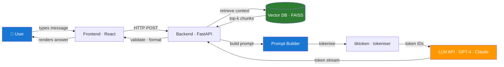

# Day 1 — LLM Pipeline Map and Model Basics — Learn & Revise

> **Pre-reading:** [Week 1 Overview](./index.md) · [Learning and Revision Plan](../index.md)

---

## 🎯 What You'll Master Today

Large Language Models power a huge range of modern applications, but they don't run magic — every
response follows a deterministic, traceable pipeline you can inspect and control. Today you'll learn
how tokens flow from your user's keyboard through an API all the way to a generated answer, why the
choice between a base model and an instruct model matters more than most people think, and how to
estimate and manage token costs before they surprise you in production.

---

## 📖 Core Concepts

### Transformer Architecture — A Practical View

You don't need to memorise every equation in the
original ["Attention is All You Need"](https://papers.nips.cc/paper_files/paper/2017/file/3f5ee243547dee91fbd053c1c4a845aa-Paper.pdf)
paper, but you do need to explain the mechanism confidently in an interview.
A Transformer processes text by first breaking it into **tokens** (sub-word fragments), converting
each token into a numerical vector,
and then running those vectors through a stack of **attention layers**. Each attention layer lets
every token look at every other token and decide how much to "attend" to it — this is how the model
understands that "bank" in "river bank" means something different from "bank" in "bank account".

The **context window** is the total number of tokens the model can hold in memory at once — both
input and output combined. GPT-4 Turbo has a 128k-token window; Claude 3 Sonnet supports 200k. Once
you exceed the window, the model simply cannot see text outside it. This is the single most
important architectural constraint to keep in mind when designing prompts and pipelines.

Layers accumulate knowledge from pre-training: the earlier layers learn syntax and grammar, deeper
layers encode facts and reasoning patterns. At inference time, none of this changes — the weights
are frozen. All you control is the input (the prompt).

### Base Model vs Instruct / Chat Model

A **base model** is the raw output of pre-training on a large corpus of internet text. It is a
brilliant text-completion engine: give it a sentence and it predicts the next token. It has no sense
of "user" or "assistant" and will happily complete a dangerous sentence if that's what the training
distribution says comes next.

An **instruct model** (also called a chat model) is the same weights, but fine-tuned further using *
*RLHF** (Reinforcement Learning from Human Feedback) and **SFT** (Supervised Fine-Tuning). This
training teaches the model to follow instructions, refuse harmful requests, maintain a
conversational role, and produce structured outputs when asked.

In practice: use an instruct/chat model for any user-facing product. Use a base model only if you
are doing your own fine-tuning or probing for raw next-token probabilities in research.

### The Full Prompt-Response Lifecycle

Here is what actually happens end-to-end when a user sends a message to your LLM-powered app:

1. User input — The user types a message in the UI.

2. Request handling — The frontend sends the message to your backend/API layer.

3. Input pre-processing — Your backend validates the request, checks auth/session, applies rate
   limits, sanitises or normalises the input if needed, and may apply safety checks or query
   rewriting.

4. Retrieval, if using RAG — The backend converts the user query into an embedding or search query,
   retrieves relevant documents or chunks from a vector database/search index, optionally reranks
   them, and selects the best context.

5. Prompt construction — Your backend builds the final prompt by assembling system instructions,
   application rules, chat history, retrieved context, and the user message.

6. Tokenisation — The final prompt is converted into token IDs using the model's tokenizer, such as
   `tiktoken`-style BPE for OpenAI models or SentencePiece/BPE-style tokenizers for many
   open-source models.

7. Model/API call — The request is sent to the model endpoint, such as OpenAI, Anthropic, or your
   hosted vLLM server. In most hosted APIs, your app sends text/messages, and the provider handles
   tokenisation internally.

8. Model inference — The Transformer runs forward passes, producing a probability distribution over
   the vocabulary. It selects the next token using greedy decoding or sampling, appends it, and
   repeats until it hits a stop token, stop sequence, or max token limit.

9. De-tokenisation — Generated token IDs are converted back into text.

10. Output post-processing — Your backend validates the output, parses JSON if required, applies
    length checks/content filters, formats the response for the UI, and logs the trace.

11. Response — The formatted answer reaches the user.

Every one of these steps is an opportunity for failure and a lever for improvement. Senior engineers
know which step to inspect first when quality drops.

### Tokenisation — Why Tokens Are Your Currency

A **token** is roughly 4 characters or ¾ of a word in English. The word "unhelpfulness" is 2–3
tokens; a Chinese character is often 1 token but corresponds to fewer characters. Whitespace,
punctuation, and special characters all consume tokens.

Why does this matter?

- **Cost** — OpenAI charges per 1,000 tokens (input + output). A prompt with 2,000 input tokens
  costs 4× more than one with 500.
- **Quality** — A very long prompt may push important instructions towards the edge of the context
  window where attention is weaker.
- **Latency** — More tokens = more time to generate a response, even with streaming.

Rule of thumb: `len(text) / 4` gives a rough token estimate. For exact counts, use `tiktoken`.

### API Models vs Hosted Models — Tradeoffs

| Dimension         | API Models (GPT-4, Claude, Gemini)    | Hosted Models (Ollama, vLLM, TGI)                   |
|-------------------|---------------------------------------|-----------------------------------------------------|
| **Setup time**    | Minutes — just an API key             | Hours to days — GPU provisioning required           |
| **Cost model**    | Per-token pay-as-you-go               | Fixed infra cost; cheap at scale                    |
| **Data privacy**  | Data leaves your network              | Fully on-premises                                   |
| **Model quality** | Best-in-class frontier models         | Smaller; rapidly closing the gap (Llama 3, Mistral) |
| **Latency**       | Network round-trip; ~200ms–2s         | Local GPU; can be lower with batching               |
| **Customisation** | Prompt engineering + fine-tuning APIs | Full access: LoRA, quantisation, custom serving     |
| **Compliance**    | Subject to provider TOS               | Full control                                        |

**Decision rule:** Start with API models for prototyping. Switch to hosted when (a) data privacy is
required, (b) your monthly token spend exceeds ~$2k, or (c) you need fine-tuning below the
provider's API level.

---

## 🗺️ Architecture / How It Works




## ⚡ Key Facts — Quick Revision Table

| Concept            | One-Line Definition                                         | Why It Matters                                               |
|--------------------|-------------------------------------------------------------|--------------------------------------------------------------|
| **Token**          | Smallest unit of text a model processes (~4 chars)          | Drives cost, latency, and context-window limits              |
| **Context window** | Max token capacity for input + output combined              | Hard limit — exceeding it silently truncates your prompt     |
| **Attention**      | Mechanism that weighs how much each token influences others | Why transformers understand long-range dependencies          |
| **Base model**     | Pre-trained weights with no instruction fine-tuning         | Raw completion; must be fine-tuned before user-facing deploy |
| **Instruct model** | Base model + RLHF/SFT to follow instructions                | Safe default for all chat/task applications                  |
| **RLHF**           | Training using human preference rankings                    | Key technique that makes models helpful and safe             |
| **tiktoken**       | OpenAI's tokeniser library (Python)                         | Exact token counting for cost estimation                     |
| **vLLM**           | High-throughput LLM inference server                        | Open-source; 3–24× faster serving via PagedAttention         |
| **Ollama**         | Local LLM runner for dev/testing                            | Simplest way to run Llama 3 or Mistral locally               |
| **Temperature**    | Sampling randomness parameter (0 = deterministic)           | Set low for factual tasks; higher for creative tasks         |

---

## 🔬 Deep Dive — Tokenisation and Cost Estimation

Understanding token costs before you write a single line of code is what separates a professional AI
engineer from a hobbyist. Here is a concrete worked example.

**Scenario:** You're building a customer support bot. Your system prompt is 300 tokens, you retrieve
3 chunks of 200 tokens each, the user message is 50 tokens, and the response averages 150 tokens.

```
Input tokens  = 300 (system) + 600 (context) + 50 (user)  = 950
Output tokens = 150
Total         = 1,100 tokens per turn
```

At GPT-4 Turbo pricing ($0.01 / 1k input, $0.03 / 1k output):

```
Cost per turn = (950 / 1000 × $0.01) + (150 / 1000 × $0.03)
             = $0.0095 + $0.0045
             = $0.014 per turn
```

At 10,000 turns/day: **$140/day** or ~**$4,200/month**. Trimming your system prompt from 300 to 150
tokens saves ~$630/month at that scale.

### Python — Call OpenAI and Count Tokens

```python
import openai
import tiktoken

client = openai.OpenAI()  # uses OPENAI_API_KEY from env

MODEL = "gpt-4-turbo"
ENCODING = tiktoken.encoding_for_model(MODEL)


def count_tokens(text: str) -> int:
  return len(ENCODING.encode(text))


system_prompt = """You are a helpful customer support agent.
Answer only from the provided context.
If the answer is not in the context, say 'I don't know'.
"""

user_message = "How do I reset my password?"

# Count before sending
input_tokens = count_tokens(system_prompt) + count_tokens(user_message)
print(f"Estimated input tokens: {input_tokens}")

response = client.chat.completions.create(
    model=MODEL,
    messages=[
      {"role": "system", "content": system_prompt},
      {"role": "user", "content": user_message},
    ],
    max_tokens=300,
    temperature=0.2,
)

answer = response.choices[0].message.content
actual_usage = response.usage

print(f"Answer: {answer}")
print(f"Actual tokens — input: {actual_usage.prompt_tokens}, "
      f"output: {actual_usage.completion_tokens}, "
      f"total: {actual_usage.total_tokens}")
```

!!! tip "Always log `response.usage`"
The API returns exact token counts. Log them in production so you can track cost trends over time
and alert when individual calls spike unexpectedly.

!!! warning "tiktoken vs model tokeniser"
`tiktoken` is accurate for OpenAI models. For open-source models (Llama, Mistral), use
`transformers.AutoTokenizer` from Hugging Face instead — different vocabularies produce different
counts.

---

## 🧪 Practice Drills

| Lab                      | Task                                                 | Step-by-Step Guidance                                                                                                                                                                                                                 | Deliverable                                        |
|--------------------------|------------------------------------------------------|---------------------------------------------------------------------------------------------------------------------------------------------------------------------------------------------------------------------------------------|----------------------------------------------------|
| **Token Budget Drill**   | Estimate and validate token usage for 5 real prompts | 1. Write 5 prompts of varying length. 2. Run `count_tokens()` on each. 3. Send to API and compare with `response.usage`. 4. Calculate cost at GPT-4 Turbo pricing.                                                                    | CSV: prompt, estimated tokens, actual tokens, cost |
| **Architecture Sketch**  | Create a system diagram for LLM app flow             | 1. Draw the 8-step lifecycle on paper first. 2. Translate to a Mermaid diagram. 3. Label each arrow with what data crosses it. 4. Add a failure mode note for 3 steps.                                                                | Mermaid diagram in a `.md` file                    |
| **Model Selection Note** | Write a 1-page model selection recommendation        | 1. Pick a real use case (e.g., legal contract review). 2. List your requirements: privacy, cost ceiling, quality bar. 3. Evaluate 3 models against the table criteria above. 4. Write a 3-sentence recommendation with justification. | Markdown doc                                       |

---

## 💬 Interview Q&A

??? question "What happens when a prompt exceeds the context window?"
**Model Answer:**
When the combined token count of your prompt and expected output exceeds the model's context window,
one of two things happens: the API returns an error (`context_length_exceeded`), or — more
dangerously — the system silently truncates the oldest tokens from the beginning of the prompt.
Silent truncation means your system instructions or critical context can be quietly dropped, leading
to wrong or hallucinated answers with no obvious error signal. The correct mitigation is to (a)
count tokens before every API call, (b) implement a truncation strategy that always preserves the
system prompt and prioritises the most recent context, and (c) monitor
`response.usage.prompt_tokens` in production.

    **Why this matters:**
    Many candidates know what a context window *is*, but interviewers want to see you understand the *failure mode* and how you'd defend against it in production code.

??? question "How do you choose between a base model and an instruct model?"
**Model Answer:**
For almost all production applications — chatbots, Q&A, summarisation, structured extraction — you
should use an **instruct model**. It is trained to follow instructions, maintain a system prompt
persona, and refuse harmful requests. A base model is only appropriate when you are: (1) building
your own instruction fine-tuning dataset and need a clean foundation, (2) running specific research
on next-token distributions, or (3) doing few-shot completion in a very constrained format where
instruction-following adds noise. Using a base model in a user-facing product without extensive
fine-tuning is a common beginner mistake that leads to unsafe or incoherent outputs.

    **Why this matters:**
    This is a classic screening question. The correct answer demonstrates you understand the fine-tuning pipeline, not just the API surface.

??? question "What are the cost implications of long prompts, and how do you manage them?"
**Model Answer:**
Long prompts increase cost in three ways: higher per-call input token charges, longer generation
time, and the need for larger context windows. I manage this by: (1) **auditing system prompts**
monthly — trim redundant instructions; (2) **compressing retrieved context** — use a re-ranker to
pass only the top-1 or top-2 chunks instead of top-5; (3) **caching repeated context** — OpenAI and
Anthropic both offer prompt caching for repeated prefixes, reducing cost by up to 90% for static
system prompts; (4) **setting `max_tokens`** deliberately rather than relying on the model to stop
itself.

    **Why this matters:**
    Cost management is a production engineering concern. Interviewers at growth-stage companies especially want to see you think beyond "it works" to "it works *and* it's economical at scale."

---

## ✅ End-of-Day Checklist

| Item                                                      | Status |
|-----------------------------------------------------------|--------|
| Can explain transformer attention in plain language       | ☐      |
| Can describe all 8 steps of the prompt-response lifecycle | ☐      |
| Can explain base vs instruct model and when to use each   | ☐      |
| Token Budget Drill completed and CSV saved                | ☐      |
| Architecture Sketch diagram created                       | ☐      |
| Model Selection Note written                              | ☐      |
| One 60-second interview answer recorded                   | ☐      |
| One weak area logged for revision                         | ☐      |

--8<-- "_abbreviations.md"
