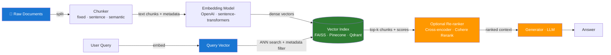

# Day 3 — Embeddings and Vector Retrieval Basics — Learn & Revise

> **Pre-reading:** [Week 1 Overview](./index.md) · [Learning and Revision Plan](../index.md)

---

## 🎯 What You'll Master Today

Search used to mean matching keywords — today it means matching *meaning*. Embeddings turn sentences into numbers, and vector databases search those numbers at scale. Today you'll learn how embeddings work, how to choose and tune a chunking strategy, and how to pick the right vector index for your use case. You'll also learn to diagnose retrieval failures — the most common cause of bad RAG answers — before they reach your users.

---

## 📖 Core Concepts

### What Embeddings Are — Dense Vectors and Semantic Meaning

An **embedding** is a list of numbers (a vector) that represents the meaning of a piece of text. A typical embedding model produces a vector of 768 or 1,536 floating-point numbers. The key property: texts with similar meaning end up with similar vectors, even if they use different words.

For example, "How do I cancel my subscription?" and "I want to terminate my account" will produce vectors that are close together in the embedding space, even though they share no content words. This is what makes semantic search powerful — users don't need to use the exact words that appear in your documents.

Embeddings are learned during model training: the model is trained to produce similar vectors for texts that appear in similar contexts across a large corpus. At inference time, you run your text through the model's encoder and get a fixed-size vector back — no generation, just a fast forward pass.

**Cosine similarity** is the standard metric for comparing two embedding vectors. It measures the angle between them (0 = perpendicular → unrelated; 1 = same direction → identical meaning). Distance metrics like Euclidean are also used but cosine is preferred for text because it's invariant to vector magnitude.

```
cosine_similarity(A, B) = (A · B) / (||A|| × ||B||)
```

A similarity score above ~0.8 is generally considered a good match for retrieval; below ~0.6 is likely irrelevant. The exact thresholds depend on your embedding model and domain.

### Embedding Models — Tradeoffs

| Model | Dimensions | Context (tokens) | Cost | Best For |
|---|---|---|---|---|
| **OpenAI `text-embedding-3-small`** | 1,536 | 8,191 | $0.02/1M tokens | General purpose; excellent quality/cost ratio |
| **OpenAI `text-embedding-3-large`** | 3,072 | 8,191 | $0.13/1M tokens | Higher quality at higher cost; multilingual |
| **`sentence-transformers/all-MiniLM-L6-v2`** | 384 | 512 | Free (local) | Dev/testing; very fast; lower quality |
| **`BAAI/bge-large-en-v1.5`** | 1,024 | 512 | Free (local) | Strong open-source alternative |
| **`nomic-embed-text`** | 768 | 8,192 | Free (local via Ollama) | Long documents; on-premises |

**Key tradeoffs:**
- Larger dimensions → better accuracy, more storage, slower ANN search
- Smaller context window → you must chunk longer documents before embedding
- Local models → no API cost, no data leaves your network, but require GPU for production throughput

### Chunking Strategies — How You Split Documents Matters

Before you embed a document, you must split it into chunks — because embedding models have token limits and because smaller, focused chunks retrieve more precisely.

**Fixed-size chunking** splits on token count with an optional overlap. Simple to implement. Works well for uniform-format documents (FAQs, structured reports). Fails on complex documents: a chunk may cut mid-sentence, splitting context that belongs together.

```python
# chunk_size=512 tokens, overlap=50 tokens
chunks = [text[i:i+512] for i in range(0, len(text), 512-50)]
```

**Sentence-boundary chunking** splits on sentence endings, then groups sentences until a token budget is filled. Produces more coherent chunks. Better for prose-heavy documents (articles, legal text, documentation).

**Semantic chunking** uses an embedding model to detect topic shifts — if adjacent sentences become significantly less similar, start a new chunk. Most faithful to the document's logical structure. Higher computational cost; harder to tune. Best for complex documents where topic shifts are frequent and meaningful (research papers, long-form reports).

**Rule of thumb for chunk size:**
- Q&A / chatbot: 256–512 tokens — precise, focused answers
- Summarisation: 1,024–2,048 tokens — need more context per chunk
- Legal / technical documents: sentence-boundary or semantic chunking regardless of size

!!! tip "Always add overlap"
    A 10–20% overlap between adjacent chunks (e.g., last 50 tokens of chunk N become the first 50 of chunk N+1) prevents answers that span chunk boundaries from being missed. Without overlap, a relevant sentence at a chunk boundary may be split and lost.

### Vector Indexes — Speed vs Accuracy Tradeoffs

| Index Type | How It Works | Speed | Accuracy | Best For |
|---|---|---|---|---|
| **Flat (brute-force)** | Compare query to every stored vector | Slow at scale | 100% recall | <100k vectors; dev/testing |
| **HNSW** (Hierarchical Navigable Small World) | Graph-based approximate nearest-neighbour | Very fast | ~95–99% recall | Most production use cases |
| **IVF** (Inverted File Index) | Cluster vectors; search only relevant clusters | Fast | ~90–95% recall | Very large indexes (>10M vectors) |
| **IVF-PQ** | IVF + product quantisation for compression | Very fast | ~85–90% recall | Huge indexes with memory constraints |

**FAISS** (Facebook AI Similarity Search) implements all of these and is the most common open-source choice. **Pinecone**, **Weaviate**, **Qdrant**, and **Chroma** are managed/embedded alternatives that add metadata filtering, persistence, and hybrid search on top.

### Top-k and Similarity Threshold Tuning

**Top-k** is the number of chunks the retriever returns. Increasing k:

- ↑ Recall — more likely to include the relevant chunk
- ↑ Context size — more tokens consumed in the prompt
- ↑ Noise — more irrelevant chunks that confuse the generator

**Similarity threshold** is a minimum score cutoff. If the top result scores below the threshold, return nothing (or trigger a fallback). Setting it:

- Too high → misses relevant chunks that are phrased differently ("low recall")
- Too low → returns irrelevant chunks that corrupt the answer ("low precision")

The right values are dataset-specific. Start with `k=5`, threshold=0.75, then evaluate on a golden set and tune.

### Metadata Filtering — Combining Dense Search with Structured Filters

Pure vector search retrieves by semantic similarity alone. In production, you almost always want to combine it with structured filters:

- "Find the most relevant chunks, **but only from documents in the `billing` category**"
- "Retrieve relevant passages, **but only from the last 6 months**"

All major vector databases support pre-filter or post-filter metadata fields. Pre-filter (narrow the search space before ANN) is faster; post-filter (run ANN then filter results) is simpler to implement.

### Common Retrieval Failure Modes

| Failure Mode | Symptom | Root Cause | Fix |
|---|---|---|---|
| **Wrong chunk boundaries** | Answer splits across chunks; neither chunk contains the full info | Fixed-size chunker cut mid-paragraph | Switch to sentence-boundary or increase overlap |
| **Poor embedding model** | Semantically similar queries miss relevant chunks | Model wasn't trained on your domain | Fine-tune or switch to a domain-specific model |
| **Threshold too high** | System says "I don't know" even when docs exist | Relevant chunk scores below threshold | Lower threshold; evaluate on golden set |
| **k too small** | Relevant chunk ranked 4th; you only retrieve top-3 | Retrieval recall is low | Increase k; add re-ranker |
| **Missing metadata filters** | Results from wrong time range or category contaminate context | No structured filters applied | Add metadata to chunks and filter at query time |
| **Query-document mismatch** | Queries are questions; documents are declarative statements | Asymmetric embedding space | Use instruction-tuned embedding models (e.g. `bge`, `e5`) |

---

## 🗺️ Architecture / How It Works



---

## ⚡ Key Facts — Quick Revision Table

| Concept | One-Line Definition | Why It Matters |
|---|---|---|
| **Embedding** | Fixed-size dense vector representing the semantic meaning of text | Enables semantic search regardless of exact wording |
| **Cosine similarity** | Angle-based similarity between two vectors (0–1) | Standard metric for comparing embeddings |
| **Chunking** | Splitting documents into smaller pieces before embedding | Required by token limits; chunk quality directly affects retrieval quality |
| **Overlap** | Repeated tokens between adjacent chunks | Prevents answers that span chunk boundaries from being lost |
| **HNSW** | Graph-based approximate nearest-neighbour index | Best all-round choice for production vector search |
| **FAISS** | Facebook's open-source vector similarity library | Most common local vector index; supports flat, HNSW, IVF |
| **Top-k** | Number of chunks returned by the retriever | Tune to balance recall vs context noise |
| **Similarity threshold** | Minimum cosine score to include a result | Prevents irrelevant chunks from polluting context |
| **Metadata filtering** | Structured filters applied alongside vector search | Enables scoped retrieval (by date, category, etc.) |
| **Re-ranker** | Second-stage model that scores query-chunk relevance more precisely | Improves precision; catches ranking errors from fast ANN search |

---

## 🔬 Deep Dive — Embed, Index, and Query with FAISS

```python
from sentence_transformers import SentenceTransformer
import faiss
import numpy as np

# 1. Load embedding model
model = SentenceTransformer("all-MiniLM-L6-v2")  # 384-dim, fast, good for dev

# 2. Prepare documents (already chunked)
chunks = [
    "Acme Corp was founded in 1985 and specialises in consumer electronics.",
    "To reset your password, visit account.acme.com and click 'Forgot Password'.",
    "Refunds are processed within 5–7 business days to the original payment method.",
    "Our support team is available Monday to Friday, 9am–6pm EST.",
    "The Acme X200 model supports USB-C charging and has a 48-hour battery life.",
]

metadata = [
    {"source": "about.pdf",   "category": "company"},
    {"source": "faq.pdf",     "category": "account"},
    {"source": "policy.pdf",  "category": "billing"},
    {"source": "support.pdf", "category": "support"},
    {"source": "x200.pdf",    "category": "product"},
]

# 3. Embed all chunks
chunk_embeddings = model.encode(chunks, normalize_embeddings=True)
# normalize=True makes cosine similarity equivalent to dot product → faster FAISS search

# 4. Build FAISS index (flat = exact search; fine for small corpora)
dim = chunk_embeddings.shape[1]  # 384
index = faiss.IndexFlatIP(dim)   # Inner Product on normalised vectors = cosine similarity
index.add(chunk_embeddings.astype(np.float32))

print(f"Index contains {index.ntotal} vectors")

# 5. Query
def retrieve(query: str, k: int = 3, threshold: float = 0.5):
    q_vec = model.encode([query], normalize_embeddings=True).astype(np.float32)
    scores, indices = index.search(q_vec, k)

    results = []
    for score, idx in zip(scores[0], indices[0]):
        if score >= threshold:
            results.append({
                "chunk": chunks[idx],
                "score": float(score),
                "metadata": metadata[idx],
            })
    return results

# Test
hits = retrieve("How long does a refund take?", k=3, threshold=0.5)
for hit in hits:
    print(f"[{hit['score']:.3f}] ({hit['metadata']['source']}) {hit['chunk'][:80]}...")
```

!!! tip "Switch to `IndexHNSWFlat` for scale"
    For indexes with >100k vectors, replace `IndexFlatIP` with `faiss.IndexHNSWFlat(dim, 32)`. This gives sub-millisecond search at the cost of ~1–5% recall drop. The `32` is the number of HNSW connections per node — increase for better accuracy, at the cost of memory.

!!! warning "Don't skip normalisation"
    `normalize_embeddings=True` is critical when using `IndexFlatIP` (inner product) to approximate cosine similarity. Without normalisation, your scores are dot products, which are biased by vector magnitude — long documents get artificially boosted.

---

## 🧪 Practice Drills

| Lab | Task | Step-by-Step Guidance | Deliverable |
|---|---|---|---|
| **Chunking Benchmark** | Compare 3 chunk strategies on same corpus | 1. Take a 5-page document. 2. Chunk with: (a) 256 fixed, (b) 512 fixed + 50 overlap, (c) sentence-boundary. 3. Embed each set. 4. Write 10 queries and measure how often the relevant chunk is in top-3 for each strategy. | Table with strategy, parameters, recall proxy score |
| **Retriever Tuning** | Tune top-k and threshold for a QA set | 1. Build a golden set of 20 query-answer pairs with ground-truth chunk IDs. 2. Vary k (1, 3, 5, 10) and threshold (0.4, 0.6, 0.8). 3. Measure recall@k for each combination. 4. Pick the setting maximising recall without exceeding your context budget. | Config file with chosen values and tuning notes |

---

## 💬 Interview Q&A

??? question "How does cosine similarity work with embeddings, and why is it preferred over Euclidean distance?"
    **Model Answer:**
    Cosine similarity measures the angle between two vectors in high-dimensional space, not their absolute distance. It returns a value between -1 and 1 (or 0 and 1 for normalised vectors), where 1 means identical direction — semantically identical texts — and 0 means orthogonal — unrelated. Euclidean distance is affected by vector magnitude: a sentence that's repeated twice will have a larger magnitude L2 norm but isn't more semantically "important." Cosine similarity ignores magnitude, which is exactly what we want for text — we care about meaning, not length. In practice, normalising embeddings to unit length lets you use dot product (which FAISS optimises extremely well via IndexFlatIP) as an exact substitute for cosine similarity, giving you both mathematical correctness and index speed.

    **Why this matters:**
    This is a common first question in retrieval interviews. Candidates who say "we use cosine because it's standard" without being able to explain *why* fail to demonstrate actual understanding.

??? question "What chunking strategy would you choose for a corpus of 50-page legal contracts?"
    **Model Answer:**
    For legal contracts, I'd use **sentence-boundary chunking** with a target size of 512 tokens and 15% overlap. Fixed-size chunking is dangerous here because legal language is dense — a clause that begins on line 40 may complete its meaning on line 45, and a hard split destroys that logical unit. Sentence-boundary chunking respects grammatical completeness and keeps clauses together. I'd add overlap because legal cross-references ("as defined in Section 3.2") need sentence context from both sides to be useful. I would also extract document metadata — section headers, clause numbers, party names — and attach it to each chunk so users can filter by section and I can include it in citation strings. For contracts with consistent structure (Definitions, Obligations, Termination), I'd also consider section-aware chunking: split on section headers first, then sentence-boundary within each section.

    **Why this matters:**
    Domain-specific chunking decisions demonstrate that you understand retrieval quality holistically, not just algorithmically.

??? question "How do you debug a RAG system with low retrieval recall?"
    **Model Answer:**
    I follow a systematic three-step process. First, **inspect the raw retrieval results** for a sample of failing queries — look at the actual similarity scores and chunk content returned. If the scores are low (below 0.6), the problem is likely the embedding model or chunk quality. If the scores look reasonable but the chunks are wrong, the issue may be that the relevant information spans chunk boundaries. Second, **test the embedding model** directly: embed a failing query and its expected answer passage, compute cosine similarity — if it's below 0.7, the model may be a poor fit for your domain. Third, **check the index parameters**: is k high enough? Is the similarity threshold too aggressive? I'd run a recall@k evaluation on a golden set of 20–50 question-chunk pairs to get a quantitative baseline before and after any changes. The most common quick wins are: increasing overlap, lowering the threshold slightly, and switching to a better embedding model.

    **Why this matters:**
    Debugging retrieval is the most important skill for RAG engineers. Interviewers want to see a structured debugging mindset, not guessing.

---

## ✅ End-of-Day Checklist

| Item | Status |
|---|---|
| Can explain cosine similarity intuitively and mathematically | ☐ |
| Can compare the 3 main chunking strategies and choose correctly | ☐ |
| Can describe HNSW vs flat vs IVF tradeoffs | ☐ |
| FAISS code example written and tested locally | ☐ |
| Chunking Benchmark lab completed with comparison table | ☐ |
| Retriever Tuning lab completed with chosen config | ☐ |
| Can name at least 4 retrieval failure modes and their fixes | ☐ |
| One 60-second interview answer recorded | ☐ |
| One weak area logged for revision | ☐ |

--8<-- "_abbreviations.md"
