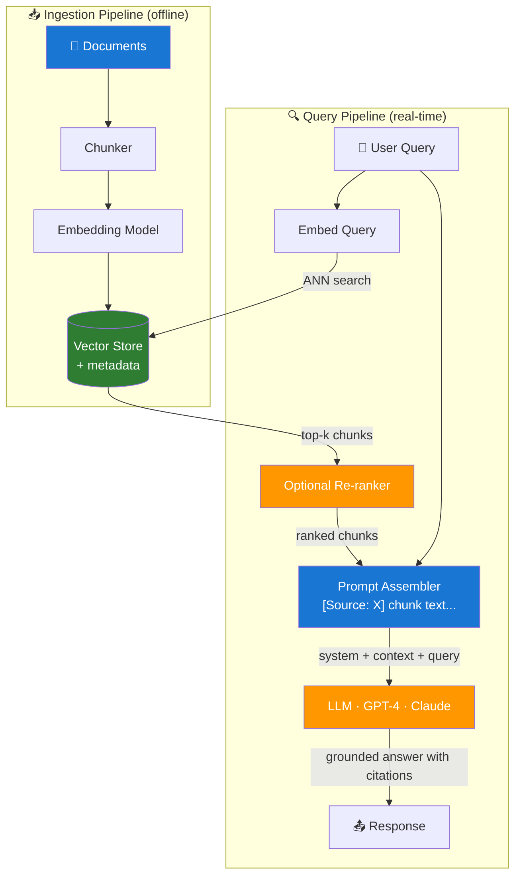

# Day 4 — RAG Architecture and Citation Grounding — Learn & Revise

> **Pre-reading:** [Week 1 Overview](./index.md) · [Learning and Revision Plan](../index.md)

---

## 🎯 What You'll Master Today

Retrieval-Augmented Generation is the dominant pattern for building trustworthy LLM applications over private or up-to-date data. Today you'll learn the complete RAG pipeline end-to-end — from ingesting documents to generating a cited answer — and understand how each component affects quality. You'll also learn the difference between naive RAG and Advanced RAG techniques like HyDE and re-ranking, and how to make the model cite its sources reliably.

---

## 📖 Core Concepts

### The Classic RAG Pipeline — End-to-End

RAG has two distinct phases: **ingestion** (happens once, or on a schedule) and **query** (happens on every user request).

**Ingestion phase:**

1. **Ingest** — Load raw documents (PDFs, web pages, databases, etc.)
2. **Chunk** — Split documents into appropriately-sized pieces (see Day 3 for strategy)
3. **Embed** — Convert each chunk to a dense vector using an embedding model
4. **Store** — Write vectors + metadata + original text to a vector database

**Query phase:**

5. **Receive query** — User asks a question
6. **Retrieve** — Embed the query; run ANN search against the vector store; return top-k chunks with scores
7. **Augment** — Assemble the retrieved chunks into a context block; inject into the prompt alongside the user query
8. **Generate** — LLM generates an answer grounded in the context
9. **Return** — Deliver the answer to the user, optionally with citations

Every step is a quality lever. Getting one step wrong — coarse chunks, wrong embedding model, a prompt that doesn't instruct citation — can produce bad answers even when every other step is correct.

### Prompt Augmentation — Injecting Retrieved Context

The way you inject retrieved chunks into your prompt significantly affects answer quality. The standard pattern:

```
System: You are a helpful assistant. Answer ONLY from the context below.
        If the answer is not in the context, say "I don't know."
        Always cite the source document name for each claim.

Context:
[Source: policy.pdf]
Refunds are processed within 5–7 business days to the original payment method.

[Source: faq.pdf]
To reset your password, visit account.acme.com and click 'Forgot Password'.

Question: How long do refunds take?
```

Key decisions here:

- **Source labels** — Include `[Source: filename]` before each chunk so the model can reference it
- **Order of chunks** — Most relevant first (the model pays more attention to early context)
- **Context length** — Enough chunks to cover the answer, but not so many that relevant information is diluted
- **Instruction clarity** — The "answer only from context" instruction is critical; without it the model mixes retrieved content with its parametric knowledge

### Citation Grounding — Attaching Sources to Answers

**Citation grounding** means the answer explicitly references which source document (and ideally which passage) the claim came from. This serves two purposes: user trust (they can verify the claim) and debuggability (you can trace a wrong answer to a bad chunk).

Implementation levels:

| Level | What It Looks Like | How to Implement |
|---|---|---|
| **Document-level** | "According to `policy.pdf`..." | Include source filename in context label |
| **Chunk-level** | Cites specific passage text | Include chunk ID or short excerpt in label |
| **Sentence-level** | Superscript footnotes per sentence | Post-process answer with a second LLM call to assign citations |

For most applications, document-level citation is sufficient and easy to implement. The prompt instruction is: `"For each claim in your answer, include the source document name in square brackets, e.g. [policy.pdf]."`

!!! warning "Models fabricate citations too"
    If you instruct the model to cite sources but it can't find a good answer, it may hallucinate a citation — inventing a plausible-sounding filename. Always validate citations in code: check that every cited source name actually exists in your retrieved chunk set.

### Naive RAG vs Advanced RAG

**Naive RAG** is the basic pipeline above: embed query → retrieve top-k → augment → generate. It works well for clean, well-structured corpora with straightforward questions. It struggles with:

- Complex questions requiring multi-hop reasoning across multiple chunks
- Ambiguous queries that the user expressed poorly
- Dense corpora where many chunks have similar scores but different relevance

**Advanced RAG** techniques address these limitations:

| Technique | What It Does | When To Use |
|---|---|---|
| **Re-ranking** | Second model re-scores query-chunk relevance after retrieval | Always: improves precision with minimal latency cost |
| **Query expansion** | LLM generates multiple paraphrases of the query; retrieve for all | When queries are ambiguous or use unusual terminology |
| **HyDE** (Hypothetical Document Embedding) | LLM generates a "hypothetical answer" and embeds it; use that for retrieval | When query-document asymmetry is high (questions vs statements) |
| **Multi-hop retrieval** | Retrieve → generate intermediate answer → retrieve again | Complex questions requiring chained reasoning |
| **Hybrid search (BM25 + dense)** | Combine keyword search with vector search using RRF | When exact terms matter (product codes, names, jargon) |
| **Contextual compression** | Extract only relevant sentences from each chunk before injection | When chunks are large and mostly irrelevant to the query |

### HyDE — How It Works

HyDE (Hypothetical Document Embedding) solves a fundamental asymmetry: your query is a question ("How long do refunds take?"), but your index contains statements ("Refunds are processed within 5–7 business days..."). These may not embed close together despite being semantically related.

HyDE's insight: generate a *hypothetical answer* to the query using the LLM, then embed *that* for retrieval. The hypothetical answer will be a statement that's much closer in embedding space to the actual answer in the corpus.

```
Query: "How long do refunds take?"
HyDE step: GPT-4 → "Refunds typically take 5-10 business days to appear on your statement."
Embed the hypothetical answer → retrieve against corpus
```

The retrieved chunks will better match the actual answer style, improving recall. The trade-off: an extra LLM call for every query.

### Hallucination Reduction Through Context

The primary mechanism by which RAG reduces hallucination is simple: the model no longer has to rely on its parametric knowledge (frozen training weights) to answer factual questions. If the context contains accurate, relevant information, and the prompt instructs the model to use it, the model will use it.

But RAG does not eliminate hallucination — it reduces it. Hallucination still occurs when:

- **The relevant chunk is not retrieved** — the model falls back to its weights
- **The context is misleading or ambiguous** — the model misinterprets a chunk
- **The model ignores the context** — this happens with poorly-written prompts or very long contexts where relevant chunks are "lost in the middle"

This is why evaluation (Day 5) is essential.

---

## 🗺️ Architecture / How It Works



---

## ⚡ Key Facts — Quick Revision Table

| Concept | One-Line Definition | Why It Matters |
|---|---|---|
| **Ingestion pipeline** | Offline process: load → chunk → embed → store | Must run before any queries can be answered |
| **Augmentation** | Injecting retrieved chunks into the prompt as context | Quality of augmentation directly determines answer quality |
| **Citation grounding** | Attaching source metadata to each claim in the answer | Enables user trust and enables debugging |
| **Naive RAG** | Basic embed-retrieve-augment-generate pipeline | Works well for clean corpora; struggles with complexity |
| **Re-ranking** | Second-stage precision improvement after initial retrieval | Best bang-for-buck Advanced RAG upgrade |
| **HyDE** | Generate hypothetical answer; embed it for retrieval | Fixes query-document embedding asymmetry |
| **Query expansion** | Paraphrase query multiple ways before retrieval | Improves recall for ambiguous queries |
| **Hybrid search** | BM25 keyword + dense vector, merged with RRF | Best of both worlds for corpora with exact-match terms |
| **Contextual compression** | Extract only relevant sentences from each chunk | Reduces context noise; saves tokens |
| **Multi-hop retrieval** | Retrieve → partial answer → retrieve again | Needed for complex, chained questions |

---

## 🔬 Deep Dive — Python RAG Pipeline with Citations

```python
import openai
from sentence_transformers import SentenceTransformer
import faiss
import numpy as np

client = openai.OpenAI()
embed_model = SentenceTransformer("all-MiniLM-L6-v2")

# --- Index (pre-built; see Day 3 for build code) ---
chunks = [
    "Refunds are processed within 5–7 business days to the original payment method.",
    "To reset your password, visit account.acme.com and click 'Forgot Password'.",
    "Our support team is available Monday to Friday, 9am–6pm EST.",
    "The Acme X200 supports USB-C charging and has a 48-hour battery life.",
    "To cancel your subscription, go to Settings > Subscription > Cancel Plan.",
]
sources = ["policy.pdf", "faq.pdf", "support.pdf", "x200-manual.pdf", "faq.pdf"]

embeddings = embed_model.encode(chunks, normalize_embeddings=True).astype(np.float32)
index = faiss.IndexFlatIP(embeddings.shape[1])
index.add(embeddings)

# --- Retrieval ---
def retrieve(query: str, k: int = 3) -> list[dict]:
    q_vec = embed_model.encode([query], normalize_embeddings=True).astype(np.float32)
    scores, indices = index.search(q_vec, k)
    return [
        {"text": chunks[i], "source": sources[i], "score": float(s)}
        for s, i in zip(scores[0], indices[0])
        if s > 0.4
    ]

# --- Context assembly ---
def build_context(hits: list[dict]) -> str:
    parts = []
    for hit in hits:
        parts.append(f"[Source: {hit['source']}]\n{hit['text']}")
    return "\n\n".join(parts)

# --- Generation with citation instruction ---
SYSTEM_PROMPT = """You are a helpful customer support assistant for Acme Corp.

Answer ONLY from the context provided below. Do not use your general knowledge.
For every factual claim in your answer, cite the source document in square brackets, e.g. [policy.pdf].
If the answer is not in the context, say: "I don't have that information in my knowledge base."
Keep your answer concise — under 100 words unless the user requests more detail.
"""

def rag_answer(query: str) -> dict:
    hits = retrieve(query, k=3)
    if not hits:
        return {"answer": "I don't have that information in my knowledge base.", "sources": []}

    context = build_context(hits)
    cited_sources = list({h["source"] for h in hits})

    response = client.chat.completions.create(
        model="gpt-4-turbo",
        messages=[
            {"role": "system", "content": SYSTEM_PROMPT},
            {"role": "user", "content": f"Context:\n{context}\n\nQuestion: {query}"},
        ],
        temperature=0.1,
        max_tokens=300,
    )

    answer_text = response.choices[0].message.content

    # Validate: check that every cited source in the answer is in our retrieved set
    for source in cited_sources:
        if source not in answer_text:
            pass  # model may not always cite; that's OK; we flag fabricated citations below

    fabricated = [
        word for word in answer_text.split()
        if word.endswith(".pdf]") and word.strip("[]") not in cited_sources
    ]
    if fabricated:
        answer_text += f"\n\n⚠️ Warning: model cited {fabricated} which was not retrieved."

    return {"answer": answer_text, "sources": cited_sources}

result = rag_answer("How long does a refund take?")
print(result["answer"])
print("Sources:", result["sources"])
```

!!! note "Citation validation is essential"
    The code above adds a basic fabricated-citation check. In production, make this more robust: use regex to extract all `[filename.ext]` patterns from the answer, then assert each is in the retrieved source list.

!!! tip "Put most-relevant chunk first"
    Research shows LLMs pay more attention to the beginning and end of their context. Sort chunks by descending score and put the highest-scoring chunk first in your context block to maximise the chance the model uses it.

---

## 🧪 Practice Drills

| Lab | Task | Step-by-Step Guidance | Deliverable |
|---|---|---|---|
| **Mini RAG QA** | Implement retrieval + citation generation | 1. Use the code above as a scaffold. 2. Replace with your own corpus (5+ documents). 3. Write 10 test questions. 4. Check that each answer cites a real source from the retrieved set. 5. Record which questions produce correct vs incorrect citations. | Working script + sample outputs for 10 questions |
| **No-Hit Safety Flow** | Add graceful response when context is insufficient | 1. Identify what "no hit" looks like: empty results OR all scores below threshold. 2. For no-hit: return a canned "I don't have that information" response without calling the LLM. 3. Log the unanswered query to a "gap" file for corpus expansion. 4. Test with 10 out-of-scope questions. | Decision logic code + 10 test transcripts |

---

## 💬 Interview Q&A

??? question "How does RAG reduce hallucinations compared to a baseline LLM?"
    **Model Answer:**
    RAG reduces hallucination by giving the model accurate, relevant information at inference time so it doesn't have to rely on its frozen training weights. Without RAG, a question like "What is Acme's refund policy?" forces the model to either draw on parametric memory (which may be wrong or outdated) or fabricate a plausible-sounding policy. With RAG, the actual policy document is injected into the context, and the prompt instructs the model to answer only from it. The remaining hallucination risk comes from three places: the retriever failing to return the relevant chunk, the model misinterpreting an ambiguous chunk, and "lost in the middle" effects where the model ignores context in the middle of long prompts. These are why evaluation and debugging are essential even with a working RAG pipeline.

    **Why this matters:**
    Interviewers want to see that you understand RAG as a probabilistic improvement, not a hallucination-proof solution.

??? question "What is HyDE and when would you use it?"
    **Model Answer:**
    HyDE stands for Hypothetical Document Embedding. It addresses a fundamental asymmetry in RAG: the user's query is a question, but the index contains declarative statements. These two forms don't always embed close together even when they're semantically related, causing relevant chunks to rank poorly. HyDE's solution: use the LLM to generate a short hypothetical answer to the query, then embed *that* instead of the raw query for retrieval. Since the hypothetical answer is a statement, it embeds much closer to the real statements in the corpus. I'd use HyDE when: (a) my initial recall@k is poor despite good chunking and embedding, and (b) my queries and documents are stylistically different (questions vs technical documentation). The cost is one extra LLM call per query — about 50–100ms and a few cents at scale.

    **Why this matters:**
    HyDE is a distinguishing concept that shows depth of RAG knowledge beyond the basic pipeline.

??? question "How do you ensure the model cites sources correctly and doesn't fabricate citations?"
    **Model Answer:**
    A three-layer approach. First, **prompt engineering**: include source labels in the context (`[Source: policy.pdf]`) and an explicit instruction to cite the source name for each claim. Second, **API-level structure**: use JSON output format with a `citations` field so the model returns cited sources separately from its answer prose — this is more reliable than extracting citations from inline text. Third, **validation in code**: after generation, extract all cited source names from the response, and check each against the list of retrieved sources. Any citation not in the retrieved set is fabricated — flag or strip it. In production, I log fabricated citations as a quality metric and set an alert if the fabrication rate exceeds 1-2%.

    **Why this matters:**
    Citation correctness is a trust and compliance issue in many enterprise RAG deployments. Interviewers want to see you take it seriously at the engineering level, not just the prompt level.

---

## ✅ End-of-Day Checklist

| Item | Status |
|---|---|
| Can describe all 9 steps of the RAG pipeline | ☐ |
| Can explain how to assemble a context block with source labels | ☐ |
| Can compare Naive RAG vs at least 3 Advanced RAG techniques | ☐ |
| Can explain HyDE without looking it up | ☐ |
| Mini RAG QA lab working with citation validation | ☐ |
| No-Hit Safety Flow implemented and tested | ☐ |
| One 60-second interview answer recorded | ☐ |
| One weak area logged for revision | ☐ |

--8<-- "_abbreviations.md"
