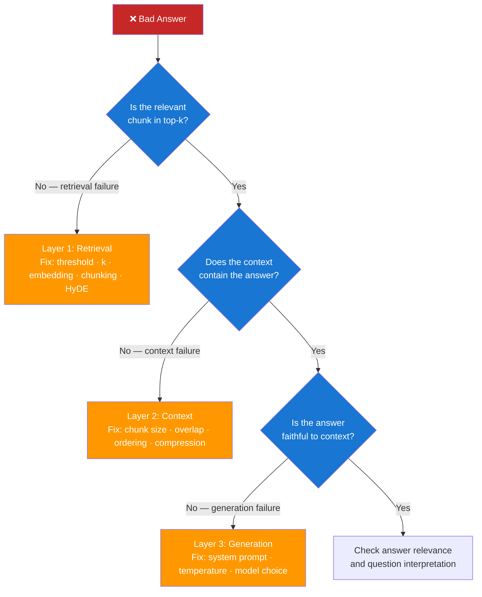

# Day 5 — RAG Quality Debugging — Learn & Revise

> **Pre-reading:** [Week 1 Overview](./index.md) · [Learning and Revision Plan](../index.md)

---

## 🎯 What You'll Master Today

Building a RAG pipeline is the easy part — knowing why it produces bad answers is where the real
engineering begins. Today you'll learn the three failure layers every RAG system can fail at, the
specific metrics for measuring each, and how to run systematic evaluations using the RAGAS
framework. By the end of the day you'll have a debugging mental model you can apply to any RAG
system in any interview or production scenario.

---

## 📖 Core Concepts

### The Three Failure Layers

When a RAG system gives a bad answer, the root cause is always in one of three places. Correctly
identifying the layer determines your fix.

```
Layer 1 — Retrieval failure:  the right chunk was never retrieved
Layer 2 — Context failure:    the right chunk was retrieved but couldn't be used
Layer 3 — Generation failure: context was fine but the LLM produced a wrong answer
```

Diagnosing which layer failed requires looking at each independently. Never jump to tuning the LLM
prompt before confirming retrieval is working.

### Layer 1 — Retrieval Failure

**Definition:** The relevant chunk exists in the corpus but was not returned in the top-k results.

**Symptoms:**

- Answer says "I don't know" but the document clearly contains the answer
- Answer is vague or generic even with specific information in the corpus
- Correct answer appears when you paste the relevant chunk directly into the prompt

**Key metrics:**

| Metric                         | Formula                                                       | What It Measures                       |
|--------------------------------|---------------------------------------------------------------|----------------------------------------|
| **Recall@k**                   | Fraction of queries where the relevant chunk is in top-k      | Did we retrieve the right chunk?       |
| **MRR** (Mean Reciprocal Rank) | Mean of 1/rank of first relevant result                       | How high is the relevant chunk ranked? |
| **Hit Rate**                   | Fraction of queries with at least one relevant chunk in top-k | Basic "did we find anything useful?"   |

**How to diagnose:** For every failing query, inspect the raw retrieval results — the actual chunks
and their similarity scores. If the relevant chunk has a low score or is ranked below k, you have a
retrieval failure.

**Common causes and fixes:**

| Cause                                   | Fix                                                     |
|-----------------------------------------|---------------------------------------------------------|
| Similarity threshold too high           | Lower threshold and re-evaluate                         |
| k too small                             | Increase k (add re-ranker if context size is a concern) |
| Poor embedding model for domain         | Switch to a domain-specific or better model             |
| Chunk boundaries split relevant content | Increase overlap or switch chunking strategy            |
| Query style differs from document style | Add HyDE or query expansion                             |

### Layer 2 — Context Failure

**Definition:** The correct chunk was retrieved, but something about how it's assembled or presented
to the LLM prevents the model from using it.

**Symptoms:**

- Retrieval succeeds (relevant chunk in top-k) but answer is still wrong
- Answer ignores information that's clearly in the context
- Model paraphrases the context inaccurately

**Failure modes:**

| Failure                        | Description                                                        | Fix                                             |
|--------------------------------|--------------------------------------------------------------------|-------------------------------------------------|
| **Chunk too large**            | Chunk contains the answer buried in 500 words of irrelevant text   | Reduce chunk size; use contextual compression   |
| **Chunk too small**            | Answer requires two sentences that were split into separate chunks | Increase chunk size or overlap                  |
| **Irrelevant chunk injection** | Low-quality chunks pollute the context and distract the model      | Increase similarity threshold or add re-ranking |
| **Lost in the middle**         | Relevant chunk is chunk #3 of 5; model ignores middle context      | Reorder: put highest-score chunk first          |
| **No source instruction**      | Model generates from general knowledge instead of context          | Add "Answer ONLY from context" to system prompt |

### Layer 3 — Generation Failure

**Definition:** Retrieval and context assembly are correct, but the LLM generates an incorrect,
incomplete, or unfaithful answer.

**Symptoms:**

- Answer is factually wrong despite the correct chunk being in context
- Answer mixes retrieved information with hallucinated content
- Answer format is wrong despite output instructions

**Key metrics:**

| Metric                | What It Measures                                                       | Range                  |
|-----------------------|------------------------------------------------------------------------|------------------------|
| **Faithfulness**      | Is every claim in the answer supported by the retrieved context?       | 0–1 (higher is better) |
| **Answer Relevance**  | Does the answer actually address the user's question?                  | 0–1                    |
| **Context Precision** | Of the retrieved chunks, what fraction were actually useful?           | 0–1                    |
| **Context Recall**    | Did the retrieved chunks contain all the information needed to answer? | 0–1                    |

### RAG Evaluation Metrics — Deep Dive

**Faithfulness** is the most important metric for production RAG. It measures whether each claim in
the generated answer is grounded in the retrieved context — i.e., can you trace every statement back
to a source passage? A faithfulness score of 0.9 means 90% of claims are grounded; 10% are
hallucinated.

**Answer Relevance** measures whether the answer is pertinent to the question. A model that responds
to "How long do refunds take?" with "Refunds are important for customer satisfaction" has high
faithfulness (it may be grounded) but low answer relevance (it didn't actually answer).

**Context Precision** measures how much of the retrieved context was actually useful. If you
retrieve 5 chunks but only 1 contributed to the answer, precision is low — you're injecting noise.

**Context Recall** measures whether the retrieved chunks contained *all* the information needed. If
the answer requires two facts but only one chunk was retrieved, recall is low.

### RAGAS Framework — Automated RAG Evaluation

**RAGAS** (Retrieval-Augmented Generation Assessment) is an open-source framework that computes all
four metrics above automatically using a combination of LLM-as-judge and embedding-based scoring.
You provide a test set of (question, ground-truth answer, generated answer, retrieved contexts)
tuples and RAGAS returns metric scores.

RAGAS eliminates the need for manual evaluation at scale — you can run it on every code change as a
quality gate.

---

## 🗺️ Architecture / How It Works



---

## ⚡ Key Facts — Quick Revision Table

| Concept                | One-Line Definition                                         | Why It Matters                                         |
|------------------------|-------------------------------------------------------------|--------------------------------------------------------|
| **Retrieval failure**  | Relevant chunk not in top-k results                         | Most common cause of bad RAG answers                   |
| **Context failure**    | Chunk retrieved but not usable by the model                 | Often caused by chunk size or ordering issues          |
| **Generation failure** | LLM ignores or misuses correct context                      | Prompt quality and model choice are the primary levers |
| **Faithfulness**       | Fraction of answer claims grounded in retrieved context     | Primary hallucination detection metric                 |
| **Answer Relevance**   | Whether the answer addresses the user's actual question     | Measures response utility, not just factual accuracy   |
| **Context Precision**  | Fraction of retrieved chunks that contributed to the answer | High noise in context lowers this                      |
| **Context Recall**     | Whether retrieved chunks contained all info needed          | Low recall = retrieval gaps                            |
| **RAGAS**              | Open-source RAG evaluation framework                        | Automates all four metrics on a test set               |
| **Recall@k**           | Fraction of queries with relevant chunk in top-k            | Primary retrieval quality metric                       |
| **Golden set**         | Hand-curated test set of question-answer pairs              | Required for systematic evaluation; build it early     |

---

## 🔬 Deep Dive — Running RAGAS Evaluation

```python
# pip install ragas datasets langchain openai
from ragas import evaluate
from ragas.metrics import (
    faithfulness,
    answer_relevancy,
    context_precision,
    context_recall,
)
from datasets import Dataset

# Your test set: list of dicts with 4 keys
# - question: the user's query
# - answer: what your RAG system generated
# - contexts: list of retrieved chunks (strings)
# - ground_truth: the correct reference answer

test_data = [
    {
        "question": "How long do refunds take?",
        "answer": "Refunds are processed within 5–7 business days [policy.pdf].",
        "contexts": [
            "Refunds are processed within 5–7 business days to the original payment method.",
            "Our support team is available Monday to Friday, 9am–6pm EST.",
        ],
        "ground_truth": "Refunds take 5–7 business days.",
    },
    {
        "question": "How do I reset my password?",
        "answer": "You can reset your password by calling support.",  # hallucinated
        "contexts": [
            "To reset your password, visit account.acme.com and click 'Forgot Password'.",
        ],
        "ground_truth": "Visit account.acme.com and click Forgot Password.",
    },
    {
        "question": "What are the support hours?",
        "answer": "Support is available 24/7.",  # wrong — hallucinated
        "contexts": [
            "Our support team is available Monday to Friday, 9am–6pm EST.",
        ],
        "ground_truth": "Monday to Friday, 9am–6pm EST.",
    },
]

dataset = Dataset.from_list(test_data)

results = evaluate(
    dataset,
    metrics=[faithfulness, answer_relevancy, context_precision, context_recall],
)

print(results)
# Example output:
# {'faithfulness': 0.67, 'answer_relevancy': 0.82, 'context_precision': 0.78, 'context_recall': 0.91}
```

!!! note "RAGAS uses GPT-4 as the judge"
RAGAS makes LLM API calls to evaluate faithfulness and answer relevancy. Budget ~$0.02–0.10 per test
case depending on context size. Use `gpt-4-turbo` for best evaluation accuracy.

!!! tip "Build your golden set early"
Don't wait until the system is broken to create a test set. After building your first version, have
a domain expert annotate 20–50 representative queries with ground-truth answers. This takes 2–3
hours but enables systematic quality tracking from day one.

### Building a Failure Taxonomy

When you get a RAGAS faithfulness score below 0.8, inspect the failures manually and label each:

| Category                | Description                                                    | % of Failures (example) |
|-------------------------|----------------------------------------------------------------|-------------------------|
| **Retrieval miss**      | Correct chunk not retrieved; model guessed                     | 40%                     |
| **Context confusion**   | Multiple similar chunks; model blended them                    | 25%                     |
| **Hallucinated detail** | Answer adds specific numbers/dates not in context              | 20%                     |
| **Scope creep**         | Answer expanded beyond what the question asked                 | 10%                     |
| **Format error**        | Answer correct but format wrong (no citation, wrong structure) | 5%                      |

This taxonomy tells you where to invest: 40% retrieval misses → fix retrieval first. 25% context
confusion → improve chunking or add re-ranking.

---

## 🧪 Practice Drills

| Lab                  | Task                                               | Step-by-Step Guidance                                                                                                                                                                                                                         | Deliverable                                                     |
|----------------------|----------------------------------------------------|-----------------------------------------------------------------------------------------------------------------------------------------------------------------------------------------------------------------------------------------------|-----------------------------------------------------------------|
| **Failure Taxonomy** | Classify 30 failed answers into root-cause buckets | 1. Take your RAG system from Day 4. 2. Generate answers for 30 queries. 3. For each failing answer, manually inspect: was the chunk retrieved? Was it in the context? Was it used? 4. Assign each to Layer 1, 2, or 3. 5. Count distribution. | Annotated spreadsheet with layer labels and fix recommendations |
| **RAGAS Evaluation** | Run RAGAS on a small test set                      | 1. Collect 10 question-answer-context-ground_truth tuples. 2. Run the RAGAS code above. 3. For each metric below 0.8, identify 2 root causes. 4. Apply one fix and re-run to measure improvement.                                             | Before-after metrics summary with fix rationale                 |

---

## 💬 Interview Q&A

??? question "How would you debug a RAG system that's returning irrelevant answers?"
**Model Answer:**
I use a three-layer diagnostic process. First, I isolate the retrieval layer: for each failing
query, I inspect the raw top-k chunks and their scores. If the relevant chunk is absent or ranked
too low, this is a retrieval failure — I check chunk size, overlap, embedding model fit, and
threshold settings. Second, if retrieval is correct, I check the context layer: is the relevant
chunk present in the prompt? Is it positioned somewhere the model will ignore it (e.g., buried in
the middle of 5 chunks)? Is a large irrelevant chunk diluting the signal? Third, if context assembly
is good, I check the generation layer: is the faithfulness score low, indicating the model is adding
information beyond the context? Is the system prompt clear enough about grounding? I never skip the
first layer — most "bad answer" problems are actually retrieval problems in disguise.

    **Why this matters:**
    Systematic debugging is what makes the difference between an engineer who can build a RAG demo and one who can operate it in production.

??? question "What is faithfulness in RAG evaluation and how do you measure it?"
**Model Answer:**
Faithfulness measures whether every claim in the generated answer is supported by the retrieved
context. A faithfulness score of 1.0 means every sentence in the answer can be traced back to a
source passage; 0.5 means half the claims are hallucinated. Faithfulness is the primary metric for
detecting hallucinations in RAG systems because it directly measures grounding, not just accuracy
relative to a reference answer. I measure it using RAGAS, which uses an LLM-as-judge approach: GPT-4
reads each claim in the answer, checks it against the retrieved context passages, and classifies it
as supported or unsupported. The score is the fraction of supported claims. In production, I run
faithfulness evaluation on a random 5–10% sample of queries daily and alert if it drops below 0.85.

    **Why this matters:**
    Faithfulness is the canonical RAG metric. If you can't define it precisely in an interview, it flags a gap in your RAG fundamentals.

??? question "How do you build a ground-truth test set for RAG, and why does it matter?"
**Model Answer:**
A ground-truth test set (sometimes called a "golden set") is a curated collection of question-answer
pairs where the correct answer is known and verified by a domain expert. It matters because without
it, you can't systematically measure quality or detect regressions. I build it in three steps:
first, I sample 30–100 real user queries from logs (or synthetically generate diverse queries if the
system is new); second, I have domain experts write reference answers for each; third, I identify
which source chunk(s) the answer requires — this is the ground-truth context. The set should cover:
simple factual questions, multi-hop questions, edge cases, and known failure types. Once built, I
run RAGAS recall, faithfulness, and relevancy against this set after every significant change to the
pipeline. A regression of >5% on any metric triggers a review before shipping.

    **Why this matters:**
    Test set design is what separates engineering (measurable, repeatable quality) from guesswork.

---

## ✅ End-of-Day Checklist

| Item                                                                          | Status |
|-------------------------------------------------------------------------------|--------|
| Can name the 3 failure layers and their symptoms                              | ☐      |
| Can explain faithfulness, answer relevancy, context precision, context recall | ☐      |
| Can describe how RAGAS computes its metrics                                   | ☐      |
| Failure Taxonomy lab completed with annotated spreadsheet                     | ☐      |
| RAGAS evaluation run on at least 10 test cases                                | ☐      |
| Can describe how to build a golden test set                                   | ☐      |
| One 60-second interview answer recorded                                       | ☐      |
| One weak area logged for revision                                             | ☐      |

--8<-- "_abbreviations.md"
