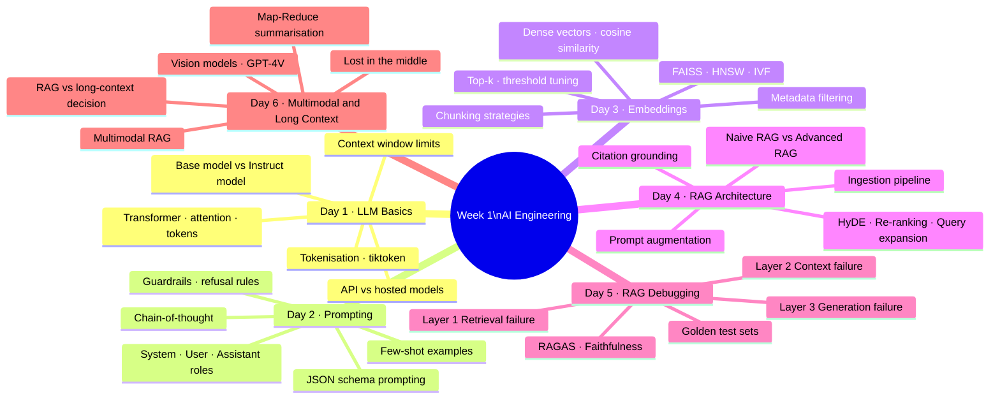
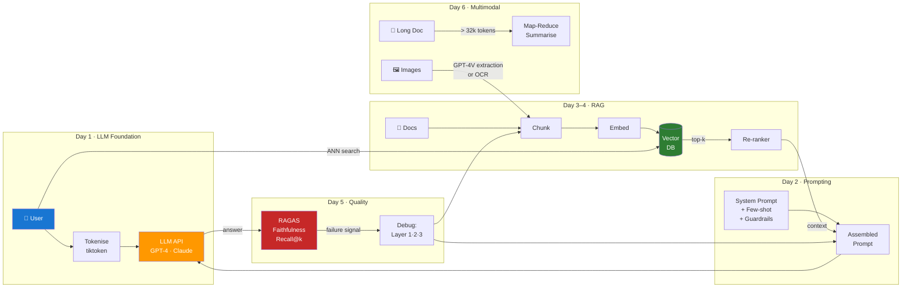

# Day 7 — Week 1 Consolidation and Retrieval Drill — Learn & Revise

> **Pre-reading:** [Week 1 Overview](./index.md) · [Learning and Revision Plan](../index.md)

---

## 🎯 What You'll Master Today

Today is about cementing everything from the week into a coherent, retrievable mental model. You
won't learn new concepts — you'll connect the ones you already know, stress-test your understanding
with a real scenario, and identify the gaps to close before interviews. A consolidation day done
well is worth three days of new content.

---

## 🗺️ Week 1 Concept Map

---

## 📖 Core Concepts Quick Revision

The table below covers 25+ key terms from the week. Use it as a rapid-fire self-quiz before
interviews.

| Concept                   | Definition                                                                 | When It Matters                                         | Common Misconception / Pitfall                                                                        |
|---------------------------|----------------------------------------------------------------------------|---------------------------------------------------------|-------------------------------------------------------------------------------------------------------|
| **Token**                 | Smallest text unit (~4 chars) processed by the model                       | Every LLM API call; cost and context limit calculations | "A token = a word" — No. A common word may be 1 token but rare words can be 3–4                       |
| **Context window**        | Maximum token capacity (input + output) for a single call                  | Prompt design; long document handling                   | "Bigger is always better" — No. Bigger costs more; lost-in-the-middle risk increases                  |
| **Base model**            | Pre-trained weights before instruction fine-tuning                         | Research; building your own fine-tuned model            | Don't use for user-facing apps without fine-tuning — output is unsafe and unpredictable               |
| **Instruct model**        | Base model + RLHF/SFT for instruction following                            | All production chat/task applications                   | RLHF doesn't make the model perfectly safe — guardrails still required                                |
| **Temperature**           | Sampling randomness (0 = deterministic)                                    | Classification: temp=0; creative: temp=0.7–1.0          | Setting temp=0 in all cases — hurts creative tasks and diversity-needed scenarios                     |
| **System prompt**         | Persistent instruction block setting model persona and rules               | Every production LLM application                        | System prompts are not secret — they can be extracted via prompt injection                            |
| **Few-shot examples**     | Input-output pairs in the prompt demonstrating expected format             | Complex output formats; domain-specific tone            | More examples = better — Not always. 2–5 high-quality examples often beat 10 mediocre ones            |
| **Chain-of-thought**      | Step-by-step reasoning before final answer                                 | Multi-step arithmetic or logic; complex reasoning       | Applying CoT everywhere — hurts simple tasks and structured output quality                            |
| **JSON schema prompting** | Including output schema in prompt + API-level JSON enforcement             | Structured data extraction                              | Relying on prose instructions alone — model occasionally adds text outside the JSON                   |
| **Guardrail**             | Explicit instruction for refusal, uncertainty, or scope                    | All production deployments                              | "Be helpful and safe" is not a guardrail — be specific and testable                                   |
| **Embedding**             | Dense fixed-size vector representing text meaning                          | Semantic search; RAG retrieval                          | Embeddings capture meaning but not all context — short chunks may lack enough context                 |
| **Cosine similarity**     | Angle-based similarity between vectors (0–1)                               | Measuring embedding relevance                           | Euclidean distance is equivalent if vectors are normalised — but don't skip normalisation             |
| **Chunking**              | Splitting documents into pieces for embedding                              | All RAG ingestion pipelines                             | Fixed-size at any size — legal/technical docs need sentence-boundary or semantic chunking             |
| **HNSW**                  | Graph-based approximate nearest-neighbour index                            | Production vector search (>100k vectors)                | "Approximate means inaccurate" — HNSW achieves 95–99% recall at millisecond speed                     |
| **Top-k**                 | Number of chunks retrieved per query                                       | RAG retrieval tuning                                    | Too high = context noise; too low = missed relevant chunks. Tune with eval data                       |
| **Similarity threshold**  | Minimum cosine score to include a chunk                                    | Preventing irrelevant context injection                 | One size fits all — threshold must be tuned per domain and embedding model                            |
| **RAG ingestion**         | Offline: load → chunk → embed → store                                      | System setup before any queries can be served           | RAG is only real-time — No. Ingestion is offline; only retrieval is real-time                         |
| **Prompt augmentation**   | Injecting retrieved chunks into the prompt as context                      | Every RAG query                                         | Putting chunks anywhere in the prompt — order matters; highest score first                            |
| **Citation grounding**    | Attaching source document names to answer claims                           | Enterprise RAG; trust-critical applications             | Model always cites correctly — Citations must be validated in code; fabrication is common             |
| **HyDE**                  | Generate hypothetical answer; embed it for retrieval                       | Low recall due to query-document style mismatch         | HyDE always helps — Adds latency and cost; evaluate before committing                                 |
| **Re-ranking**            | Second-stage cross-encoder to improve precision                            | Almost all production RAG (low cost, high value)        | Re-ranking is too slow — Cross-encoders add ~50–100ms; usually acceptable                             |
| **Faithfulness**          | Fraction of answer claims grounded in retrieved context                    | Primary hallucination detection metric                  | High faithfulness = correct answer — No. A faithful answer can still be wrong if the context is wrong |
| **RAGAS**                 | Open-source RAG evaluation framework                                       | Automated quality measurement                           | "RAGAS is ground truth" — It uses LLM-as-judge; results are probabilistic, not exact                  |
| **Lost in the middle**    | Model ignores context in the middle of long prompts                        | Long-context and multi-chunk RAG                        | This only affects full-document prompts — Affects any context with 5+ chunks                          |
| **Map-Reduce**            | Summarise chunks independently, then combine                               | Very long document summarisation                        | Single-pass summarisation of 200k-token documents — Context limit prevents this                       |
| **Multimodal RAG**        | Embed image descriptions; retrieve images + text; generate with vision LLM | Document corpora with diagrams, scans, tables           | Vision models can read any image accurately — Small/blurry text and complex layouts still fail        |

---

## 🗺️ Architecture Recap — Unified Week 1 Pipeline

---

## ⚡ End-to-End Drill — Customer Support Chatbot Scenario

**Scenario:** You've been asked to build a customer support chatbot for a SaaS company. It should
answer questions about the product, billing, and support policies — drawing from a corpus of 500 PDF
documents, FAQs, and policy pages. The company requires source citations, handles 10,000 queries per
day, and has strict data privacy requirements (no data can leave the company's cloud).

Work through every decision from Week 1:

---

**Step 1 — Model selection (Day 1)**

*Decision:* Use a hosted open-source model (e.g., Llama 3.1 70B running on vLLM) — data privacy
requirements prevent using external APIs like OpenAI. At 10,000 queries/day with ~1,100 tokens each,
this is ~11M tokens/day; at scale, hosted models are also more economical.

*Fallback:* Azure OpenAI with private deployment if Llama quality is insufficient.

---

**Step 2 — Prompt design (Day 2)**

*Decision:* Three-layer prompt:

- System: Role (support agent), scope (product/billing/support ONLY), guardrails (uncertainty: "I
  don't have that information"), output format (answer + cited sources)
- Few-shot: 2 examples — one billing query with citation, one out-of-scope with polite redirect
- No CoT — this is a factual Q&A task with structured output; CoT would add noise

*Output format:* JSON `{"answer": "...", "sources": ["doc1.pdf"]}` — parseable for the UI to render
citations

---

**Step 3 — Document ingestion (Days 1, 3)**

*Decision:*

- Chunk size: 512 tokens with 50-token overlap — balanced for Q&A precision
- Chunking strategy: Sentence-boundary — documents are policy/FAQ prose, not code or tables
- Embedding model: Local `BAAI/bge-large-en-v1.5` (data privacy; strong quality for English
  enterprise docs)
- Vector index: FAISS HNSW on a single GPU server for dev; Qdrant for production (supports metadata
  filters and horizontal scaling)
- Metadata: `{source_file, section_heading, last_updated_date, category}`

---

**Step 4 — Retrieval design (Days 3, 4)**

*Decision:*

- Hybrid search: BM25 + dense retrieval merged with RRF — FAQs use exact product version numbers
  that dense search misses
- k=5, threshold=0.65 (tuned on golden set)
- Re-ranking: `cross-encoder/ms-marco-MiniLM-L-6-v2` — fast cross-encoder; adds ~80ms
- Metadata filter: `category` filter applied at query time based on query classifier output

---

**Step 5 — Context assembly and generation (Day 4)**

*Decision:*

- Sort retrieved chunks by re-ranker score, highest first
- Context format: `[Source: {filename} · {section}]\n{chunk_text}`
- Citation instruction in system prompt: required for every factual claim
- Validate citations in post-processing: reject fabricated source names

---

**Step 6 — Quality measurement (Day 5)**

*Decision:*

- Build a golden set of 100 queries during the first week (30 billing, 40 product, 20 support, 10
  edge cases)
- Run RAGAS (self-hosted, using local Llama 3.1 as judge) on every deployment
- Alert thresholds: faithfulness < 0.85, context recall < 0.80, answer relevancy < 0.78
- Weekly failure taxonomy review

---

**Step 7 — Multimodal handling (Day 6)**

*Decision:* Some product manuals contain diagrams. Use GPT-4V (via Azure OpenAI with private
endpoint) in the ingestion pipeline to extract diagram descriptions as text — stored as chunks with
`content_type=image` metadata. At query time, if retrieved chunks have this metadata, fetch the
original image and include it in the prompt (hybrid text + image). This keeps the retrieval pipeline
standard while preserving visual content.

---

## 💬 Interview Q&A

??? question "How does RAG fit into a broader LLM production system? What are the dependencies?"
**Model Answer:**
RAG is one component of a production LLM system, not the whole system. The broader system
includes: (1) a **prompt layer** (system prompt, guardrails, output schema — Day 2) that governs all
model interactions; (2) a **retrieval layer** (embedding, vector index, chunking — Day 3) that
supplies grounding context; (3) a **generation layer** (the LLM call itself — Day 1) that produces
the answer; (4) an **evaluation layer** (RAGAS, golden sets, faithfulness tracking — Day 5) that
measures quality continuously; and (5) an **infrastructure layer** (model hosting, vector DB,
observability — ongoing) that ensures reliability at scale. The dependencies flow in one direction:
bad retrieval causes bad generation; bad prompts make good retrieval irrelevant; good generation on
bad retrieved context still hallucinates. Fixing the system requires understanding which layer is
failing, not applying general improvements.

    **Why this matters:**
    Systems thinking is what senior AI engineers are hired for. This answer demonstrates you see the full picture.

??? question "What's the single most important improvement you can make to a RAG system that's
underperforming?"
**Model Answer:**
Measure before you change anything. The most important improvement is always to first diagnose which
layer is failing using the three-layer framework: retrieval, context, or generation. Without this
diagnosis, you risk spending a week tuning the system prompt when the actual problem is a retrieval
miss — or re-indexing the entire corpus when the issue is a missing guardrail. Once you know the
layer, the highest-value fix is: for retrieval failure — add a re-ranker (high value, low cost); for
context failure — fix chunk ordering (put highest-relevance chunk first) or add contextual
compression; for generation failure — add or strengthen the grounding instruction in the system
prompt. The re-ranker is the best all-round single investment: it costs ~$100/month at scale and
typically improves precision by 15–25%.

    **Why this matters:**
    Interviewers want evidence-based improvement thinking, not a list of techniques applied blindly.

??? question "How do you decide between building a RAG system vs fine-tuning a model?"
**Model Answer:**
These solve different problems. RAG is the right choice when: (a) the knowledge base changes
frequently (policies, product catalog) — RAG can be updated by re-indexing without retraining; (b)
you need verifiable citations — RAG retrieves sources that can be shown to users; (c) the knowledge
base is too large to fit in training data effectively. Fine-tuning is the right choice when: (a) you
need the model to adopt a specific *style* or *behaviour* that can't be reliably achieved through
prompting alone (e.g., always respond in a specific brand voice); (b) you have high-volume,
cost-sensitive applications where a smaller fine-tuned model can match a large model's performance
on your narrow task; (c) you need to teach the model a new *format* or *capability* (e.g., output a
new structured schema consistently across millions of calls). In practice, most production systems
use both: RAG for dynamic knowledge, fine-tuning for style and format stability.

    **Why this matters:**
    RAG vs fine-tuning is a classic design question. The wrong answer is treating them as alternatives rather than complementary tools.

??? question "What would you measure in the first week after launching a RAG system to a real user
base?"
**Model Answer:**
Five things, in order of priority. First, **faithfulness** on a daily sample of 50–100 real
queries — my primary hallucination signal. Second, **unanswered rate** — the fraction of queries
where the system returned "I don't know" — this indicates retrieval gaps and corpus coverage issues.
Third, **user feedback signals** — thumbs up/down or escalation rate if the product collects them;
this is the ground truth on perceived quality. Fourth, **token usage per query** — to detect prompt
bloat, unexpectedly long contexts, or chunking issues that inflate cost. Fifth, **tail latency (P95)
** — to ensure the 95th percentile response time is within user tolerance (typically <5s for sync, <
30s for async). I'd set up a dashboard on day 1 for all five, with alert thresholds, so quality
issues surface in hours not weeks.

    **Why this matters:**
    Post-launch monitoring is where most RAG systems fail silently. This answer shows operational maturity.

??? question "Walk me through how you'd debug a specific failing query end-to-end."
**Model Answer:**
Say a user asks "What's the cancellation policy for Enterprise plans?" and gets "I don't have that
information." I'd debug in five steps. Step 1: **check the retrieval** — run the raw query through
the vector store and inspect top-5 results and scores. If the cancellation policy chunk scores above
0.65 and exists, I have a context issue. If it scores below 0.5 or doesn't appear, it's retrieval.
Step 2: **if retrieval failure** — check if the policy document was ingested by searching for its
known text directly. If missing, the ingestion pipeline likely failed or the document type wasn't
handled. If present but low score, test the query and passage cosine similarity directly — if below
0.6, I need a better embedding model or HyDE. Step 3: **if context failure** — check where the chunk
appears in the assembled prompt. If it's chunk #4 of 5, reorder by score. If the chunk is too
long (>600 tokens), it may dilute the signal — reduce chunk size. Step 4: **if generation failure
** — paste the exact context into a prompt manually and send to the LLM. If it answers correctly,
the issue is context assembly. If it still fails, the system prompt grounding instruction may be
missing or weak. Step 5: **log and add to golden set** — whether I fix it or not, this query joins
the test set so I can detect regressions.

    **Why this matters:**
    End-to-end debugging demonstrates exactly the systematic thinking that senior interview questions are designed to surface.

---

## 🧪 Practice Drills

| Lab               | Task                                                          | Step-by-Step Guidance                                                                                                                                                                                          | Deliverable                                               |
|-------------------|---------------------------------------------------------------|----------------------------------------------------------------------------------------------------------------------------------------------------------------------------------------------------------------|-----------------------------------------------------------|
| **RAG Playbook**  | Produce a concise one-page SOP for the build-debug-ship cycle | 1. Summarise the 9-step RAG pipeline. 2. Add the 3-layer debugging flowchart. 3. List the 5 RAGAS metrics to track. 4. Add the decision framework: RAG vs long-context vs fine-tuning.                         | One-page Markdown SOP                                     |
| **Timed QA Mock** | Solve 10 RAG issues in 45 minutes                             | 1. Write 10 RAG failure scenarios (5 retrieval, 3 context, 2 generation). 2. Set a 45-minute timer. 3. For each: identify the layer, name the root cause, propose one fix. 4. Review and score yourself after. | Issue log with layer label, root cause, and fix rationale |

---

## 🔍 Weak Spots Tracker

Common misconceptions about Week 1 concepts — use this table to check your mental models.

| Misconception                                    | Correct Mental Model                                                                                                           |
|--------------------------------------------------|--------------------------------------------------------------------------------------------------------------------------------|
| "RAG eliminates hallucination"                   | RAG reduces hallucination by grounding answers in retrieved context — but if retrieval fails, the model still hallucinates     |
| "Bigger context window = better RAG"             | Wider windows cost more, increase latency, and risk lost-in-the-middle errors; focused RAG usually outperforms stuffed context |
| "More few-shot examples = better output"         | 2–5 high-quality examples usually outperform 10 mediocre or contradictory ones                                                 |
| "CoT always improves answers"                    | CoT helps on multi-step reasoning but hurts on simple factual recall and structured output tasks                               |
| "Base models are fine for chat if prompted well" | Base models lack safety training; deploying them in user-facing products without fine-tuning is dangerous                      |
| "Cosine similarity = accuracy"                   | Cosine similarity is a proxy for semantic relevance, not factual correctness                                                   |
| "Fixed-size chunks are good enough"              | For prose-heavy legal/technical documents, sentence-boundary or semantic chunking significantly outperforms fixed-size         |
| "RAGAS gives exact quality scores"               | RAGAS uses LLM-as-judge which is probabilistic — treat scores as directional signals, not ground truth                         |
| "HyDE always improves retrieval"                 | HyDE adds latency and cost and only helps when query-document style mismatch is the root cause of low recall                   |
| "Citations are reliable if instructed"           | Models fabricate citations; always validate every cited source against the retrieved set in code                               |

---

## ✅ End-of-Day Checklist

| Item                                                                     | Status |
|--------------------------------------------------------------------------|--------|
| Concept map reviewed and can explain each Day's theme in 2 sentences     | ☐      |
| Quick Revision Table reviewed — can define all 25+ terms without looking | ☐      |
| End-to-End Drill scenario walked through with all 7 decisions made       | ☐      |
| RAG Playbook one-pager written                                           | ☐      |
| Timed QA Mock completed and scored                                       | ☐      |
| Weak Spots Tracker reviewed — flagged at least 2 areas to strengthen     | ☐      |
| All 5 interview Q&As practiced aloud                                     | ☐      |
| Ready to start Week 2                                                    | ☐      |

--8<-- "_abbreviations.md"
