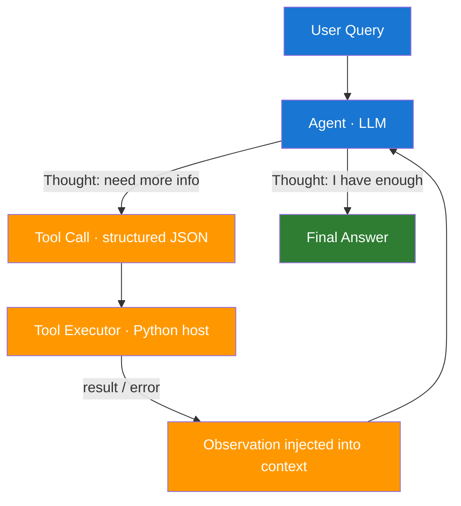

# Day 8 — Agentic Patterns and Tool Calling — Learn & Revise

> **Pre-reading:** [Week 2 Overview](./index.md) · [Learning Plan](../index.md)

---

## 🎯 What You'll Master Today

An **agent** is an LLM that can decide *what to do next* rather than just answering once and
stopping. Today you will learn how agents differ from simple chains, how the ReAct pattern
structures that decision loop, and how tool calling lets an agent reach out to the real world — from
APIs to databases to calculators — and incorporate what it finds before producing a final answer.

---

## 📖 Core Concepts

### Chains vs Agents — The Critical Difference

A **chain** is a fixed sequence of steps: prompt → LLM → output, repeated in a predetermined order.
The developer decides the flow at design time. Chains are fast, predictable, and easy to test, but
they cannot adapt mid-run.

An **agent** hands control back to the LLM at each step. After each action or tool result the model
decides: *should I call another tool, ask a clarifying question, or produce the final answer?* This
loop continues until a stopping condition is met. The power is flexibility; the risk is that the
loop may never stop, or may call the wrong tool.

**Rule of thumb:** use a chain when the steps are known in advance; use an agent when the steps
depend on what the model discovers at runtime.

### The ReAct Pattern — Reason Then Act

ReAct (Reasoning + Acting) was introduced in the 2022 paper by Yao et al. The model interleaves *
*Thought** (internal reasoning), **Action** (a tool call), and **Observation** (the tool result) in
a single text stream until it reaches a **Final Answer**.

A concrete trace for *"What is the capital of the country bordering France to the north-east that
contains 'land' in its English name?"*:

```
Thought: I need to find countries bordering France to the north-east that contain "land".
Action: search("countries bordering France north-east")
Observation: Germany, Luxembourg, Switzerland
Thought: "Switzerland" contains "land" in English — Switzer-land.
Action: search("capital of Switzerland")
Observation: Bern
Final Answer: Bern
```

Each Thought–Action–Observation cycle is one **step**. Most production agents cap steps at 10–15 to
prevent runaway loops.

### Tool Calling / Function Calling

Tool calling is the mechanism by which an LLM emits a **structured request** rather than free text.
The model outputs something like:

```json
{
  "name": "get_weather",
  "arguments": { "city": "London", "units": "celsius" }
}
```

The **host application** intercepts this, runs the actual Python function, and feeds the result back
into the context window as a new message. The model never directly executes code — it merely
requests execution. This separation is a key safety boundary.

OpenAI's function calling formalised this with a `tools` parameter in the Chat Completions API,
fine-tuning the model to emit valid JSON tool calls rather than inventing syntax in prose.

### Tool Interface Design — Why It Matters

A poorly described tool is almost as dangerous as no tool at all. The model uses the tool's **name
**, **description**, and **parameter schema** to decide *when* and *how* to call it. Key principles:

- **Precise names**: `search_products` not `search` — ambiguous names cause mis-selection.
- **Rich descriptions**: include what the tool does, what it returns, and when *not* to use it.
- **Typed parameters**: use JSON Schema types (`string`, `integer`, `array`) so the model can
  validate its own output.
- **Error returns in schema**: document what error strings look like so the model can handle
  failures gracefully instead of hallucinating success.

### Workflow Agent vs Autonomous Agent

| Dimension       | Workflow Agent                | Autonomous Agent                   |
|-----------------|-------------------------------|------------------------------------|
| Step sequence   | Mostly fixed by developer     | Decided by LLM at runtime          |
| Tool selection  | Limited / pre-assigned        | Open — any available tool          |
| Predictability  | High                          | Low                                |
| Risk of runaway | Low                           | Medium-High                        |
| Best for        | Structured business processes | Open-ended research, complex tasks |
| Example         | Invoice approval pipeline     | Open-ended research assistant      |

!!! warning "Don't default to autonomous"
Autonomous agents are exciting but hard to test and monitor. Start with a workflow agent and add
autonomy only where it is genuinely needed.

---

## 🗺️ Architecture / How It Works



The loop between **B → C → D → E → B** is the ReAct loop. It terminates when the model emits a Final
Answer or the host enforces a max-step limit.

---

## ⚡ Key Facts — Quick Revision Table

| Concept                       | One-Line Definition                                  | Why It Matters                                  |
|-------------------------------|------------------------------------------------------|-------------------------------------------------|
| Agent                         | LLM that decides its next action at each step        | Enables dynamic, adaptive workflows             |
| Chain                         | Fixed sequence of LLM calls defined by the developer | Predictable, fast, easy to test                 |
| ReAct                         | Thought → Action → Observation loop                  | Standard pattern understood across teams        |
| Tool call                     | Structured JSON request emitted by the model         | Keeps execution outside the model safely        |
| Tool schema                   | Name + description + parameter types                 | Determines when and how the model uses the tool |
| Function calling (OpenAI)     | Native API feature for structured tool emission      | Reliable, validated tool invocation             |
| `@tool` decorator (LangChain) | Wraps a Python function as an agent tool             | Simplest way to expose tools in LangChain       |
| Workflow agent                | Agent with mostly predetermined steps                | Lower risk, easier to audit                     |
| Autonomous agent              | Agent that decides all steps at runtime              | Flexible but harder to control                  |
| Max steps / step limit        | Hard cap on ReAct iterations                         | Prevents infinite loops in production           |

---

## 🔬 Deep Dive

### OpenAI Function Calling — Real Example

```python
import json
import openai

client = openai.OpenAI()

# 1. Define the tool schema
tools = [
    {
        "type": "function",
        "function": {
            "name": "get_weather",
            "description": (
                "Returns current weather for a city. "
                "Use this when the user asks about weather, temperature, or conditions. "
                "Do NOT use for historical weather data."
            ),
            "parameters": {
                "type": "object",
                "properties": {
                    "city": {
                        "type": "string",
                        "description": "City name, e.g. 'London' or 'New York'"
                    },
                    "units": {
                        "type": "string",
                        "enum": ["celsius", "fahrenheit"],
                        "description": "Temperature unit"
                    }
                },
                "required": ["city"]
            }
        }
    }
]

# 2. Fake tool executor (replace with real API call)
def get_weather(city: str, units: str = "celsius") -> dict:
    return {"city": city, "temp": 18, "condition": "partly cloudy", "units": units}

# 3. First LLM call — model decides whether to call the tool
messages = [{"role": "user", "content": "What's the weather in London?"}]
response = client.chat.completions.create(
    model="gpt-4o",
    tools=tools,
    messages=messages
)

msg = response.choices[0].message

# 4. If the model requested a tool call, execute it
if msg.tool_calls:
    tool_call = msg.tool_calls[0]
    args = json.loads(tool_call.function.arguments)
    result = get_weather(**args)

    # 5. Feed result back as a tool message
    messages.append(msg)  # assistant message with tool_calls
    messages.append({
        "role": "tool",
        "tool_call_id": tool_call.id,
        "content": json.dumps(result)
    })

    # 6. Second LLM call — model now has the observation
    final = client.chat.completions.create(model="gpt-4o", messages=messages)
    print(final.choices[0].message.content)
else:
    print(msg.content)
```

### LangChain `@tool` Decorator

```python
from langchain_core.tools import tool
from langchain_openai import ChatOpenAI
from langchain.agents import create_tool_calling_agent, AgentExecutor
from langchain_core.prompts import ChatPromptTemplate

@tool
def get_weather(city: str, units: str = "celsius") -> str:
    """
    Returns current weather conditions for a given city.
    Use this for questions about temperature, rain, or weather.
    Do NOT use for historical data.

    Args:
        city: City name (e.g. 'Paris')
        units: 'celsius' or 'fahrenheit'
    """
    return f"18°{units[0].upper()}, partly cloudy in {city}"

llm = ChatOpenAI(model="gpt-4o")
tools = [get_weather]

prompt = ChatPromptTemplate.from_messages([
    ("system", "You are a helpful assistant. Use tools when needed."),
    ("human", "{input}"),
    ("placeholder", "{agent_scratchpad}"),
])

agent = create_tool_calling_agent(llm, tools, prompt)
executor = AgentExecutor(agent=agent, tools=tools, verbose=True, max_iterations=10)
result = executor.invoke({"input": "What's the weather in Tokyo in Fahrenheit?"})
print(result["output"])
```

!!! tip "Always set `max_iterations`"
`AgentExecutor` defaults to 15 iterations. Set it explicitly so runaway agents are caught early in
testing.

---

## 🧪 Practice Drills

**Drill 1 — Tool Schema Design**

Write JSON schemas for three tools: `search_web(query)`, `calculate(expression)`, and
`lookup_product(sku, fields)`. For each:

1. Write a description that includes one example and one "do NOT use when" clause.
2. Define all parameters with types and constraints.
3. Describe what the error response looks like.

**Drill 2 — Trace a ReAct Loop**

Given the question *"How many days until Christmas 2025?"*, write out a 3-step ReAct trace
manually (Thought → Action → Observation → … → Final Answer). Then implement it with `AgentExecutor`
using a `datetime` tool and verify the trace matches.

**Drill 3 — Agent vs Chain Decision**

For each scenario below, decide: chain or agent? Justify in one sentence.

- Summarise a support ticket and classify its priority.
- Research a company, find their CEO, then find the CEO's LinkedIn posts about AI.
- Convert a PDF invoice into structured JSON.
- Answer "Is it cheaper to fly or take the train from London to Paris next Friday?"

**Drill 4 — Add Error Handling**

Extend the OpenAI example above so that if `get_weather` raises an exception, the agent receives
`{"error": "tool_failed", "message": "..."}` and gracefully responds to the user without crashing.

---

## 💬 Interview Q&A

??? question "What is the ReAct pattern and why is it used in agents?"
ReAct stands for Reasoning + Acting. The model alternates between **Thought** (internal reasoning
about what to do next), **Action** (a tool call), and **Observation** (the tool result). This loop
continues until the model decides it has enough information for a **Final Answer**. It is used
because it makes the model's reasoning transparent and auditable — you can inspect the full
Thought–Action–Observation chain in the trace — and it mirrors how a human expert would work through
a problem step by step.

??? question "How do you design a safe tool interface for an LLM agent?"
Three rules: (1) **Precise naming** — the tool name should be unambiguous so the model doesn't
confuse similar tools. (2) **Rich description** — include what the tool does, what it returns, and
explicitly when *not* to use it. (3) **Typed schema + error contract** — use JSON Schema types so
the model validates its own arguments, and document error response shapes so the model can handle
failures rather than hallucinating success. For high-stakes tools (e.g. `delete_record`), add a
human-in-the-loop gate rather than letting the agent execute autonomously.

??? question "What is the difference between a chain and an agent?"
A **chain** has a fixed execution path defined at design time — the developer decides each step in
advance. An **agent** lets the LLM decide at runtime what the next step should be, based on what it
has learned so far. Chains are faster, cheaper, and easier to test; agents are more flexible but
introduce non-determinism, higher token cost, and the risk of infinite loops. The right choice
depends on whether the task's steps are known in advance.

---

## ✅ End-of-Day Checklist

| Item                                                     | Status |
|----------------------------------------------------------|--------|
| Can explain chain vs agent in ≤60 seconds                | ☐      |
| Can draw the ReAct loop from memory                      | ☐      |
| Understand how tool calling works at the API level       | ☐      |
| Wrote or reviewed a tool schema with description + types | ☐      |
| Ran AgentExecutor with at least one real tool            | ☐      |
| Completed at least 2 practice drills                     | ☐      |
| Logged one weak area for revision                        | ☐      |

--8<-- "_abbreviations.md"
