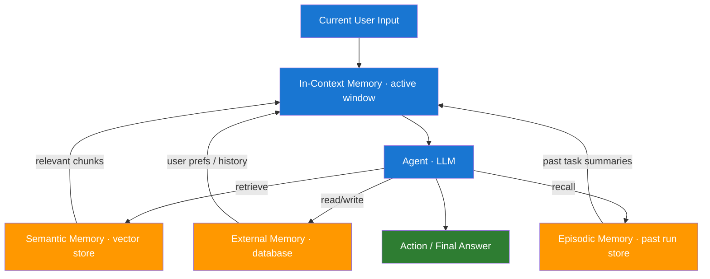

# Day 9 — Planning, Memory, and State Management — Learn & Revise

> **Pre-reading:** [Week 2 Overview](./index.md) · [Learning Plan](../index.md)

---

## 🎯 What You'll Master Today

Memory is one of the hardest problems in production agent systems. Unlike a human assistant who remembers everything from your last conversation, an LLM only sees what is inside its context window right now. Today you will learn the four types of memory available to an agent, how to manage state explicitly so it does not drift, and how to apply planning patterns that structure multi-step reasoning without letting the agent wander.

---

## 📖 Core Concepts

### The 4 Types of Agent Memory

Agents have four distinct memory stores, each with different scope and persistence:

| Memory Type | Where It Lives | Scope | Example |
|---|---|---|---|
| **In-context (short-term)** | The active context window | Current conversation only | Chat history, last tool result |
| **External (long-term)** | Database, vector store, file | Persists across sessions | User preferences, past reports |
| **Episodic** | Structured store of past runs | Past task traces | "Last time I searched X I got Y" |
| **Semantic** | Knowledge base / vector store | Factual knowledge | Company docs, API reference |

**In-context memory** is the simplest — everything in the prompt/message list. It is fast but limited by the context window (typically 8k–128k tokens). Once you exceed the window, old content is truncated.

**External memory** survives between sessions. The agent writes to and reads from a database or vector store. This is how an agent remembers a user's name or the outcome of a task from last week.

**Episodic memory** stores summaries of past agent runs — useful for learning from mistakes and avoiding repeated errors on similar tasks.

**Semantic memory** stores factual knowledge that the agent queries on demand. A vector store of company documentation is an example: the agent does a similarity search and injects the retrieved chunks into context.

### State Management — What State Is and Why It Drifts

**State** is the structured data that an agent carries from step to step. In LangGraph, state is an explicit TypedDict. In simple chains, state is implicit — it lives only in the prompt string. Implicit state is the source of most agent bugs.

Common causes of state drift:

- The agent updates one field but forgets to clear a stale field from a previous step.
- Long conversations accumulate contradictory information and the model starts favouring more recent tokens.
- Tool errors are silently swallowed, leaving the state in an inconsistent intermediate.

The fix is **explicit state schemas**: every field is named and typed, every node declares what it reads and what it writes, and every error updates the state with a clear error field rather than silently failing.

### Planning Patterns

| Pattern | How It Works | Best For |
|---|---|---|
| **Single-step** | LLM generates one plan + executes it | Short, well-defined tasks |
| **Plan-and-Execute** | Planner LLM creates ordered steps; executor LLM runs each | Multi-step tasks where steps are independent |
| **Hierarchical** | High-level planner decomposes into sub-plans; sub-planners refine | Complex projects with parallel sub-tasks |
| **ReAct (reactive)** | Plan is implicit — next action decided after each observation | Exploratory tasks where steps depend on results |

**Plan-and-Execute** separates the *thinking* from the *doing*. A planner (usually a stronger model like GPT-4o) produces a numbered plan. An executor (possibly a faster/cheaper model) runs each step. This is cost-effective and auditable — you can show the user the plan before executing.

### Context Window Management

The context window is finite. When it fills up you must decide what to keep:

1. **Keep**: system prompt, user's original request, most recent tool results, current plan.
2. **Summarise**: earlier conversation turns using a summarisation LLM call and replace them with the summary.
3. **Externalise**: large retrieved documents — store in vector store and re-query on demand rather than keeping in context.

**Relevance pruning** removes tool results that are no longer relevant to the current step. For example, a web search result referenced two steps ago can be dropped once its information has been incorporated into the plan.

### LangChain Memory Classes

| Class | What It Does | When to Use |
|---|---|---|
| `ConversationBufferMemory` | Keeps the full message history in context | Short conversations (< ~20 turns) |
| `ConversationSummaryMemory` | Summarises older turns, keeps recent verbatim | Long conversations |
| `ConversationSummaryBufferMemory` | Hybrid: recent turns verbatim + summary for older | Most production use-cases |
| `VectorStoreRetrieverMemory` | Stores each turn in a vector store; retrieves relevant past turns | When past context is large and only some is relevant |

!!! note "LangChain v0.2+ memory"
    LangChain moved most memory classes to `langchain-community`. For new projects prefer managing state explicitly in a LangGraph `TypedDict` rather than using the legacy memory abstractions.

---

## 🗺️ Architecture / How It Works



---

## ⚡ Key Facts — Quick Revision Table

| Concept | One-Line Definition | Why It Matters |
|---|---|---|
| In-context memory | Everything in the active context window | Fastest but bounded by token limit |
| External memory | Persists across sessions in a DB or vector store | Enables long-term personalisation |
| Episodic memory | Summaries of past agent runs | Lets agent learn from past mistakes |
| Semantic memory | Factual knowledge queried on demand | Decouples knowledge from context size |
| State drift | State becoming inconsistent over a long run | Root cause of most production agent bugs |
| Explicit state schema | TypedDict or dataclass defining all state fields | Prevents drift, enables debugging |
| Plan-and-Execute | Separate planner + executor agents | Cheaper, auditable multi-step reasoning |
| Context window management | Deciding what to keep, summarise, or externalise | Controls token cost and coherence |
| Relevance pruning | Removing stale tool results from context | Keeps context focused and accurate |
| `ConversationSummaryMemory` | LangChain memory that auto-summarises old turns | Handles long dialogues without overflow |

---

## 🔬 Deep Dive

### LangChain Agent with ConversationSummaryMemory

```python
from langchain_openai import ChatOpenAI
from langchain.memory import ConversationSummaryMemory
from langchain.agents import create_tool_calling_agent, AgentExecutor
from langchain_core.tools import tool
from langchain_core.prompts import ChatPromptTemplate, MessagesPlaceholder

llm = ChatOpenAI(model="gpt-4o")

# Memory: summarises older turns, keeps recent verbatim
memory = ConversationSummaryMemory(
    llm=llm,
    memory_key="chat_history",
    return_messages=True
)

@tool
def search_docs(query: str) -> str:
    """Search internal documentation. Use for product, policy, or technical questions."""
    return f"[Doc result for '{query}']: Feature X requires admin permissions."

tools = [search_docs]

prompt = ChatPromptTemplate.from_messages([
    ("system", "You are a helpful assistant. Use tools when needed."),
    MessagesPlaceholder(variable_name="chat_history"),
    ("human", "{input}"),
    MessagesPlaceholder(variable_name="agent_scratchpad"),
])

agent = create_tool_calling_agent(llm, tools, prompt)
executor = AgentExecutor(
    agent=agent,
    tools=tools,
    memory=memory,
    verbose=True,
    max_iterations=8
)

# Turn 1
r1 = executor.invoke({"input": "What permissions does Feature X require?"})
print(r1["output"])

# Turn 2 — memory carries forward the summary
r2 = executor.invoke({"input": "Who grants those permissions?"})
print(r2["output"])
```

### Implementing Plan-and-Execute from Scratch

```python
from langchain_openai import ChatOpenAI
from langchain_core.prompts import ChatPromptTemplate

planner_llm = ChatOpenAI(model="gpt-4o")
executor_llm = ChatOpenAI(model="gpt-4o-mini")  # cheaper for execution

PLAN_PROMPT = ChatPromptTemplate.from_messages([
    ("system", "You are a planning assistant. Given a task, output a numbered list of steps. "
               "Be specific. Output ONLY the numbered list, no other text."),
    ("human", "Task: {task}")
])

EXECUTE_PROMPT = ChatPromptTemplate.from_messages([
    ("system", "You are an execution assistant. Complete the given step and output the result only."),
    ("human", "Step: {step}\nContext so far: {context}")
])

def plan_and_execute(task: str) -> str:
    # 1. Plan
    plan_response = (PLAN_PROMPT | planner_llm).invoke({"task": task})
    steps = [s.strip() for s in plan_response.content.strip().split("\n") if s.strip()]
    print(f"Plan:\n" + "\n".join(steps))

    # 2. Execute each step
    context = ""
    for step in steps:
        result = (EXECUTE_PROMPT | executor_llm).invoke({"step": step, "context": context})
        context += f"\n{step} → {result.content}"
        print(f"Step done: {step[:60]}...")

    return context

output = plan_and_execute("Research the top 3 open-source LLM frameworks and compare their licensing.")
print(output)
```

!!! tip "When to use Plan-and-Execute"
    Use it when you want the user to approve the plan before execution, or when steps are long enough that a stronger model planning upfront saves token cost overall.

---

## 🧪 Practice Drills

**Drill 1 — Memory Type Mapping**

For each scenario, identify which memory type should store the information and why:

- The user's preferred language (French).
- The result of a web search done 3 steps ago that is still relevant.
- A summary of what happened in last week's agent run on the same task.
- A 500-page product manual that the agent may need to reference.

**Drill 2 — State Schema Design**

Design an explicit TypedDict state schema for a research agent that: takes a query, searches the web, retrieves documents, drafts an answer, and validates the answer. Include fields for errors and current step.

**Drill 3 — Context Overflow Simulation**

Simulate a 30-turn conversation by appending fake messages. At what turn does `ConversationBufferMemory` exceed 4000 tokens? Switch to `ConversationSummaryMemory` and compare the token count at turn 30.

**Drill 4 — Plan-and-Execute Implementation**

Implement a plan-and-execute agent that: plans a trip from London to Tokyo (flight + hotel + activity), executes each planning step with a mock tool, and returns a formatted itinerary. Log the planner's output before execution starts.

---

## 💬 Interview Q&A

??? question "What are the 4 types of agent memory and when would you use each?"
    (1) **In-context** — the active context window; use for the current conversation and immediate tool results. (2) **External** — a database or key-value store that persists between sessions; use for user preferences, long-term facts, and session state. (3) **Episodic** — a store of past run summaries; use when an agent needs to learn from or reference what it did on previous tasks. (4) **Semantic** — a vector store of factual knowledge; use when the knowledge base is too large to fit in context and must be retrieved on demand. Matching the right memory type to the persistence and retrieval requirements is a core architectural decision.

??? question "How do you prevent an agent from forgetting earlier context in a long conversation?"
    Use a summarisation strategy. `ConversationSummaryMemory` (LangChain) automatically summarises older turns with an LLM call and keeps only the summary + recent verbatim messages in context. For agents with explicit state (LangGraph), trigger a summarisation node when the message list exceeds a token threshold, replace the old messages with the summary, and store the full history in an external store for audit. Relevance pruning — removing tool results that are no longer needed — also helps keep the window lean.

??? question "When would you use a plan-and-execute agent instead of a ReAct agent?"
    Plan-and-execute is better when: (1) the task has clearly separable sub-tasks that can be listed upfront, (2) you want the user to review and approve the plan before execution starts, (3) you can use a cheaper model for execution steps to reduce cost, or (4) you need a structured audit trail. ReAct is better for exploratory tasks where each step depends on the result of the previous one and a full plan cannot be written upfront.

---

## ✅ End-of-Day Checklist

| Item | Status |
|---|---|
| Can name the 4 memory types without notes | ☐ |
| Understand what state drift is and how to prevent it | ☐ |
| Can explain plan-and-execute vs ReAct tradeoffs | ☐ |
| Implemented at least one LangChain memory class | ☐ |
| Designed an explicit state schema for a sample agent | ☐ |
| Completed at least 2 practice drills | ☐ |
| Logged one weak area for revision | ☐ |

--8<-- "_abbreviations.md"
