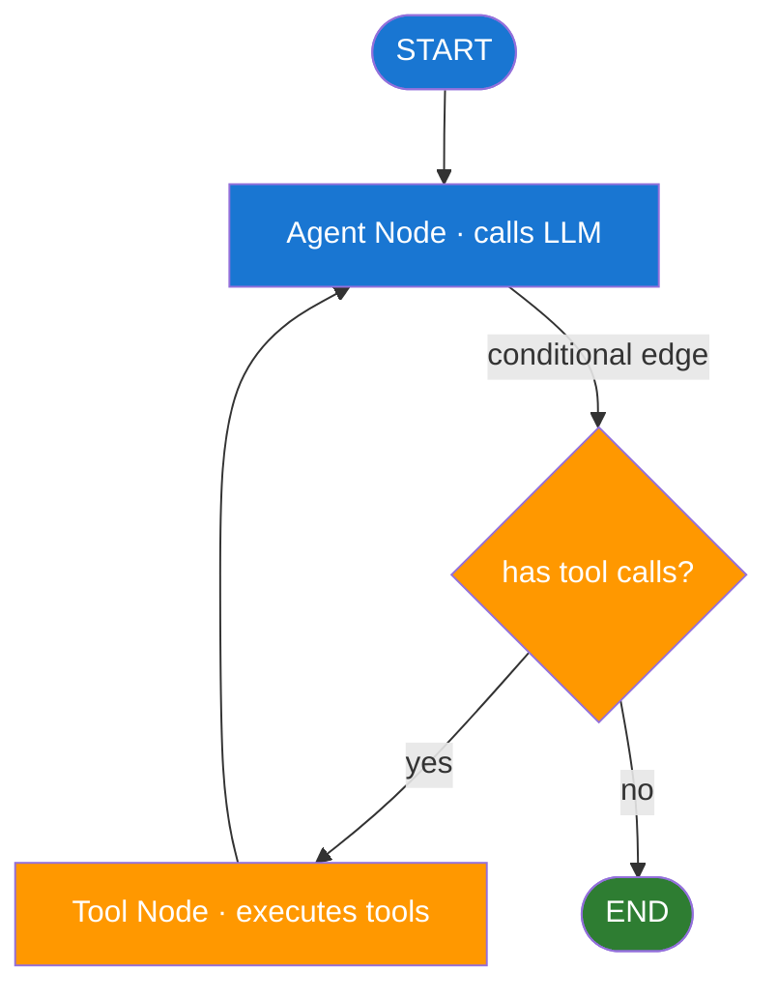

# Day 10 — LangGraph Fundamentals — Learn & Revise

> **Pre-reading:** [Week 2 Overview](./index.md) · [Learning Plan](../index.md)

---

## 🎯 What You'll Master Today

LangGraph is the framework that turns a LangChain agent into a proper stateful workflow. Instead of a linear chain or an opaque agent loop, you model your application as a directed graph where each node is a Python function and each edge is a transition rule. Today you will learn the core building blocks — StateGraph, nodes, edges, and conditional routing — and understand when LangGraph is the right tool compared to simpler alternatives.

---

## 📖 Core Concepts

### What LangGraph Is

LangGraph is an open-source library (part of the LangChain ecosystem) that lets you define LLM workflows as **directed graphs**. Each node in the graph is a Python function that receives the current state, does some work (call an LLM, run a tool, validate output), and returns an updated state. Edges define which node runs next, and conditional edges let you branch based on the current state.

The key insight is that **state is explicit and typed**. Every node sees exactly the same structured state object, modifies only what it needs to, and passes the updated state to the next node. This eliminates the implicit, string-based state of simple LCEL chains and makes debugging, testing, and checkpointing straightforward.

### Core Concepts: StateGraph, Nodes, Edges

**StateGraph** is the main class. You initialise it with a TypedDict schema that defines the shape of the state, add nodes, add edges, set an entry point, and compile the graph into a runnable.

**Nodes** are plain Python functions (or async functions) with the signature `(state: StateType) -> dict`. They return only the fields they want to update — LangGraph merges the returned dict into the existing state.

**Edges** are simple transitions: `graph.add_edge("node_a", "node_b")` means "after node_a always go to node_b". The special node name `END` terminates the graph.

**Conditional edges** branch based on the current state: `graph.add_conditional_edges("node_a", routing_function, {"route_1": "node_b", "route_2": "node_c"})`. The routing function receives the state and returns a string key that selects the next node.

### State Schema — TypedDict

```python
from typing import TypedDict, Annotated, List
from langchain_core.messages import BaseMessage
import operator

class AgentState(TypedDict):
    messages: Annotated[List[BaseMessage], operator.add]  # append-only
    next_step: str
    error: str | None
    final_answer: str | None
```

`Annotated[List[BaseMessage], operator.add]` tells LangGraph to *append* new messages rather than replace the list. This is the standard pattern for chat agents where every node adds to the conversation.

### Conditional Routing

```python
def should_continue(state: AgentState) -> str:
    last_message = state["messages"][-1]
    # If the last message has tool calls, route to tool executor
    if hasattr(last_message, "tool_calls") and last_message.tool_calls:
        return "tools"
    # Otherwise we are done
    return "end"
```

This function is passed to `add_conditional_edges`. The string it returns is looked up in a mapping dict to find the next node name. This is how you implement the agent loop: agent → tools → agent → … → end.

### Retries, Fallbacks, and CheckpointSaver

**CheckpointSaver** (e.g. `MemorySaver` for in-memory, `SqliteSaver` for persistence) saves the full graph state after every node. If a node fails or the process crashes, you can resume from the last checkpoint rather than restarting from scratch. This is critical for long-running workflows.

**Error nodes** are standard nodes that catch exceptions and update the state with an error field, then route to a recovery or graceful-degradation node.

**Interrupt and resume** allows you to pause a running graph at a named node, wait for external input (human approval, a webhook), and then resume. This is the foundation for human-in-the-loop patterns (covered on Day 12).

### When to Use LangGraph vs LCEL vs Raw Python

| Scenario | Best Choice |
|---|---|
| Simple prompt → LLM → output | LCEL pipeline |
| Multi-step chain with no branching | LCEL pipeline |
| Agent loop with tool calling | LangGraph |
| Multi-agent with routing between agents | LangGraph |
| Human-in-the-loop checkpoints | LangGraph |
| Fully custom, no LangChain dependency | Raw Python |

!!! note "LCEL vs LangGraph"
    LCEL (LangChain Expression Language) is great for composing simple chains with `|` pipes. LangGraph is for stateful, cyclical, conditional workflows. They complement each other — you can use LCEL inside a LangGraph node.

---

## 🗺️ Architecture / How It Works



The loop **AG → TN → AG** continues until the agent produces a message with no tool calls, at which point the conditional edge routes to END.

---

## ⚡ Key Facts — Quick Revision Table

| Concept | One-Line Definition | Why It Matters |
|---|---|---|
| StateGraph | LangGraph class that holds nodes, edges, and state schema | The top-level object for every LangGraph app |
| Node | Python function that reads state and returns partial update | The unit of work in LangGraph |
| Edge | Fixed transition between two nodes | Defines the default next step |
| Conditional edge | Transition chosen by a routing function at runtime | Enables branching and agent loops |
| TypedDict | Python type hint style used for LangGraph state schemas | Gives type safety and IDE support |
| `Annotated[List, operator.add]` | Tells LangGraph to append to a list field instead of replacing it | Standard pattern for message accumulation |
| CheckpointSaver | Saves state after every node for resume and fault tolerance | Critical for long-running or interruptible workflows |
| MemorySaver | In-memory CheckpointSaver (dev/test only) | Quick to set up, lost on restart |
| interrupt | Pauses graph execution at a node for human input | Foundation of HITL patterns |
| END | Special node name that terminates the graph | Every graph must be able to reach it |

---

## 🔬 Deep Dive

### Simple LangGraph Agent — 2 Nodes with Conditional Edge

```python
from typing import TypedDict, Annotated, List
from langchain_core.messages import BaseMessage, HumanMessage
from langchain_openai import ChatOpenAI
from langchain_core.tools import tool
from langgraph.graph import StateGraph, END
from langgraph.prebuilt import ToolNode
import operator

# 1. State schema
class AgentState(TypedDict):
    messages: Annotated[List[BaseMessage], operator.add]

# 2. Tools
@tool
def get_word_count(text: str) -> int:
    """Count the number of words in a text string."""
    return len(text.split())

tools = [get_word_count]
llm = ChatOpenAI(model="gpt-4o").bind_tools(tools)

# 3. Nodes
def agent_node(state: AgentState) -> dict:
    response = llm.invoke(state["messages"])
    return {"messages": [response]}

tool_node = ToolNode(tools)  # LangGraph built-in tool executor node

# 4. Routing function
def should_continue(state: AgentState) -> str:
    last = state["messages"][-1]
    if hasattr(last, "tool_calls") and last.tool_calls:
        return "tools"
    return "end"

# 5. Build the graph
graph = StateGraph(AgentState)
graph.add_node("agent", agent_node)
graph.add_node("tools", tool_node)

graph.set_entry_point("agent")
graph.add_conditional_edges("agent", should_continue, {"tools": "tools", "end": END})
graph.add_edge("tools", "agent")

app = graph.compile()

# 6. Run
result = app.invoke({"messages": [HumanMessage(content="How many words are in 'Hello world foo bar'?")]})
print(result["messages"][-1].content)
```

### Adding a CheckpointSaver for Fault Tolerance

```python
from langgraph.checkpoint.memory import MemorySaver

saver = MemorySaver()
app = graph.compile(checkpointer=saver)

# Each invocation needs a thread_id to identify the checkpoint
config = {"configurable": {"thread_id": "session-42"}}
result = app.invoke(
    {"messages": [HumanMessage(content="Count words in 'foo bar baz'")]},
    config=config
)

# Resume from checkpoint if needed
state = app.get_state(config)
print("Checkpoint state:", state)
```

!!! tip "Thread IDs for multi-user apps"
    Use a unique `thread_id` per user session. This ensures each user's conversation state is checkpointed and resumed independently.

---

## 🧪 Practice Drills

**Drill 1 — Draw Before You Code**

Before writing any code, draw the StateGraph for a "classify–retrieve–answer" pipeline as a box-and-arrow diagram. Label each node (Classifier, Retriever, Answerer), each edge (including the conditional fallback if retrieval returns no results), and the START and END points.

**Drill 2 — Implement the Graph**

Implement the classify–retrieve–answer graph from Drill 1. Use mock functions for retrieval and answering. Add a conditional edge: if the retriever returns 0 results, route to a "no_results" node that returns a canned response instead of the answerer.

**Drill 3 — Add a Checkpoint**

Add `MemorySaver` to your Drill 2 graph. Run it twice with the same `thread_id` but different inputs. Print the full state after each run and verify that messages accumulate correctly.

**Drill 4 — Trace Reading**

Run your graph with `verbose=True` or enable LangSmith tracing. For each node execution, record: input state fields, output state fields, and which edge was taken. This trains you to read traces in production.

---

## 💬 Interview Q&A

??? question "How does LangGraph differ from LangChain's LCEL?"
    LCEL (LangChain Expression Language) uses the `|` pipe operator to compose a *linear, acyclic* chain of steps at design time. It has no native state management or conditional branching. LangGraph adds an explicit, typed state object, supports *cycles* (loops), conditional edges (branching), checkpointing, and interrupts. The right choice: LCEL for simple prompt-chain-output pipelines; LangGraph for anything with loops, branching, multi-agent routing, or human-in-the-loop steps.

??? question "How do you implement conditional routing in LangGraph?"
    You write a routing function that takes the current state and returns a string key. You then call `graph.add_conditional_edges(source_node, routing_fn, mapping)` where `mapping` is a dict from string key to target node name. LangGraph calls the routing function after the source node runs and jumps to whichever node the key resolves to. If no match is found, an error is raised — so always include a default key in the mapping (e.g. `"end": END`).

??? question "What is a StateGraph and how does state flow through it?"
    A `StateGraph` is LangGraph's core class. You initialise it with a TypedDict schema that defines all fields in the shared state. Each node is a function that receives the full state as a typed dict and returns a partial dict with only the fields it wants to update. LangGraph merges the partial dict into the state using the reducer functions specified in the schema (e.g. `operator.add` for lists). The updated state is then passed to the next node. This means every node has a consistent, full view of state without manually threading data through function calls.

---

## ✅ End-of-Day Checklist

| Item | Status |
|---|---|
| Can explain StateGraph, node, edge, and conditional edge | ☐ |
| Understand how TypedDict shapes state | ☐ |
| Implemented a 2-node graph with conditional routing | ☐ |
| Added a CheckpointSaver and verified state persistence | ☐ |
| Can explain when to choose LangGraph vs LCEL | ☐ |
| Completed at least 2 practice drills | ☐ |
| Logged one weak area for revision | ☐ |

--8<-- "_abbreviations.md"
