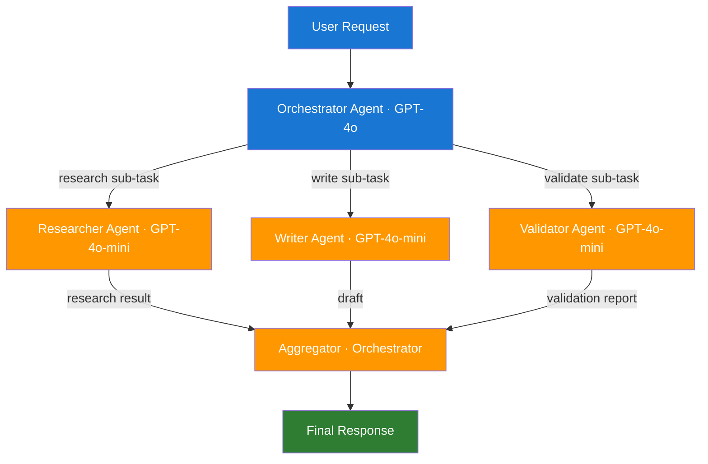

# Day 11 — Multi-Agent Coordination — Learn & Revise

> **Pre-reading:** [Week 2 Overview](./index.md) · [Learning Plan](../index.md)

---

## 🎯 What You'll Master Today

A single agent becomes a bottleneck when tasks require specialised knowledge, parallelism, or
context isolation. Multi-agent systems split the work across multiple LLM agents, each optimised for
a sub-task, and coordinate them via well-defined handoff protocols. Today you will learn the three
main coordination patterns, how to design safe handoffs, and how to reason about the failure modes
and costs that make multi-agent systems harder than they look.

---

## 📖 Core Concepts

### Why Multi-Agent?

Single agents hit practical limits quickly:

- **Context saturation**: a long task accumulates so much history that the model loses track of
  earlier requirements.
- **Specialisation**: a single agent trying to be a researcher, writer, and code reviewer
  simultaneously does all three poorly.
- **Parallelism**: some sub-tasks are independent and can run concurrently, but a single-threaded
  agent executes them sequentially.
- **Access control**: you may want to restrict which tools each agent can call — a writer agent
  should not have access to a database-write tool.

Multi-agent systems solve these by assigning each sub-task to a specialised agent with its own
context window, tool set, and prompt persona.

### Coordination Patterns

| Pattern                     | Structure                                                       | Strengths                                 | Weaknesses                                                 |
|-----------------------------|-----------------------------------------------------------------|-------------------------------------------|------------------------------------------------------------|
| **Orchestrator / Subagent** | One central orchestrator routes tasks to specialist subagents   | Clear authority, easy to audit            | Orchestrator is a bottleneck; single point of failure      |
| **Peer-to-Peer**            | Agents communicate directly with each other                     | No bottleneck, natural for parallel tasks | Hard to debug, risk of circular messaging                  |
| **Hierarchical**            | Multiple layers: super-orchestrator → orchestrators → subagents | Scales to very complex tasks              | Latency multiplies across layers; complex state management |

**Orchestrator/Subagent** is the most common production pattern. The orchestrator holds the overall
plan and delegates atomic sub-tasks to specialist agents (Researcher, Writer, Validator). Each
subagent has a narrow context and returns a result to the orchestrator.

### Handoff Protocol

A handoff is the transfer of a task from one agent to another. A well-designed handoff includes:

1. **Task description**: what the receiving agent must do, in precise terms.
2. **Relevant context**: only the context the receiving agent needs — not the entire history.
3. **Output contract**: the exact format the receiving agent must return.
4. **Error escalation path**: what to do if the receiving agent fails.

In LangGraph, a handoff is implemented as a conditional edge from the orchestrator node to a
subagent node. The orchestrator writes the task and context into specific state fields; the subagent
reads them, does its work, and writes its result to a designated output field.

### Shared State vs Message Passing

| Dimension     | Shared State                               | Message Passing                               |
|---------------|--------------------------------------------|-----------------------------------------------|
| Data location | Single state dict accessible by all agents | Explicit messages sent between agents         |
| Consistency   | Easier — one source of truth               | Harder — messages can be lost or out of order |
| Coupling      | Tight — all agents share schema            | Loose — agents only see their messages        |
| Best for      | LangGraph graphs (single process)          | Distributed or async agent systems            |

In LangGraph, shared state is the natural approach — all nodes in a graph read and write to the same
StateGraph state. For truly distributed multi-agent systems (separate services, async queues),
message passing over a broker (e.g. Redis, Kafka) is more appropriate.

### Latency and Token Cost Management

Token costs multiply fast in multi-agent systems. Every agent call consumes tokens proportional to
its context. An orchestrator that passes its entire state to each subagent is burning tokens that
most subagents never use.

Mitigation strategies:

- **Context trimming**: before handing off, extract only the fields the subagent needs.
- **Model tiering**: use GPT-4o for orchestration and GPT-4o-mini for simpler subagents.
- **Caching**: cache subagent results for identical inputs (especially for retrieval and search
  agents).
- **Parallelism**: run independent subagents concurrently with `asyncio.gather`.

### Failure Propagation

One subagent failing can cascade. Design failure modes explicitly:

| Failure Mode                               | Mitigation                                     |
|--------------------------------------------|------------------------------------------------|
| Subagent returns garbage output            | Output validation before accepting result      |
| Subagent times out                         | Timeout wrapper + fallback response            |
| Subagent calls wrong tool                  | Restrict tool set per agent                    |
| Orchestrator loses context after many hops | Checkpoint state after each subagent completes |

!!! warning "Test failure injection"
Always write a test that simulates a subagent failure. Verify the orchestrator handles it gracefully
and does not propagate garbage to the user.

---

## 🗺️ Architecture / How It Works



---

## ⚡ Key Facts — Quick Revision Table

| Concept                 | One-Line Definition                                       | Why It Matters                                       |
|-------------------------|-----------------------------------------------------------|------------------------------------------------------|
| Orchestrator / Subagent | Central coordinator delegates tasks to specialist agents  | Most common, auditable multi-agent pattern           |
| Peer-to-Peer            | Agents communicate directly without a central coordinator | Good for parallel tasks, hard to debug               |
| Hierarchical            | Multi-layer orchestration for very complex tasks          | Scales but adds latency and complexity               |
| Handoff                 | Structured transfer of task + context between agents      | Poorly designed handoffs cause most multi-agent bugs |
| Output contract         | Exact format a subagent must return                       | Prevents orchestrator from receiving garbage         |
| Context trimming        | Passing only relevant state to each subagent              | Controls token cost                                  |
| Model tiering           | Using cheaper models for simpler subagents                | Reduces cost without sacrificing quality             |
| Failure propagation     | One agent's failure cascading through the system          | Must be tested explicitly                            |
| Shared state            | All agents read/write to a single state dict              | Natural in LangGraph single-process graphs           |
| Message passing         | Agents exchange explicit messages                         | Better for distributed / async architectures         |

---

## 🔬 Deep Dive

### LangGraph Multi-Agent with Orchestrator Routing

```python
from typing import TypedDict, Annotated, List, Literal
from langchain_core.messages import BaseMessage, HumanMessage, AIMessage
from langchain_openai import ChatOpenAI
from langgraph.graph import StateGraph, END
import operator

# State schema
class WorkflowState(TypedDict):
    messages: Annotated[List[BaseMessage], operator.add]
    task: str
    research_result: str
    draft: str
    validation: str
    next: Literal["researcher", "writer", "validator", "end"]

llm_strong = ChatOpenAI(model="gpt-4o")
llm_fast = ChatOpenAI(model="gpt-4o-mini")

# Orchestrator: decides which subagent to call next
def orchestrator(state: WorkflowState) -> dict:
    prompt = f"""You are an orchestrator. Given the task and current results, decide the next step.
Task: {state['task']}
Research: {state.get('research_result', 'not done')}
Draft: {state.get('draft', 'not done')}
Validation: {state.get('validation', 'not done')}

Reply with ONLY one of: researcher, writer, validator, end"""
    decision = llm_strong.invoke([HumanMessage(content=prompt)]).content.strip().lower()
    return {"next": decision if decision in ["researcher", "writer", "validator", "end"] else "end"}

# Researcher subagent
def researcher(state: WorkflowState) -> dict:
    result = llm_fast.invoke([
        HumanMessage(content=f"Research this topic concisely: {state['task']}")
    ]).content
    return {"research_result": result}

# Writer subagent
def writer(state: WorkflowState) -> dict:
    draft = llm_fast.invoke([
        HumanMessage(content=f"Write a short answer based on: {state['research_result']}")
    ]).content
    return {"draft": draft}

# Validator subagent
def validator(state: WorkflowState) -> dict:
    validation = llm_fast.invoke([
        HumanMessage(content=f"Validate this draft for accuracy. Draft: {state['draft']}")
    ]).content
    return {"validation": validation}

# Build graph
graph = StateGraph(WorkflowState)
graph.add_node("orchestrator", orchestrator)
graph.add_node("researcher", researcher)
graph.add_node("writer", writer)
graph.add_node("validator", validator)

graph.set_entry_point("orchestrator")
graph.add_conditional_edges(
    "orchestrator",
    lambda s: s["next"],
    {"researcher": "researcher", "writer": "writer", "validator": "validator", "end": END}
)
graph.add_edge("researcher", "orchestrator")
graph.add_edge("writer", "orchestrator")
graph.add_edge("validator", "orchestrator")

app = graph.compile()

result = app.invoke({"task": "Explain what LangGraph is in 2 sentences.", "messages": []})
print("Draft:", result["draft"])
print("Validation:", result["validation"])
```

!!! tip "Add a max-step guard to the orchestrator"
Track the number of orchestrator calls in state. If it exceeds 10, force `next = "end"` to prevent
infinite orchestration loops.

---

## 🧪 Practice Drills

**Drill 1 — Pattern Selection**

For each scenario, choose the coordination pattern (Orchestrator/Subagent, Peer-to-Peer,
Hierarchical) and justify in two sentences:

- Automated blog post pipeline: research → outline → write → edit → SEO check.
- Real-time customer support with simultaneous billing, technical, and account agents.
- Enterprise autonomous coding assistant with a planner, multiple coders, a tester, and a security
  reviewer.

**Drill 2 — Handoff Design**

Design the handoff contract between an Orchestrator and a Researcher subagent for a market research
task. Specify: task field format, context fields to pass, output schema, and what happens if the
researcher returns an error.

**Drill 3 — Failure Injection**

Modify the code example above so that `researcher` raises a `RuntimeError` 50% of the time. Add
error handling in the graph so the orchestrator routes to a "fallback_researcher" node that returns
a canned response instead of crashing.

**Drill 4 — Token Audit**

Run the orchestrator graph on a 3-step task. After each node, print `state["messages"]` token count.
Identify where most tokens are spent and propose one optimisation.

---

## 💬 Interview Q&A

??? question "What are the main multi-agent coordination patterns?"
Three main patterns: (1) **Orchestrator/Subagent** — a central orchestrator routes tasks to
specialist subagents and aggregates results; best for sequential, auditable workflows. (2) *
*Peer-to-Peer** — agents communicate directly, no central coordinator; better for parallel tasks but
harder to debug and trace. (3) **Hierarchical** — multiple orchestration layers for very complex
tasks that decompose recursively; adds latency and state management complexity. Most production
systems use Orchestrator/Subagent because it is the easiest to monitor and audit.

??? question "How do you handle a subagent failure in a multi-agent system?"
At a minimum, every subagent call should have: (1) a timeout wrapper so a hung subagent does not
block the orchestrator forever, (2) output validation so garbage output is caught before being
passed downstream, and (3) a fallback path — either a retry with a simpler prompt, a different
subagent, or a graceful degradation response. In LangGraph, implement this as an error-handling
conditional edge that routes from the subagent node to a "handle_error" node when the state contains
an error field.

??? question "When would you split a task across multiple agents?"
Split when: (1) the task requires different expertise that conflicts in a single system prompt (e.g.
researcher vs creative writer vs security reviewer), (2) sub-tasks are independent and can run in
parallel to reduce latency, (3) the total context of doing everything in one agent would exceed the
model's context window, or (4) you need different tool access per sub-task for security reasons. Do
not split just because the task is complex — an orchestration system adds latency and cost, so the
specialisation benefit must outweigh that overhead.

---

## ✅ End-of-Day Checklist

| Item                                                         | Status |
|--------------------------------------------------------------|--------|
| Can name and compare the 3 coordination patterns             | ☐      |
| Understand what a handoff protocol must include              | ☐      |
| Know the difference between shared state and message passing | ☐      |
| Implemented an orchestrator/subagent graph in LangGraph      | ☐      |
| Can explain how to handle subagent failure                   | ☐      |
| Completed at least 2 practice drills                         | ☐      |
| Logged one weak area for revision                            | ☐      |

--8<-- "_abbreviations.md"
