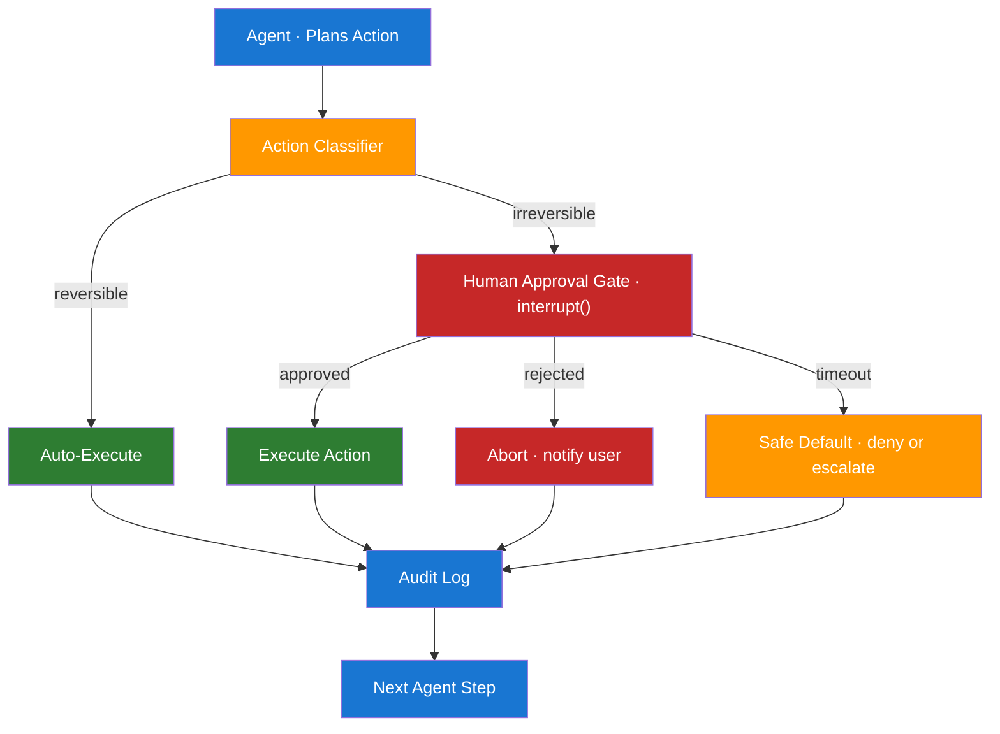

# Day 12 — Human-in-the-Loop and Approvals — Learn & Revise

> **Pre-reading:** [Week 2 Overview](./index.md) · [Learning Plan](../index.md)

---

## 🎯 What You'll Master Today

Autonomous agents are powerful but dangerous when they can take irreversible actions — deleting records, sending emails, making purchases, or deploying to production. Human-in-the-loop (HITL) is the design pattern that inserts a human approval step before high-stakes actions. Today you will learn when HITL is mandatory, how to classify actions by reversibility, how to implement pause-and-resume in LangGraph, and how to design the audit trail that makes HITL meaningful for compliance and debugging.

---

## 📖 Core Concepts

### Why HITL Is Non-Negotiable in Some Systems

An autonomous agent is, at its core, a program that makes decisions. Most decisions are fine to automate. But some actions have properties that require human oversight:

- **Irreversibility**: deleting a customer record, sending an email to 10,000 people, or publishing a document cannot be easily undone.
- **High financial impact**: approving a purchase, generating an invoice, or adjusting pricing.
- **Compliance and regulation**: financial services, healthcare, and legal contexts often legally require a human sign-off.
- **Trust building**: in early deployment, users and stakeholders need to see the agent's decisions before trusting it to act autonomously.

HITL is not a sign of weakness — it is a responsible engineering choice. The goal is to identify the precise category of actions requiring human oversight and gate only those, keeping the rest fully automated.

### Action Classification — Reversible vs Irreversible

Before implementing HITL, classify every action the agent can take:

| Category | Examples | Policy |
|---|---|---|
| **Fully reversible** | Read data, search, draft content, summarise | Auto-execute — no approval needed |
| **Partially reversible** | Update a record (can be reverted), send an internal message | Auto-execute with logging; alert on anomaly |
| **Irreversible – low impact** | Send one transactional email, create a draft PR | Soft gate — warn user, proceed unless rejected |
| **Irreversible – high impact** | Send mass email, delete data, deploy to prod, post publicly | Hard gate — block until explicit approval |

Maintain this classification as a lookup table in code. Every tool call should be tagged with its reversibility class before execution.

### Approval Gate Patterns

| Pattern | How It Works | Latency | Best For |
|---|---|---|---|
| **Synchronous (blocking)** | Agent pauses, waits for human input, resumes | High (human response time) | Low-frequency, high-stakes actions |
| **Asynchronous (queue + callback)** | Agent submits approval request to a queue; continues other work; resumes when approved | Medium | High-throughput pipelines |
| **Timeout-with-default** | Agent waits N minutes; if no response, applies a safe default (deny or escalate) | Configurable | Systems where approvers may be unavailable |

### LangGraph Interrupt and Resume

LangGraph's `interrupt()` function pauses the graph at a specific node. The graph state is checkpointed, and the graph can be resumed later with human-provided input injected into the state.

```python
from langgraph.types import interrupt

def review_action_node(state):
    # This node pauses and waits for human input
    human_decision = interrupt({
        "action": state["proposed_action"],
        "context": state["action_context"],
        "message": "Please approve or reject this action."
    })
    return {"human_decision": human_decision}
```

When a graph hits `interrupt()`, it raises an `Interrupt` exception internally, saves the checkpoint, and returns control to the caller. The caller (your API endpoint) can then present the approval UI to the human. When the human responds, you resume: `app.invoke(Command(resume=decision), config=config)`.

### Audit Trail Design

An audit trail is a time-ordered, immutable log of every action the agent proposed, who approved/rejected it, and what happened as a result. Key fields:

| Field | Description |
|---|---|
| `timestamp` | When the action was proposed (ISO 8601) |
| `session_id` | Unique identifier for the agent run |
| `action_type` | The tool name and parameters |
| `reversibility_class` | From your classification table |
| `approver_id` | Who approved (user ID, or "auto" for automated) |
| `decision` | approved / rejected / timed-out |
| `outcome` | What happened after (success, error, rollback) |

Store audit logs in an append-only store (e.g. a database table with no DELETE permission, or an event stream). Never allow the agent to modify or delete its own audit records.

### UX Patterns for Human Approvals

- **Slack bot**: agent posts a message with Approve/Reject buttons; decision arrives via webhook.
- **Email approval**: agent sends a structured email with a unique approval link; link triggers a webhook.
- **In-app UI**: a purpose-built approval dashboard that shows context, proposed action, and risk level.
- **CLI / terminal**: for developer tools, a simple `input()` prompt is sufficient.

!!! tip "Always show context, not just the action"
    An approver seeing only "DELETE record #4821" cannot make an informed decision. Show the full context: what the agent was trying to accomplish, what record #4821 contains, and what happens if they approve vs reject.

---

## 🗺️ Architecture / How It Works



---

## ⚡ Key Facts — Quick Revision Table

| Concept | One-Line Definition | Why It Matters |
|---|---|---|
| HITL | Design pattern requiring human approval before certain agent actions | Prevents irreversible mistakes in production |
| Irreversible action | An action that cannot be easily undone | The primary trigger for requiring approval |
| Approval gate | A blocking checkpoint where a human must decide before execution | Core HITL implementation pattern |
| Synchronous approval | Agent blocks until human responds | Simple, safe, high latency |
| Async approval | Agent queues approval request and resumes on callback | Better for high-throughput systems |
| `interrupt()` | LangGraph function that pauses graph at a node | Foundation for LangGraph HITL implementation |
| CheckpointSaver | Saves state when interrupt fires so graph can resume | Enables durable pause-and-resume |
| `Command(resume=...)` | LangGraph call to resume a paused graph with human input | How you feed the approval decision back |
| Audit trail | Immutable log of every proposed and executed action | Required for compliance and debugging |
| Reversibility classification | Tagging every tool action by how reversible it is | Drives the routing decision to auto-execute or gate |

---

## 🔬 Deep Dive

### LangGraph with interrupt() for Database Write Approval

```python
from typing import TypedDict, Optional
from langgraph.graph import StateGraph, END
from langgraph.checkpoint.memory import MemorySaver
from langgraph.types import interrupt, Command
from langchain_core.messages import HumanMessage
from langchain_openai import ChatOpenAI
import datetime

class AgentState(TypedDict):
    task: str
    proposed_action: Optional[str]
    proposed_payload: Optional[dict]
    human_decision: Optional[str]
    result: Optional[str]
    audit_log: list

llm = ChatOpenAI(model="gpt-4o")

def plan_node(state: AgentState) -> dict:
    """Agent decides what action to take."""
    response = llm.invoke([
        HumanMessage(content=f"Task: {state['task']}\n"
                              "Respond with: ACTION: <delete_record|update_record|read_record> "
                              "PAYLOAD: <json with record_id>")
    ])
    # Parse (simplified)
    content = response.content
    action = "delete_record" if "delete_record" in content else "read_record"
    return {
        "proposed_action": action,
        "proposed_payload": {"record_id": 42, "table": "customers"}
    }

def classify_and_gate_node(state: AgentState) -> dict:
    """Classify action; if irreversible, interrupt for human approval."""
    irreversible_actions = {"delete_record", "send_mass_email", "deploy_to_prod"}

    if state["proposed_action"] in irreversible_actions:
        # This pauses the graph and returns control to the caller
        decision = interrupt({
            "proposed_action": state["proposed_action"],
            "payload": state["proposed_payload"],
            "message": f"⚠️ Irreversible action requested. Approve or reject?",
            "risk": "HIGH"
        })
        return {"human_decision": decision}
    else:
        return {"human_decision": "auto_approved"}

def execute_node(state: AgentState) -> dict:
    """Execute only if approved."""
    log_entry = {
        "timestamp": datetime.datetime.utcnow().isoformat(),
        "action": state["proposed_action"],
        "payload": state["proposed_payload"],
        "decision": state["human_decision"],
    }

    if state["human_decision"] in ("approved", "auto_approved"):
        result = f"Executed {state['proposed_action']} on {state['proposed_payload']}"
        log_entry["outcome"] = "success"
    else:
        result = "Action rejected by human reviewer."
        log_entry["outcome"] = "rejected"

    return {"result": result, "audit_log": state.get("audit_log", []) + [log_entry]}

# Build graph
graph = StateGraph(AgentState)
graph.add_node("plan", plan_node)
graph.add_node("classify_and_gate", classify_and_gate_node)
graph.add_node("execute", execute_node)

graph.set_entry_point("plan")
graph.add_edge("plan", "classify_and_gate")
graph.add_edge("classify_and_gate", "execute")
graph.add_edge("execute", END)

saver = MemorySaver()
app = graph.compile(checkpointer=saver, interrupt_before=["classify_and_gate"])

config = {"configurable": {"thread_id": "hitl-demo-1"}}

# First invocation — runs until interrupt
result = app.invoke({"task": "Delete the test customer record", "audit_log": []}, config=config)
print("Graph paused. Proposed action:", app.get_state(config).values.get("proposed_action"))

# Human responds — resume with approval
final = app.invoke(Command(resume="approved"), config=config)
print("Final result:", final["result"])
print("Audit log:", final["audit_log"])
```

---

## 🧪 Practice Drills

**Drill 1 — Action Classification Table**

List 10 actions an AI email assistant could take (read inbox, draft reply, send reply, unsubscribe, delete thread, add contact, set rule, archive, search, create calendar event). Classify each as fully reversible, partially reversible, or irreversible. Assign a HITL policy to each.

**Drill 2 — Implement interrupt()**

Take the simple LangGraph agent from Day 10. Add a new node that calls `interrupt()` before any tool that modifies data. Test the pause-and-resume flow with `MemorySaver`.

**Drill 3 — Audit Trail Schema**

Design a SQLite table schema for an agent audit trail. Include all fields from the "Audit Trail Design" section. Write a Python function `log_action(conn, entry: dict)` that inserts a row using only an INSERT (no UPDATE).

**Drill 4 — Timeout Default**

Extend the code example above so that if the human does not respond within 60 seconds, the graph automatically resumes with `decision = "rejected"`. Use `threading.Timer` or an async timeout pattern.

---

## 💬 Interview Q&A

??? question "When must you include a human-in-the-loop in an agent system?"
    HITL is mandatory when: (1) the action is **irreversible** — deleting data, sending communications to many people, or deploying to production; (2) there is **high financial impact** — approving significant purchases or adjusting pricing; (3) **compliance or regulation** requires a human sign-off (e.g. GDPR, SOX, healthcare data access); or (4) the system is still in early deployment and the agent's reliability has not been established with stakeholders. For all other actions, auto-execute with logging is preferred to keep the system fast and useful.

??? question "How do you implement a pause-and-resume pattern in LangGraph?"
    Use `interrupt()` inside a node. When the graph reaches that node, LangGraph saves the full state via the configured `CheckpointSaver` and raises an internal interrupt. Your application receives control and can present the decision context to the human (via UI, Slack, email, etc.). When the human responds, you call `app.invoke(Command(resume=decision), config=config)` with the same `thread_id`. LangGraph reloads the checkpoint, injects the human's decision into the state, and continues graph execution from where it paused.

??? question "How do you design an audit trail for agent actions?"
    An audit trail must be: (1) **append-only** — never allow the agent to modify or delete its own records; (2) **structured** — each entry should include timestamp, session ID, action type, parameters, reversibility class, approver identity, decision, and outcome; (3) **queryable** — stored in a database or event stream that can be filtered by date, action type, or approver; (4) **timestamped at proposal** (when the agent decided) and again at **execution** (when it ran), so the delay is captured. In high-compliance environments, the audit log should be written to an immutable store such as an append-only S3 bucket with object lock enabled.

---

## ✅ End-of-Day Checklist

| Item | Status |
|---|---|
| Can classify actions by reversibility | ☐ |
| Know the difference between sync and async approval gates | ☐ |
| Implemented `interrupt()` in a LangGraph graph | ☐ |
| Tested pause-and-resume with `Command(resume=...)` | ☐ |
| Designed an audit trail schema | ☐ |
| Completed at least 2 practice drills | ☐ |
| Logged one weak area for revision | ☐ |

--8<-- "_abbreviations.md"
