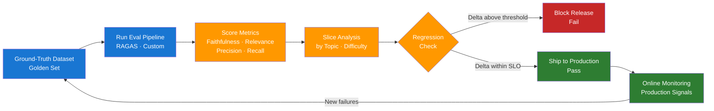

# Day 15 — Evaluation Strategy and Datasets — Learn & Revise

> **Pre-reading:** [Week 3 Overview](./index.md) · [Learning Plan](../index.md)

---

## 🎯 What You'll Master Today

Evaluation is the backbone of trustworthy LLM systems — without a rigorous eval strategy, you are
flying blind in production. Today you will learn how to construct ground-truth datasets, select the
right metrics for RAG and agent systems, and run LLM-as-judge scoring you can actually trust. By the
end you will be able to articulate a complete eval hierarchy in any interview.

---

## 📖 Core Concepts

### The Eval Hierarchy — Offline Before Online

Offline evaluation runs against a fixed, labeled dataset before any code ships. Online evaluation
tracks live user interactions in production. You always run offline first because it is cheap,
repeatable, and controllable — a regression caught offline costs minutes; one caught in production
costs users.

The hierarchy is: **unit tests → integration tests → offline eval → shadow traffic → A/B test → full
rollout**. Skipping offline eval means you have no regression signal: any prompt or retrieval change
could silently degrade quality with no way to detect it until users complain.

!!! warning "Common mistake"
Teams often skip directly to A/B testing because it feels data-driven. But A/B tests require large
traffic volumes and take days. Offline evals give you a signal in minutes.

### Building a Ground-Truth Dataset (Golden Sets)

A golden set is a curated collection of `(input, expected_output)` pairs that represent the real
distribution of production queries. For a RAG system this means `(question, context, ideal_answer)`
triples.

**How many examples?** Start with 50–100 for a first baseline. That is enough to detect large
regressions (>5% metric drop). Aim for 300–500 before treating your eval as statistically reliable.
For rare failure modes, deliberately oversample — if 5% of real queries are about billing disputes,
put 20% of your eval set on billing so regressions there are visible.

**Diversity criteria:** Cover different query intents (factual, procedural, comparative), difficulty
levels (answerable, partially answerable, unanswerable), user types (expert, novice), and known edge
cases from past incidents. A golden set that only reflects easy queries will give you falsely high
scores.

!!! tip "Source your golden set from production"
Export the top 200 most-frequent real queries, manually curate answers, and supplement with
synthetic edge cases. Real production queries reveal distribution shift you would never think to
invent.

### RAG Metrics — What Each One Catches

| Metric                | Definition                                                                   | What it catches                                              |
|-----------------------|------------------------------------------------------------------------------|--------------------------------------------------------------|
| **Faithfulness**      | Does the answer only assert facts present in the retrieved context?          | Hallucination — the model invented facts not in the context  |
| **Answer Relevance**  | Does the answer actually address the user's question?                        | Topic drift — relevant context but wrong response            |
| **Context Precision** | What fraction of retrieved chunks are actually useful?                       | Noisy retrieval — retrieving irrelevant chunks wastes tokens |
| **Context Recall**    | What fraction of the information needed is present in the retrieved context? | Missing retrieval — key facts never made it into context     |

RAGAS computes all four automatically using an LLM judge internally. Faithfulness and Context Recall
are the most critical for catching dangerous failures.

### Agent Metrics

Agents require different metrics because success is multi-step:

| Metric                 | Definition                                                         |
|------------------------|--------------------------------------------------------------------|
| **Task Success Rate**  | % of tasks completed to the defined goal state                     |
| **Tool Call Accuracy** | % of tool invocations that were correct (right tool, right args)   |
| **Step Efficiency**    | Actual steps taken ÷ minimum steps needed (lower = more efficient) |
| **Completion Rate**    | % of tasks that reach a terminal state (no infinite loops)         |

For agentic eval, define acceptance criteria per task upfront: "Book a flight to NYC for next
Tuesday" passes only if the correct flight API was called with the correct parameters.

### Slice-Based Evaluation

Aggregate metrics hide failures in subgroups. A system with 85% overall faithfulness might score 60%
faithfulness on medical queries — a dangerous blind spot.

Always evaluate on slices: by topic, by difficulty, by user type, by query length. If a slice
performs poorly, it becomes a priority for dataset expansion and targeted fixes. Slice-based eval is
what separates production engineers from researchers.

### LLM-as-Judge

LLM-as-judge means using a powerful model (typically GPT-4) to score the output of your production
model on dimensions like faithfulness, coherence, or helpfulness. The judge receives a rubric and
the model output and returns a numeric score plus reasoning.

**When to trust it:** LLM-as-judge correlates well (~0.8) with human ratings on well-defined
dimensions like faithfulness. It is less reliable on subjective dimensions like tone or creativity.

**Calibration:** Always run your judge against 50–100 human-labeled examples and measure agreement (
Cohen's kappa > 0.6 = acceptable). If your judge disagrees with humans on specific patterns, refine
the rubric or add few-shot examples to the judge prompt.

!!! warning "LLM-as-judge is not ground truth"
Never use LLM-as-judge as your only signal. Always maintain a human-labeled golden set for
calibration. Judges inherit the biases of their underlying model.

---

## 🗺️ Architecture / How It Works



---

## ⚡ Key Facts — Quick Revision Table

| Concept               | One-Line Definition                                | Why It Matters                                |
|-----------------------|----------------------------------------------------|-----------------------------------------------|
| Golden set            | Curated labeled dataset for offline eval           | The only reliable regression baseline         |
| Faithfulness          | Answer only asserts facts in the retrieved context | Catches hallucination before it reaches users |
| Answer relevance      | Answer addresses the actual question               | Catches topic drift from over-retrieval       |
| Context precision     | Fraction of retrieved chunks that are useful       | Drives prompt efficiency and token cost       |
| Context recall        | Fraction of needed info that was retrieved         | Catches dangerous knowledge gaps              |
| Slice-based eval      | Evaluating on subgroups, not just aggregate        | Surfaces hidden failures in minority topics   |
| LLM-as-judge          | LLM scoring model outputs against a rubric         | Scales human-quality eval at low cost         |
| Task success rate     | % of agent tasks reaching the goal state           | Core agentic system quality metric            |
| Tool call accuracy    | % of tool invocations correct                      | Catches wrong tool selection in agents        |
| Offline before online | Run evals on fixed dataset before live traffic     | Fails fast, cheaply, and repeatably           |

---

## 🔬 Deep Dive

### Python RAGAS Eval Pipeline

The following script runs RAGAS faithfulness and answer relevance on 10 QA pairs. Requires `ragas`,
`langchain-openai`, and `datasets`.

```python
import os
from datasets import Dataset
from ragas import evaluate
from ragas.metrics import faithfulness, answer_relevancy
from langchain_openai import ChatOpenAI, OpenAIEmbeddings

data = {
    "question": [
        "What is retrieval-augmented generation?",
        "How does BM25 ranking work?",
        "What is the difference between dense and sparse retrieval?",
        "What is a vector database?",
        "How do you handle unanswerable questions in RAG?",
        "What is context window and why does it matter?",
        "What is chunking and why is chunk size important?",
        "What is a reranker in a RAG pipeline?",
        "How does HyDE improve retrieval?",
        "What is the purpose of a system prompt?",
    ],
    "answer": [
        "RAG combines a retrieval step with an LLM generation step to ground responses in external documents.",
        "BM25 scores documents using term frequency and inverse document frequency with length normalization.",
        "Dense retrieval uses embedding vectors; sparse retrieval uses keyword term weights like BM25.",
        "A vector database stores and indexes high-dimensional embeddings for fast ANN search.",
        "The model should state it cannot answer rather than guessing if evidence is absent.",
        "The context window is the maximum number of tokens the model can process in a single forward pass.",
        "Chunking splits documents into segments; smaller chunks improve precision but may lose context.",
        "A reranker re-scores initially retrieved candidates using a cross-encoder for higher precision.",
        "HyDE generates a hypothetical answer first, then uses its embedding to retrieve more relevant documents.",
        "The system prompt sets the model's behaviour, persona, and constraints before any user turn.",
    ],
    "contexts": [
        ["RAG retrieves relevant documents before asking an LLM to generate an answer."],
        ["BM25 is a probabilistic ranking function using TF-IDF with document length normalisation."],
        ["Dense retrieval encodes queries into vectors; sparse uses inverted index token weights."],
        ["Vector databases store embeddings and support ANN search for fast similarity lookup."],
        ["When no supporting evidence is found, a RAG system should return a cannot-answer response."],
        ["The context window defines how many tokens a model processes at once."],
        ["Chunk size affects retrieval granularity; too large reduces precision, too small loses context."],
        ["A reranker applies cross-attention between query and document for accurate relevance scoring."],
        ["HyDE generates a fake ideal answer and retrieves documents similar to it rather than the query."],
        ["The system prompt controls model persona, tone restrictions, and task framing."],
    ],
    "ground_truth": [
        "RAG retrieves relevant documents and feeds them to an LLM to generate grounded answers.",
        "BM25 scores documents by TF-IDF weighted term frequency with length normalisation.",
        "Dense retrieval uses embedding similarity; sparse uses exact term matching.",
        "A vector database indexes embeddings for ANN similarity search.",
        "Say cannot answer when the context does not support an answer.",
        "Context window is the max tokens the model can see at once.",
        "Chunking splits documents; chunk size balances precision versus context.",
        "A reranker rescores retrieved documents using a cross-encoder model.",
        "HyDE embeds a hypothetical answer to improve retrieval relevancy.",
        "A system prompt defines model behaviour before the user's first message.",
    ],
}

dataset = Dataset.from_dict(data)

llm = ChatOpenAI(model="gpt-4o-mini", temperature=0)
embeddings = OpenAIEmbeddings(model="text-embedding-3-small")

results = evaluate(
    dataset=dataset,
    metrics=[faithfulness, answer_relevancy],
    llm=llm,
    embeddings=embeddings,
)

df = results.to_pandas()
print(df[["question", "faithfulness", "answer_relevancy"]].to_string())

THRESHOLD = 0.7
failing = df[df["faithfulness"] < THRESHOLD]
print(f"\n{len(failing)} rows below faithfulness threshold {THRESHOLD}:")
print(failing[["question", "faithfulness"]])
```

**Reading the output:** `faithfulness` near 1.0 means the answer only uses facts from context.
`answer_relevancy` near 1.0 means the answer directly addresses the question. Any score below 0.7
warrants investigation.

---

## 🧪 Practice Drills

### Drill 1 — Build a 50-Sample Golden Set

1. Export the top 50 queries from your product logs (or invent realistic ones for a chosen domain).
2. For each query, manually write the ideal answer in 1–3 sentences.
3. Retrieve the top-3 context chunks your current RAG system returns for each query.
4. Label each row: `answerable` / `partially_answerable` / `unanswerable`.
5. Save as JSONL:
   `{"question": ..., "answer": ..., "contexts": [...], "ground_truth": ..., "label": ...}`.
6. Ensure at least 5 rows are `unanswerable` to test abstention behaviour.

### Drill 2 — Run RAGAS Baseline

1. Load your golden set JSONL into a `datasets.Dataset`.
2. Run the RAGAS script above against your dataset.
3. Record the baseline scores: faithfulness, answer relevancy, context precision, context recall.
4. Identify the 5 lowest-scoring rows and read the retrieved context — diagnose why they scored low.
5. Log findings: "Retrieval misses on topic X, faithfulness drops on topic Y."

### Drill 3 — Slice Analysis

1. Add a `topic` field to every row (e.g., `billing`, `technical`, `general`).
2. Group the RAGAS output DataFrame by `topic` and compute mean faithfulness per group.
3. Identify the worst-performing slice and document it as a known weakness.
4. Add 5 more golden-set rows targeting that slice to increase its representation.

---

## 💬 Interview Q&A

??? question "How do you build an LLM evaluation dataset from scratch?"
Start by exporting the most frequent real production queries — these reflect the actual
distribution. For each query, manually write the ideal answer and capture the top-3 retrieved
context chunks. Label rows by answerability and ensure diversity across topics, difficulty, and user
types. Aim for 50–100 rows for a first baseline and grow the set by adding every production failure
as a new test case. Oversample rare but critical slices (medical queries, billing disputes) so
regressions there remain visible in aggregate metrics.

??? question "What is LLM-as-judge and when is it reliable?"
LLM-as-judge means using a frontier model like GPT-4 to score model outputs against a rubric — it
receives the question, the answer, optionally the context, and returns a numeric score plus
reasoning. It is reliable for well-defined objective dimensions like faithfulness (correlation ~0.8
with human labels) but less reliable for subjective dimensions like tone or creativity. Always
calibrate your judge against 50–100 human-labeled examples and measure Cohen's kappa before trusting
it in CI. Use it as one signal among many, never as ground truth.

??? question "How do you evaluate an agentic system?"
Agentic eval requires task-level acceptance criteria because success is multi-step. Define the goal
state for each task upfront — "book a flight" passes only if the flight API was called with the
correct date, destination, and passenger count. Measure task success rate (% reaching goal), tool
call accuracy (% of tool invocations correct), and step efficiency (actual steps divided by minimum
steps). Run evals across a diverse task bank covering easy, medium, and hard tasks. Instrument each
run to capture the full action trace so failures can be debugged step by step.

---

## ✅ End-of-Day Checklist

| Item                                                                          | Status |
|-------------------------------------------------------------------------------|--------|
| Can explain the eval hierarchy (offline → online)                             | ☐      |
| Can define faithfulness, answer relevancy, context precision, context recall  | ☐      |
| Can explain how to build a golden set (size, diversity, sourcing)             | ☐      |
| Can explain LLM-as-judge and its calibration requirements                     | ☐      |
| Can explain slice-based evaluation and why aggregate metrics are insufficient | ☐      |
| RAGAS script run locally with real output captured                            | ☐      |
| 50-sample golden set drafted                                                  | ☐      |
| All 3 interview answers rehearsed out loud                                    | ☐      |

--8<-- "_abbreviations.md"
