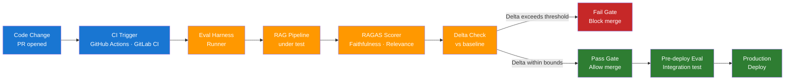

# Day 16 — Automated Eval Pipelines — Learn & Revise

> **Pre-reading:** [Week 3 Overview](./index.md) · [Learning Plan](../index.md)

---

## 🎯 What You'll Master Today

Manual evaluation does not scale — you cannot hand-review hundreds of model outputs per pull request. Today you will learn how to embed automated evals directly into your CI/CD pipeline so every code change is gated on quality metrics before it ships. By the end you will be able to design an eval harness, integrate it with a CI system, and explain regression-testing strategy for prompts and retrieval changes.

---

## 📖 Core Concepts

### Why Manual Eval Does Not Scale

Manual eval has two fatal scaling problems: **cost** and **latency**. Reviewing 200 outputs at 2 minutes each takes nearly 7 hours — far too slow for a fast-moving team shipping multiple PRs per day. Human reviewers also drift: inter-annotator agreement drops as fatigue increases, making scores unreliable across time.

Automated eval solves both problems. A RAGAS run over 100 test cases completes in under 3 minutes using GPT-4o-mini as the judge. When integrated into CI/CD, it runs on every commit with zero human time — bad changes are blocked before they ever merge.

!!! note "Manual eval still belongs in calibration"
    Use human review to calibrate your automated judge (see Day 15), not as the primary gate. Reserve human review for new metric design and post-incident investigation.

### CI/CD for LLMs — Where Evals Fit

The standard LLM development lifecycle has three eval moments:

| Stage | When it runs | What it tests |
|---|---|---|
| **Pre-merge** | On every pull request, before merge to main | Prompt changes, retrieval config changes, new tool calls |
| **Pre-deploy** | After merge, before production rollout | Full pipeline integration — end-to-end quality and latency |
| **Post-deploy** | After production rollout, continuously | Online quality monitoring, drift detection |

Pre-merge evals are the most important gate. They give developers fast feedback (under 5 minutes) and prevent regressions from entering the main branch. Pre-deploy evals catch integration issues that only appear when all components run together.

### Regression Testing for LLMs

A regression test checks that a code or config change does not degrade a previously passing metric. For LLMs, regressions typically come from:

- **Prompt changes** — rewording the system prompt shifts model behaviour unexpectedly.
- **Retrieval config changes** — changing chunk size or top-k alters what context the model sees.
- **Model version bumps** — GPT-4o replaces GPT-4 Turbo; behaviour shifts even on identical prompts.
- **Dependency updates** — LangChain or LlamaIndex version changes alter chain behaviour.

**Alert thresholds:** Track metric deltas, not absolute values. A drop of 0.03 in faithfulness (3 percentage points) on a 100-sample set is a meaningful regression. Set your CI threshold based on the minimum detectable effect you care about — typically 0.03–0.05 for RAG systems.

### RAGAS Framework — Deep Dive

RAGAS is an open-source framework for evaluating RAG pipelines. Its key components are:

| Component | Role |
|---|---|
| `Dataset` | Input — list of `{question, answer, contexts, ground_truth}` dicts |
| `Metric` | Scoring function — faithfulness, answer_relevancy, context_precision, context_recall |
| `evaluate()` | Orchestrator — runs all metrics, returns `EvaluationResult` |
| `EvaluationResult.to_pandas()` | Output — per-row scores as a DataFrame |

RAGAS uses an LLM judge internally for each metric. It decomposes faithfulness into claims extraction + claim verification — each step is a separate LLM call, so cost scales with dataset size. Budget roughly 5–8 LLM calls per row.

### Prompt Regression Tests

A prompt regression test isolates a single prompt change and checks whether it improves target test cases without degrading existing ones. The workflow:

1. Run the eval harness on the current prompt → save baseline scores.
2. Apply the prompt change.
3. Re-run the eval harness.
4. Compute deltas per metric and per test case.
5. Pass if: target cases improve AND no existing case drops below threshold.

This is analogous to software unit tests: a change must not break what was previously passing.

!!! warning "Watch for metric gaming"
    A prompt change that raises answer_relevancy by making answers longer may hurt faithfulness by encouraging hallucination. Always check all metrics together, not just the one you were optimising.

### Eval Harness Design

A well-designed eval harness has four components:

| Component | Responsibility |
|---|---|
| **Test case schema** | Defines the shape of each test: `{id, question, ground_truth, tags}` |
| **Runner** | Invokes the pipeline under test and collects `{answer, contexts}` |
| **Scorer** | Runs RAGAS (or custom metrics) against runner output |
| **Reporter** | Writes results as JSON/HTML and emits pass/fail exit code for CI |

The reporter's exit code is critical — CI only sees exit 0 (pass) or non-zero (fail). Your reporter must exit non-zero when any tracked metric drops below its threshold.

---

## 🗺️ Architecture / How It Works



---

## ⚡ Key Facts — Quick Revision Table

| Concept | One-Line Definition | Why It Matters |
|---|---|---|
| Pre-merge eval | Eval run on every PR before it merges | Catches regressions before they enter main |
| Pre-deploy eval | Full pipeline eval before production rollout | Catches integration issues between components |
| Metric delta | Change in score vs baseline, not absolute value | Absolute scores vary; deltas signal regressions |
| Alert threshold | Minimum metric drop that triggers a CI failure | Defines your quality SLO for automated gating |
| RAGAS | Open-source RAG eval framework | Standardises faithfulness, relevance, precision, recall |
| Eval harness | Runner + scorer + reporter pipeline | Makes evals reproducible and CI-compatible |
| Prompt regression test | Check prompt change doesn't break existing cases | Prevents silent degradation from prompt edits |
| Reporter exit code | Non-zero exit when metrics fail threshold | How CI knows to block the deployment |
| Test case schema | Structured format for each eval input | Ensures reproducibility across runs |
| Shadow traffic | Route live traffic to new version without serving it | Real-distribution test before full rollout |

---

## 🔬 Deep Dive

### Python Eval Harness with pytest + RAGAS

```python
# eval_harness.py
import json
import sys
from pathlib import Path
from datasets import Dataset
from ragas import evaluate
from ragas.metrics import faithfulness, answer_relevancy, context_precision, context_recall
from langchain_openai import ChatOpenAI, OpenAIEmbeddings

# ---------- Config ----------
GOLDEN_SET_PATH = "tests/golden_set.jsonl"
BASELINE_PATH = "tests/baseline_scores.json"
THRESHOLDS = {
    "faithfulness": 0.75,
    "answer_relevancy": 0.75,
    "context_precision": 0.65,
    "context_recall": 0.65,
}
REGRESSION_DELTA = 0.03  # fail if any metric drops more than this vs baseline

# ---------- Load golden set ----------
def load_golden_set(path: str) -> Dataset:
    rows = [json.loads(l) for l in Path(path).read_text().splitlines() if l.strip()]
    return Dataset.from_list(rows)

# ---------- Run your RAG pipeline ----------
def run_pipeline(question: str) -> dict:
    """Replace with your actual RAG pipeline call."""
    # Example stub — returns answer and retrieved contexts
    return {
        "answer": f"Stub answer for: {question}",
        "contexts": ["Stub context chunk 1.", "Stub context chunk 2."],
    }

# ---------- Build eval dataset ----------
def build_eval_dataset(golden_set: Dataset) -> Dataset:
    rows = []
    for row in golden_set:
        result = run_pipeline(row["question"])
        rows.append({
            "question": row["question"],
            "answer": result["answer"],
            "contexts": result["contexts"],
            "ground_truth": row["ground_truth"],
        })
    return Dataset.from_list(rows)

# ---------- Score ----------
def score(eval_dataset: Dataset) -> dict:
    llm = ChatOpenAI(model="gpt-4o-mini", temperature=0)
    embeddings = OpenAIEmbeddings(model="text-embedding-3-small")
    results = evaluate(
        dataset=eval_dataset,
        metrics=[faithfulness, answer_relevancy, context_precision, context_recall],
        llm=llm,
        embeddings=embeddings,
    )
    df = results.to_pandas()
    return {
        "faithfulness": float(df["faithfulness"].mean()),
        "answer_relevancy": float(df["answer_relevancy"].mean()),
        "context_precision": float(df["context_precision"].mean()),
        "context_recall": float(df["context_recall"].mean()),
    }

# ---------- Compare vs baseline ----------
def check_regression(current: dict, baseline_path: str) -> list[str]:
    failures = []
    if not Path(baseline_path).exists():
        print("No baseline found — saving current scores as baseline.")
        Path(baseline_path).write_text(json.dumps(current, indent=2))
        return failures
    baseline = json.loads(Path(baseline_path).read_text())
    for metric, value in current.items():
        threshold = THRESHOLDS.get(metric, 0.0)
        delta = value - baseline.get(metric, value)
        if value < threshold:
            failures.append(f"FAIL: {metric}={value:.3f} below threshold {threshold}")
        elif delta < -REGRESSION_DELTA:
            failures.append(f"REGRESSION: {metric} dropped {abs(delta):.3f} vs baseline")
    return failures

# ---------- Main ----------
if __name__ == "__main__":
    golden = load_golden_set(GOLDEN_SET_PATH)
    eval_ds = build_eval_dataset(golden)
    scores = score(eval_ds)

    print("\n=== Eval Results ===")
    for k, v in scores.items():
        print(f"  {k}: {v:.3f}")

    failures = check_regression(scores, BASELINE_PATH)
    if failures:
        print("\n=== FAILURES ===")
        for f in failures:
            print(f"  {f}")
        sys.exit(1)
    else:
        print("\nAll checks passed.")
        # Update baseline with latest passing scores
        Path(BASELINE_PATH).write_text(json.dumps(scores, indent=2))
        sys.exit(0)
```

**GitHub Actions integration:**

```yaml
# .github/workflows/eval.yml
name: LLM Eval Gate
on: [pull_request]
jobs:
  eval:
    runs-on: ubuntu-latest
    steps:
      - uses: actions/checkout@v4
      - uses: actions/setup-python@v5
        with: { python-version: "3.11" }
      - run: pip install ragas langchain-openai datasets
      - run: python eval_harness.py
        env:
          OPENAI_API_KEY: ${{ secrets.OPENAI_API_KEY }}
```

The job exits non-zero if any metric regresses, which blocks the PR merge in GitHub branch protection rules.

---

## 🧪 Practice Drills

### Drill 1 — Set Up a Local Eval Harness

1. Create `tests/golden_set.jsonl` with 20 QA pairs from your Day 15 golden set.
2. Copy the `eval_harness.py` script above and replace the `run_pipeline` stub with your actual RAG call.
3. Run `python eval_harness.py` — observe baseline scores written to `tests/baseline_scores.json`.
4. Intentionally degrade the pipeline (e.g., reduce top-k to 1) and re-run — confirm a regression is detected.

### Drill 2 — Prompt Regression Test

1. Take your current system prompt and create an alternate version (paraphrase or add constraints).
2. Run the eval harness with the original prompt → save scores.
3. Swap to the new prompt and re-run.
4. Compute metric deltas. Does the new prompt improve or regress?
5. Document your finding: "Prompt change X improved answer_relevancy by Y but degraded context_recall by Z."

### Drill 3 — GitHub Actions Integration

1. Push your eval harness to a GitHub repo.
2. Add the `eval.yml` workflow above.
3. Open a PR with a deliberate regression (lower top-k to 1).
4. Observe the Actions job fail and block the PR.
5. Fix the regression and confirm the job passes.

---

## 💬 Interview Q&A

??? question "How do you integrate LLM evals into a CI/CD pipeline?"
    You run the eval harness as a CI job triggered on every pull request. The harness loads the golden set, invokes the RAG pipeline under test, scores outputs with RAGAS, and compares scores to baseline. The reporter exits non-zero if any metric drops below threshold, which blocks the PR merge via branch protection rules. Pre-deploy evals run the same harness on the full integrated pipeline before any production rollout. This gives you two quality gates: fast feedback at PR time and a final check before traffic hits production.

??? question "What is regression testing for prompts?"
    A prompt regression test captures the metric scores on your golden set before a prompt change, applies the change, re-runs scoring, and checks that no previously passing test case now fails. The key insight is that prompt changes are not obviously safe — rewording a sentence can shift model behaviour in unexpected ways. You track metric deltas (not just absolute values) and set a regression threshold (typically 0.03 points) below which a drop triggers a CI failure. This gives you the same safety net for prompts that unit tests give for code.

??? question "How do you decide what threshold triggers a pipeline failure?"
    Set thresholds based on two signals: your product's quality SLO and the statistical noise floor of your eval set. For a 100-sample set, random variance in LLM judging is roughly ±0.02 points, so a regression threshold below 0.03 will produce false positives. A good starting point is: absolute floor = 0.75 for faithfulness and relevance, regression delta = 0.03. Review and tighten thresholds quarterly as your golden set grows and your system matures. The goal is to block genuine regressions while avoiding alert fatigue from noise.

---

## ✅ End-of-Day Checklist

| Item | Status |
|---|---|
| Can explain where evals fit in CI/CD (pre-merge, pre-deploy, post-deploy) | ☐ |
| Can design an eval harness (runner, scorer, reporter, exit code) | ☐ |
| Can explain prompt regression testing and metric delta tracking | ☐ |
| Can explain RAGAS components and cost per row | ☐ |
| Eval harness script runs locally against a golden set | ☐ |
| Regression detection confirmed (intentional degradation caught) | ☐ |
| GitHub Actions workflow drafted or deployed | ☐ |
| All 3 interview answers rehearsed out loud | ☐ |

--8<-- "_abbreviations.md"
