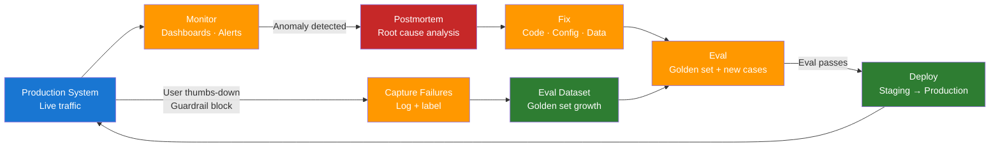

# Day 20 — Postmortems and Continuous Improvement — Learn & Revise

> **Pre-reading:** [Week 3 Overview](./index.md) · [Learning Plan](../index.md)

---

## 🎯 What You'll Master Today

Production LLM systems fail in ways that are often subtle and hard to detect — a retrieval index
degrades, a prompt change silently shifts model behaviour, or a model version update introduces
systematic errors. Today you will learn how to run blameless postmortems for LLM failures, close the
feedback loop from production incidents into your eval dataset, and safely run A/B tests on prompt
and model changes. By the end you will be able to turn every production failure into a system
improvement.

---

## 📖 Core Concepts

### What a Postmortem Is

A postmortem (also called an incident review or retrospective) is a structured, blameless analysis
of a production failure. Blameless means the goal is to understand the system failure, not to assign
fault to individuals. Psychological safety is required — if engineers fear blame, they will suppress
information the team needs to prevent recurrence.

A postmortem produces three outputs:

1. **A shared understanding** of what happened, when, and why.
2. **Action items** with owners and due dates that prevent recurrence.
3. **Eval dataset additions** — every production failure becomes a new test case.

!!! note "Postmortems are not optional for LLM systems"
LLM failures are often subtle — a 10% quality degradation over two weeks looks like noise until it
causes a user complaint. Postmortems create the institutional memory to detect patterns and act
before they escalate.

### LLM-Specific Failure Taxonomy

| Failure Type                | Description                                     | Detection signal                                          |
|-----------------------------|-------------------------------------------------|-----------------------------------------------------------|
| **Retrieval regression**    | Vector index degraded, wrong chunks retrieved   | Context recall drops, user complaints about wrong answers |
| **Prompt regression**       | Prompt change shifted model behaviour           | Faithfulness or answer relevancy drops after deployment   |
| **Model drift**             | Model version update changed behaviour          | Metric shift correlated with model version timestamp      |
| **Config error**            | Wrong temperature, top-k, or max_tokens         | Truncated responses, over-creative outputs, high variance |
| **Infrastructure failure**  | Model endpoint down, rate-limited, or slow      | Error rate spike, latency P95 spike                       |
| **Data quality regression** | Source documents updated with incorrect content | Faithfulness high but factually wrong answers             |

The hardest failures to catch are retrieval regression and model drift because they degrade
gradually over days rather than causing immediate errors.

### Postmortem Template for LLM Systems

```
## Incident: [Short description]
**Date:** YYYY-MM-DD  
**Severity:** P1 / P2 / P3  
**Duration:** HH:MM (detection to resolution)

## Timeline
| Time | Event |
|---|---|
| T+0 | Anomaly first visible in metrics |
| T+N | Alert fired / team notified |
| T+N | Root cause identified |
| T+N | Fix deployed |
| T+N | Metrics confirmed recovered |

## Root Cause
[One paragraph — what system property caused the failure?]

## Impact
[# users affected · # requests affected · SLO breach duration]

## Detection Lag
[How long between failure start and detection? Why?]

## Fix
[What was changed to resolve the incident?]

## Prevention
| Action item | Owner | Due date |
|---|---|---|
| Add eval test case for this failure pattern | | |
| Add alert for early detection signal | | |
| Review [component] for similar failure modes | | |
```

The **detection lag** section is often the most valuable — a failure that takes 4 hours to detect
causes 4x more impact than one detected in 1 hour. Shrinking detection lag is often a higher ROI
than preventing the failure entirely.

### Continuous Improvement Loop

The improvement loop connects postmortem outputs to system changes:

1. **Production:** System runs, metrics collected.
2. **Monitor:** Dashboards and alerts watch for anomalies.
3. **Detect degradation:** Alert fires or user complaint received.
4. **Postmortem:** Root cause analysis, action items generated.
5. **Fix:** Code, config, or data change deployed.
6. **Eval:** Eval harness run against golden set + new test cases.
7. **Deploy:** Fix verified in staging, promoted to production.
8. Back to step 1.

Every iteration of this loop produces a better eval dataset, better alerts, and a more robust
system. Teams that run this loop consistently improve system quality over time even without changing
the underlying model.

### Feedback Loops — Capturing User Signals

User feedback is the richest signal of production quality:

| Signal              | Collection method                           | How to use                                 |
|---------------------|---------------------------------------------|--------------------------------------------|
| **Thumbs up/down**  | UI button on every response                 | Binary quality label for sampled responses |
| **Correction**      | User overwrites or edits the response       | Gold label for that exact query            |
| **Abandonment**     | User leaves without engaging the response   | Negative signal — response missed the mark |
| **Follow-up query** | User asks a clarifying question immediately | Partial failure — answer was incomplete    |
| **Copy/paste**      | User copies the response                    | Strong positive signal                     |

Thumbs-down signals are the highest priority for eval dataset growth. Every thumbs-down should
trigger: (1) log the query + response, (2) manually label the correct answer, (3) add to the golden
set.

### Eval Dataset Growth from Production Failures

Your eval dataset should grow continuously. The pipeline:

1. **Capture:** Log every query that triggers a thumbs-down, guardrail block, or low retrieval
   score.
2. **Label:** Manually write the correct answer for each captured query.
3. **Deduplicate:** Check for near-duplicates against existing golden set (using embedding
   similarity).
4. **Add:** Append to the golden set JSONL file.
5. **Rerun baseline:** Confirm existing fixes pass the new test cases.

Target: grow the golden set by 5–10 rows per week from production failures. After 6 months, your
golden set will reflect the real failure distribution of your system.

### A/B Testing for LLM Changes

An A/B test routes a fraction of live traffic to the new version (variant B) while the rest receives
the current version (control A). For LLM changes:

| Step                     | Detail                                                               |
|--------------------------|----------------------------------------------------------------------|
| **Define hypothesis**    | "New prompt reduces hallucination rate by 10%"                       |
| **Choose traffic split** | Start with 5–10% to variant B to limit blast radius                  |
| **Choose metrics**       | Primary: faithfulness. Secondary: latency, user feedback score       |
| **Run duration**         | Minimum 1 week to account for day-of-week variation                  |
| **Statistical test**     | t-test or Mann-Whitney for continuous metrics; chi-square for binary |
| **Decision**             | Promote if primary metric improves AND no secondary metric degrades  |

!!! warning "A/B testing LLM changes is hard"
LLM output metrics have high variance. You need large traffic volumes (> 1,000 samples per variant)
for statistical significance. For low-traffic features, use offline eval on a growing golden set
instead.

---

## 🗺️ Architecture / How It Works



---

## ⚡ Key Facts — Quick Revision Table

| Concept                     | One-Line Definition                                           | Why It Matters                                            |
|-----------------------------|---------------------------------------------------------------|-----------------------------------------------------------|
| Blameless postmortem        | Failure analysis focused on systems, not individuals          | Psychological safety enables honest information sharing   |
| Detection lag               | Time between failure start and alert/discovery                | Reducing lag is often higher ROI than preventing failures |
| Retrieval regression        | Vector index degrades; wrong chunks retrieved                 | Gradual — easy to miss without monitoring                 |
| Model drift                 | Model version change shifts output behaviour                  | Correlated with deployment timestamps                     |
| Continuous improvement loop | Postmortem → Fix → Eval → Deploy → Monitor cycle              | Compounds quality gains over time                         |
| Thumbs-down signal          | User negative feedback on a response                          | Highest priority source for eval dataset growth           |
| A/B test                    | Split traffic between control and variant to measure impact   | Only way to measure real-world quality improvement        |
| Eval dataset growth         | Adding production failures as new golden-set test cases       | Ensures eval reflects real failure distribution           |
| Config error                | Wrong model parameter (temperature, top-k) causes bad outputs | Common root cause; easily missed in postmortem            |
| Action item                 | Specific, owned, dated change to prevent recurrence           | Postmortem without action items is just a log             |

---

## 🔬 Deep Dive

### Python Script — Capture Failed Queries into Growing Eval Dataset

```python
import json
import hashlib
import numpy as np
from datetime import datetime
from pathlib import Path
from sentence_transformers import SentenceTransformer

EVAL_DATASET_PATH = "tests/golden_set.jsonl"
FAILURE_LOG_PATH = "logs/production_failures.jsonl"
DEDUP_THRESHOLD = 0.92  # Cosine similarity threshold for near-duplicate detection

embedder = SentenceTransformer("all-MiniLM-L6-v2")


def embed(text: str) -> np.ndarray:
    return embedder.encode(text, normalize_embeddings=True)


def load_existing_questions() -> list[dict]:
    if not Path(EVAL_DATASET_PATH).exists():
        return []
    return [json.loads(l) for l in Path(EVAL_DATASET_PATH).read_text().splitlines() if l.strip()]


def is_near_duplicate(new_question: str, existing: list[dict]) -> bool:
    """Return True if new_question is semantically similar to an existing golden-set question."""
    if not existing:
        return False
    new_emb = embed(new_question)
    for row in existing:
        existing_emb = embed(row["question"])
        sim = float(np.dot(new_emb, existing_emb))
        if sim >= DEDUP_THRESHOLD:
            return True
    return False


def log_production_failure(
    query: str,
    model_answer: str,
    retrieved_contexts: list[str],
    failure_reason: str,
) -> None:
    """Called at runtime when a failure signal is detected (thumbs-down, guardrail block, etc.)."""
    entry = {
        "timestamp": datetime.utcnow().isoformat(),
        "query": query,
        "model_answer": model_answer,
        "retrieved_contexts": retrieved_contexts,
        "failure_reason": failure_reason,
        "correct_answer": None,  # To be filled in by human review
    }
    Path(FAILURE_LOG_PATH).parent.mkdir(parents=True, exist_ok=True)
    with open(FAILURE_LOG_PATH, "a") as f:
        f.write(json.dumps(entry) + "\n")
    print(f"[FAILURE LOGGED] reason={failure_reason} query='{query[:50]}...'")


def promote_failure_to_golden_set(failure_entry: dict, correct_answer: str) -> bool:
    """
    Adds a labeled failure to the golden set after human review.
    Returns True if added, False if near-duplicate detected.
    """
    existing = load_existing_questions()

    if is_near_duplicate(failure_entry["query"], existing):
        print(f"  Skipped (near-duplicate): '{failure_entry['query'][:50]}...'")
        return False

    golden_row = {
        "question": failure_entry["query"],
        "answer": correct_answer,
        "contexts": failure_entry["retrieved_contexts"],
        "ground_truth": correct_answer,
        "source": "production_failure",
        "failure_reason": failure_entry["failure_reason"],
        "added_date": datetime.utcnow().isoformat(),
    }

    with open(EVAL_DATASET_PATH, "a") as f:
        f.write(json.dumps(golden_row) + "\n")
    print(f"  Added to golden set: '{failure_entry['query'][:50]}...'")
    return True


def process_failure_log_batch() -> None:
    """Batch-process the failure log — requires human-provided correct_answer for each entry."""
    if not Path(FAILURE_LOG_PATH).exists():
        print("No failure log found.")
        return

    failures = [json.loads(l) for l in Path(FAILURE_LOG_PATH).read_text().splitlines() if l.strip()]
    unlabeled = [f for f in failures if f.get("correct_answer") is None]
    labeled = [f for f in failures if f.get("correct_answer") is not None]

    print(f"\nFailure log: {len(failures)} total, {len(unlabeled)} need labeling, {len(labeled)} labeled")

    added = 0
    for failure in labeled:
        if promote_failure_to_golden_set(failure, failure["correct_answer"]):
            added += 1

    print(f"\nBatch complete: {added} new rows added to golden set.")
    existing = load_existing_questions()
    print(f"Golden set now has {len(existing)} rows.")


# ---------- Demo ----------
if __name__ == "__main__":
    # Simulate a production failure being logged
    log_production_failure(
        query="What are the refund policy terms for enterprise customers?",
        model_answer="Enterprise customers have a 30-day refund window.",
        retrieved_contexts=["Standard refund policy: 14 days for all customers."],
        failure_reason="thumbs_down",
    )

    # Simulate a second failure
    log_production_failure(
        query="How do I cancel my enterprise subscription?",
        model_answer="Contact support@example.com.",
        retrieved_contexts=["Cancellation requires 30 days notice via the billing portal."],
        failure_reason="guardrail_block",
    )

    print("\n--- Processing labeled failures ---")
    # In real life, a human adds correct_answer before calling this
    # Here we simulate it by injecting correct answers directly
    if Path(FAILURE_LOG_PATH).exists():
        lines = Path(FAILURE_LOG_PATH).read_text().splitlines()
        labeled_lines = []
        for line in lines:
            entry = json.loads(line)
            if entry["failure_reason"] == "thumbs_down":
                entry["correct_answer"] = "Enterprise customers have a 14-day refund window per standard policy."
            elif entry["failure_reason"] == "guardrail_block":
                entry["correct_answer"] = "Cancel via the billing portal with 30 days notice."
            labeled_lines.append(json.dumps(entry))
        Path(FAILURE_LOG_PATH).write_text("\n".join(labeled_lines) + "\n")

    process_failure_log_batch()
```

---

## 🧪 Practice Drills

### Drill 1 — Write a Postmortem

Choose a past (real or hypothetical) LLM system failure. Fill in the postmortem template above:

1. Write a 3-sentence root cause analysis.
2. Identify the detection lag — when did the failure start, and when was it noticed?
3. Write 3 action items with realistic owners and due dates.
4. Identify one eval test case that this failure should generate.

### Drill 2 — Production Failure Capture Pipeline

1. Run the failure capture script above against your RAG pipeline from earlier this week.
2. Simulate 5 thumbs-down events by calling `log_production_failure()` with realistic queries.
3. Manually write the correct answer for each.
4. Run `process_failure_log_batch()` and verify the golden set grows.
5. Check the deduplication: add a paraphrased query and verify it is not added.

### Drill 3 — A/B Test Design

Design (on paper) an A/B test for a prompt change to your RAG system:

1. Write the hypothesis: "Changing [X] in the prompt will improve [metric] by [Y]."
2. Choose traffic split (start with 5%).
3. Define primary and secondary metrics.
4. Define the minimum duration (1 week minimum).
5. Define the decision rule: what delta on the primary metric constitutes a win?

---

## 💬 Interview Q&A

??? question "Walk me through a blameless postmortem for an LLM production failure."
A blameless postmortem starts with a shared timeline — every team member adds what they observed and
when, building a chronological record from failure start to resolution. The root cause analysis
asks "what system property caused this?" not "who made a mistake?" — for example, "faithfulness
dropped because a retrieval index rebuild failed silently, so the model received stale context." We
record the detection lag — in this case 4 hours because we had no alert on context recall. Action
items follow: add a context recall alert, add a test case for stale index detection, set up a health
check on the index rebuild job. The postmortem ends with the failing query added to the golden set
so this failure mode is covered in future eval runs.

??? question "How do you use production feedback to improve your eval dataset?"
Every user thumbs-down, guardrail block, or low-retrieval-score event is logged with the query,
model answer, and retrieved contexts. A human reviewer writes the correct answer for each. Before
adding to the golden set, I run a near-duplicate check using embedding similarity — if a
semantically equivalent query already exists, I skip it to avoid eval set bloat. Labeled failures
are appended to the golden set JSONL file. I run the eval harness after each batch addition to
confirm the fix for that failure also passes the new test cases. The goal is to grow the golden set
by 5–10 rows per week so it increasingly reflects the real failure distribution, not just the cases
we thought of upfront.

??? question "How would you run an A/B test on a prompt change?"
Start with a clear hypothesis — for example, "adding chain-of-thought instructions to the prompt
will improve faithfulness by 10%." Route 5% of live traffic to the new prompt (variant B); the other
95% receive the current prompt (control A). Log the full request and response for both variants.
Measure primary metric (faithfulness via sampled RAGAS scoring) and secondary metrics (latency, user
thumbs-up rate). Run for at least one week to capture day-of-week variation and accumulate the
1,000+ samples per variant needed for statistical significance. Use a t-test on continuous metrics
and chi-square on binary outcomes. Promote if the primary metric improves without secondary metric
degradation. If traffic is too low for statistical significance, use offline eval on an expanded
golden set instead.

---

## ✅ End-of-Day Checklist

| Item                                                                   | Status |
|------------------------------------------------------------------------|--------|
| Can explain what a blameless postmortem is and why "blameless" matters | ☐      |
| Can name and describe the 6 LLM failure types                          | ☐      |
| Can fill in a postmortem template for a hypothetical failure           | ☐      |
| Can explain the continuous improvement loop                            | ☐      |
| Can explain how to capture production failures as eval test cases      | ☐      |
| Can design an A/B test for an LLM prompt change                        | ☐      |
| Failure capture script run with golden set growth verified             | ☐      |
| Postmortem written for a real or hypothetical failure                  | ☐      |
| All 3 interview answers rehearsed out loud                             | ☐      |

--8<-- "_abbreviations.md"
