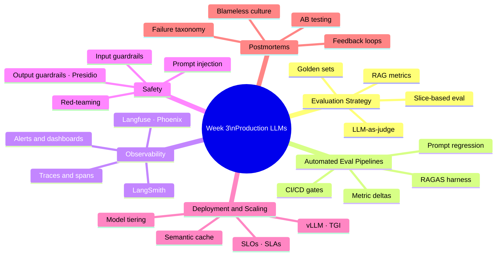
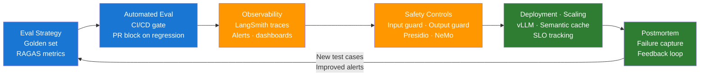

# Day 21 — Week 3 Consolidation and Production Readiness Review

> **Pre-reading:** [Week 3 Overview](./index.md) · [Learning Plan](../index.md)

---

## 🎯 What You'll Master Today

Today is your Week 3 integration session. You will connect all six production topics into a unified mental model, complete the production readiness drill, and identify any remaining weak spots before moving to Week 4. Work through this article without notes first — if you need to look something up, log it in the Weak Spots Tracker.

---

## 🗺️ Week 3 Concept Map

---

## 🗺️ Unified Architecture — End-to-End Production System

---

## ⚡ Master Revision Table — 25+ Concepts

| Concept | Definition | When It Matters | Common Pitfall |
|---|---|---|---|
| Golden set | Curated labeled dataset of (question, context, ideal answer) | Every eval run and CI gate | Too small (< 50 rows) hides regressions |
| Faithfulness | Answer only asserts facts present in retrieved context | RAG quality gate | High score can coexist with missing information |
| Answer relevance | Answer addresses the actual question asked | RAG quality gate | Easy to game by making answers longer |
| Context precision | Fraction of retrieved chunks that are useful | Retrieval tuning | Low precision = wasted tokens in prompt |
| Context recall | Fraction of needed info present in retrieved context | Retrieval tuning | Low recall = model lacks necessary facts |
| Slice-based eval | Eval on subgroups (topic, difficulty, user type) | Finding hidden regressions | Aggregate metrics mask minority failures |
| LLM-as-judge | LLM scores model outputs against a rubric | Monitoring quality at scale | Must be calibrated vs human labels |
| Task success rate | % of agent tasks reaching the defined goal state | Agent eval | Needs explicit acceptance criteria per task |
| Tool call accuracy | % of tool invocations correct (right tool, right args) | Agent eval | Often lower than task success rate |
| Pre-merge eval | RAGAS run blocking PR if metrics regress | CI/CD quality gate | Too-tight threshold causes false positive blocks |
| Regression delta | Metric drop vs baseline that triggers CI failure | CI/CD quality gate | Setting delta too low → alert fatigue |
| Eval harness | Runner + scorer + reporter pipeline for CI | Automated quality gate | Reporter must exit non-zero for CI to block |
| Prompt regression | Prompt change breaks previously passing test cases | Every prompt edit | Often invisible without a golden set |
| Logs | Discrete timestamped events | Debugging specific requests | Rich but hard to aggregate at scale |
| Metrics | Numeric aggregates (P95, error rate) | Alerting and dashboards | Hides root cause — need traces to diagnose |
| Traces | End-to-end span trees per request | Latency and correctness debugging | Logging PII in traces creates compliance risk |
| LangSmith | Managed tracing for LangChain/LangGraph stacks | Native LangChain tracing | Free tier limited; data leaves your infra |
| Langfuse | Open-source observability for any LLM stack | Self-hosted / non-LangChain | More setup than LangSmith |
| P95 latency | 95th-percentile response time | Latency SLO | Mean latency hides slow tail requests |
| Prompt injection | Adversarial input hijacking model instructions | Every public LLM endpoint | Indirect injection via retrieved documents |
| Presidio | Microsoft open-source PII detection and anonymisation | Output guardrail | Needs spaCy model downloaded separately |
| NeMo Guardrails | NVIDIA Colang-based dialogue policy framework | Complex safety rails | Steep learning curve for Colang DSL |
| SLO | Internal target for reliability or quality metric | Before launch, ongoing | Forgetting quality SLOs (only tracking latency) |
| SLA | Customer-facing contractual commitment | Enterprise contracts | Setting SLA tighter than SLO |
| vLLM | High-throughput inference server with PagedAttention | Self-hosted open model serving | GPU memory management complexity |
| Semantic cache | Cache keyed on embedding similarity, not exact text | Reducing model call costs | Threshold too low → wrong cached answers served |
| Model tiering | Route simple queries to cheap model, complex to expensive | Cost optimisation | Router classifier needs its own eval |
| Warm pool | Keep minimum replicas running to avoid cold starts | Latency SLO compliance | Idle GPU cost — size pool carefully |
| Blameless postmortem | Failure analysis focused on system, not individuals | After every P1/P2 incident | Blame culture suppresses incident information |
| Detection lag | Time from failure start to alert | Incident severity multiplier | Long lag = large user impact |
| Retrieval regression | Index degradation causes wrong chunks to be retrieved | Ongoing monitoring | Gradual; hard to spot without context recall alert |
| A/B testing | Split traffic between control and variant | Measuring prompt/model changes | Needs 1,000+ samples per variant for significance |
| Feedback loop | Thumbs-down → log → label → golden set → eval | Continuous improvement | Skipping the labeling step — guessing correct answers |
| Red-teaming | Adversarial self-testing of LLM safety controls | Pre-launch and recurring | Treating it as one-time rather than continuous |

---

## 🏗️ End-to-End Drill — Production Readiness Checklist

**Scenario:** You just deployed a RAG-powered knowledge base feature to production. Walk through your production readiness checklist.

Work through this scenario out loud or in writing. Use the questions below as prompts. Suggested time: 30 minutes.

---

### Phase 1 — Eval Strategy (Days 15–16)

**Questions to answer:**

1. How many rows does your golden set have? Is it large enough to catch a 5% regression?
2. Which RAG metrics are you tracking? (Name all four RAGAS metrics and what each catches.)
3. Is your eval harness wired into CI/CD? What happens when faithfulness drops 0.05?
4. Have you run slice-based eval across at least 3 dimensions (topic, difficulty, user type)?
5. Is your LLM-as-judge calibrated against human labels (Cohen's kappa > 0.6)?

**Model answer:**

My golden set has 250 rows sampled from real queries, covering 5 topic slices. I track all four RAGAS metrics: faithfulness (catches hallucination), answer relevancy (catches topic drift), context precision (noisy retrieval), and context recall (missing context). The eval harness runs on every PR via GitHub Actions and blocks merge if faithfulness drops more than 0.03 vs baseline or falls below 0.75 absolute. I have run slice analysis — medical queries are my weakest slice at 0.68 faithfulness, which I have flagged as a known risk. My LLM-as-judge uses GPT-4o-mini with a calibration kappa of 0.71 against 100 human-labeled examples.

---

### Phase 2 — Observability (Day 17)

**Questions to answer:**

1. Is every request traced? Can you see the span tree for a slow request?
2. Which alerts are active? Name at least 4 with their thresholds.
3. How long would it take you to identify whether a P95 latency spike is caused by retrieval or model inference?
4. How are you monitoring quality in production (not just availability and latency)?

**Model answer:**

Every request is traced in LangSmith with four spans: retrieval, prompt build, model inference, post-process. Active alerts: P95 > 5s over 5 min, error rate > 1% over 5 min, token usage > 90% of context window on > 10% of requests, and context recall proxy < 0.5 over rolling 100 requests. For a latency spike, I open LangSmith, find the slow traces, and look at span durations — I can pinpoint the bottleneck in under 2 minutes. Quality monitoring: I score a 1% production sample with RAGAS nightly and alert if the rolling 24-hour faithfulness average drops below 0.7.

---

### Phase 3 — Safety (Day 18)

**Questions to answer:**

1. What input guardrails are active? What attacks do they catch and miss?
2. Is PII redaction running on every response? What entities does it cover?
3. Have you run a red-team exercise? How many attack categories did you cover?
4. What happens when a guardrail fires? Is it logged and alerted?

**Model answer:**

Input guardrails: fast regex (known injection patterns, < 1ms), then NLI classifier (injection intent hypothesis, 25ms). The NLI classifier catches novel phrasing that regex misses but may miss multi-turn injection across conversation history — a known gap. Output guardrail: Presidio PII detection (PERSON, EMAIL, PHONE, SSN, CREDIT_CARD) runs on every response and replaces entities before returning to the caller. Red-team exercise covered 5 categories: injection probes, topic bypass, PII extraction, capability abuse, edge-case inputs. 2 of 5 injection probes succeeded — both are now blocked and logged as test cases. Every guardrail trigger writes to the incident log and increments a counter alerting at > 50 triggers/hour.

---

### Phase 4 — Deployment and Scaling (Day 19)

**Questions to answer:**

1. What is your P95 latency SLO? How close are you to it right now?
2. What is your quality SLO? How do you measure it?
3. What caching strategy is active? What is your cache hit rate?
4. How does the system behave under 10x normal traffic?

**Model answer:**

SLOs: P95 < 5s (current P95 = 2.8s — 44% headroom), availability 99.5% (current 99.7%), error rate < 0.5% (current 0.2%), faithfulness > 0.75 (current 0.82 on weekly sample). Semantic cache with similarity threshold 0.92 is active — cache hit rate is 28% across the past 7 days, saving approximately 28% of model API calls. Under 10x traffic: the load balancer distributes across 4 API replicas; the semantic cache absorbs repeated queries; async queue handles document processing requests; minimum 2 warm replicas prevent cold starts. At 10x, P95 would likely rise to ~4.5s — within SLO. Above 20x, we would hit model pool saturation and need to scale horizontally.

---

### Phase 5 — Postmortem and Improvement (Day 20)

**Questions to answer:**

1. What is your process when a user reports a wrong answer?
2. How does a thumbs-down become a new golden-set test case?
3. What is the detection lag for a quality regression in your system?
4. How would you run an A/B test on a prompt change?

**Model answer:**

Wrong answer report → log the query + response + retrieved context with reason "user_report" → human reviewer writes the correct answer within 24 hours → near-duplicate check → if unique, add to golden set → rerun eval harness with new test case. Current detection lag for quality regression: ~6 hours (nightly RAGAS sample). I am working to reduce this to 1 hour via continuous 1% sampling with real-time alerting. For an A/B test: define hypothesis, route 5% traffic to variant B, measure faithfulness on sampled RAGAS for 1 week (target: 1,000+ samples per variant), use t-test, promote on primary metric improvement without secondary degradation.

---

## 💬 Interview Q&A

??? question "How do you know your RAG system is production-ready?"
    Production readiness for an RAG system has five dimensions. First, eval: golden set with > 200 rows, RAGAS metrics above target thresholds, eval harness in CI that blocks on regression, slice-based eval covering all major user segments. Second, observability: every request traced with a tool like LangSmith, active alerts on P95 latency, error rate, and a quality proxy metric. Third, safety: input and output guardrails active, red-team exercise completed, PII redaction running on every response. Fourth, deployment: SLOs defined and currently met, warm pool preventing cold starts, semantic cache reducing API cost, load tested at 5x normal traffic. Fifth, improvement loop: thumbs-down events captured and fed into the golden set, postmortem process documented, A/B test capability ready for prompt experiments.

??? question "What is the most important metric to monitor in a production RAG system?"
    Faithfulness is the most important quality metric because it directly measures hallucination — the most harmful user-facing failure mode. But faithfulness requires an LLM judge to compute, which makes real-time monitoring expensive. In practice I monitor faithfulness on a sampled basis (1% of traffic, scored nightly) and use it as the primary quality SLO. For real-time alerting I use proxy signals: retrieval score (a drop below 0.5 predicts faithfulness degradation), error rate, and P95 latency. A sudden spike in latency plus a drop in retrieval score is a reliable early warning of a retrieval regression — the most common faithfulness failure mode.

??? question "If you had one week to improve a degraded production RAG system, what would you do first?"
    First, I identify the root cause by reading traces for the lowest-faithfulness requests in LangSmith — is the retrieval returning stale or irrelevant chunks, or is the model generating unsupported claims? This takes 30 minutes and determines whether the fix is in retrieval or prompting. If retrieval: check index freshness, re-embed stale documents, increase top-k and add a reranker. If prompting: tighten the system prompt ("Only answer using the provided context; if unsupported, say so"), add chain-of-thought. Then I add any failing query patterns to the golden set, rerun the eval harness to verify the fix, and deploy. In the second half of the week I add an alert on whatever signal would have detected this regression earlier.

??? question "How do you prevent LLM quality regressions from reaching production?"
    Three layers of protection. First, pre-merge eval: every PR runs the RAGAS eval harness against the golden set and blocks merge if faithfulness drops > 0.03 or falls below 0.75. This catches prompt changes and retrieval config changes instantly. Second, pre-deploy integration eval: after merging, a full end-to-end eval runs against the staging environment before promoting to production. Third, post-deploy monitoring: LangSmith traces every request; a nightly 1% RAGAS sample fires an alert if the rolling average drops below the quality SLO. If a regression still reaches production, the postmortem process captures the failing query, adds it to the golden set, and ensures it is covered by all three future gates.

??? question "Describe your ideal team process for LLM production operations."
    Weekly rhythm: Monday, review the previous week's quality metrics dashboard — faithfulness trend, error rate, P95 latency. Wednesday, process the failure log: review thumbs-down events, write correct answers, promote to golden set with near-duplicate check, rerun eval harness. Friday, ship any pending fixes that passed CI and eval. Monthly: run a red-team exercise (30 minutes, 5 attack categories), review and tighten SLO targets, audit alert thresholds for false-positive rate. After every P1/P2 incident: blameless postmortem within 48 hours, action items with owners and due dates, new golden set rows added before the postmortem is closed. This rhythm compounds — the golden set grows, alerts improve, and the eval harness catches more regressions over time.

---

## 🩹 Weak Spots Tracker

Use this table during your review session. Mark any concept you could not explain confidently, then revisit the source article.

| Concept | Confidence (1–5) | Source article | Notes |
|---|---|---|---|
| RAG metrics (all four) | | Day 15 | |
| LLM-as-judge calibration | | Day 15 | |
| Slice-based eval | | Day 15 | |
| Eval harness design | | Day 16 | |
| Prompt regression testing | | Day 16 | |
| CI/CD gate / exit codes | | Day 16 | |
| Trace and span tree | | Day 17 | |
| LangSmith vs Langfuse vs Phoenix | | Day 17 | |
| Alert thresholds (5 metrics) | | Day 17 | |
| Prompt injection defence | | Day 18 | |
| Input guardrail layering | | Day 18 | |
| Presidio PII redaction | | Day 18 | |
| SLO vs SLA | | Day 19 | |
| vLLM vs TGI tradeoffs | | Day 19 | |
| Semantic cache vs exact-match | | Day 19 | |
| Blameless postmortem | | Day 20 | |
| LLM failure taxonomy (6 types) | | Day 20 | |
| A/B test design for prompts | | Day 20 | |
| Feedback loop → golden set | | Day 20 | |
| Continuous improvement loop | | Day 20 | |

**Scoring guide:** 5 = can explain fluently without notes, 4 = can explain with minor hesitation, 3 = partial explanation, 2 = vague, 1 = cannot explain. Target: all concepts at 4+ before Week 4.

--8<-- "_abbreviations.md"
