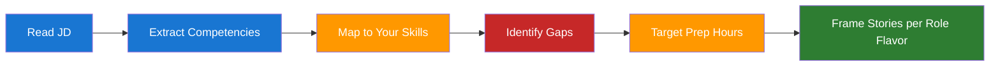

# Day 22 — Role Targeting and Competency Mapping — Learn & Revise

> **Pre-reading:** [Week 4 Overview](./index.md) · [Learning Plan](../index.md)

---

## 🎯 What You'll Master Today

AI engineering roles are not interchangeable — an LLM Engineer and an ML Engineer share vocabulary
but are tested on very different skills. Today you will learn how to decode a job description (JD)
in under 20 minutes, extract the 5–7 competencies the hiring team is actually scoring, and map those
competencies to concrete evidence from your own experience. By the end of the day you will have a
personal competency matrix you can use to direct every remaining preparation hour.

---

## 📖 Core Concepts

### AI Engineer Role Variants

Four common flavors appear in the market. Each emphasizes different depth:

| Role Title              | Primary Emphasis                                     | Secondary Signal        | Typical Outputs                           |
|-------------------------|------------------------------------------------------|-------------------------|-------------------------------------------|
| **ML Engineer**         | Model training, feature engineering, offline metrics | Infra, pipelines        | Trained models, datasets, experiments     |
| **LLM Engineer**        | Prompt engineering, RAG, agent design                | Evals, safety           | Chatbots, search, generative APIs         |
| **Applied AI Engineer** | Product integration, latency, reliability            | A/B testing, monitoring | Production APIs, dashboards               |
| **AI Product Engineer** | User experience, rapid iteration, cross-functional   | PM collaboration        | Prototypes, feature flags, growth metrics |

When you read a JD, identify which flavor is primary. A ML Engineer role at a mid-size startup will
test model debugging; the same title at a tech company may mean owning eval infrastructure. The
title is a hint; the bullet points are the signal.

### Competency Mapping — Reading a JD

Most JDs contain noise. Strip it out with this workflow:

1. **Highlight action verbs** — "design", "own", "collaborate", "debug", "evaluate". Each verb
   points to a competency cluster.
2. **Group bullets** — Cluster bullets into 5–7 themes: technical depth, system design,
   cross-functional, evaluation, reliability, leadership, domain.
3. **Weight by repetition** — A competency mentioned three times is a top priority. One mention may
   be a wish list item.
4. **Look for level signals** — Words like "lead", "define", "drive" indicate senior-level (L5+). "
   Contribute", "support", "learn" suggest L4 or below.

A well-decoded JD gives you the exam rubric before the test.

### Gap Analysis

Gap analysis asks: "What is the delta between what this role requires and what I can currently
demonstrate?"

Create a simple three-column table: **Competency | My Evidence | Confidence (1–5)**. Be honest. A
gap at confidence 2 is something to address this week; a gap at confidence 4 just needs a strong
story. Prioritize gaps by **impact × likelihood of being tested**, not just by how hard they are to
close.

For AI engineering roles, the most common under-prepared areas are: writing and running evaluations,
explaining architecture tradeoff decisions verbally, and quantifying the business impact of
technical work.

### Targeting Your Answers

The same experience can be framed differently for different roles. A project where you built a RAG
pipeline can be narrated as:

- **For ML Engineer**: "I implemented a hybrid BM25 + dense retrieval system and ran ablation
  studies to select the best configuration."
- **For LLM Engineer**: "I designed the retrieval and prompt chain, set up RAGAS evaluations, and
  hit 87% answer faithfulness."
- **For Applied AI**: "I integrated the system into an existing API, added latency monitoring, and
  reduced P95 response time by 40%."

The underlying experience is the same. The framing matches what that interviewer is scoring.

### Leveling Signals — L4, L5, and Staff

Interviewers calibrate level continuously. Here are markers:

| Level      | Signal in Answers                                                                                     |
|------------|-------------------------------------------------------------------------------------------------------|
| **L4**     | Solves defined problems well. Explains their own work clearly. Asks good clarifying questions.        |
| **L5**     | Scopes ambiguous problems. Makes tradeoff decisions and defends them. Shows cross-team influence.     |
| **Staff+** | Sets direction. Identifies problems others haven't named. Connects technical choices to org strategy. |

Aim to demonstrate one level above the minimum for the role. If the role is L5, show Staff thinking
in at least two answers.

---

## 🗺️ Strategy Map

---

## ⚡ Key Facts — Quick Revision Table

| Concept            | One-Line Definition                                                | Why It Matters                                      |
|--------------------|--------------------------------------------------------------------|-----------------------------------------------------|
| Role flavor        | Sub-type of AI engineer role with different skill emphasis         | Prevents preparing for the wrong interview focus    |
| JD decoding        | Extracting tested competencies from job description noise          | Gives you the scoring rubric in advance             |
| Competency cluster | Group of related skills tested together                            | Lets you prepare one story to cover many questions  |
| Gap analysis       | Delta between required competency and your current evidence        | Directs remaining prep time to highest-impact areas |
| Story targeting    | Reframing the same experience for a different role flavor          | One project can answer 10 different questions       |
| L4 signal          | Solves defined problems, explains work clearly                     | Minimum bar for most mid-level AI roles             |
| L5 signal          | Scopes ambiguity, makes tradeoff decisions, influences cross-team  | Target signal for senior AI engineer positions      |
| Staff signal       | Sets direction, identifies systemic problems, connects to strategy | Differentiates top candidates in competitive loops  |
| JD weight          | How often a competency appears in a JD                             | Predicts how heavily it will be tested              |
| Evidence gap       | A competency you cannot yet back with a concrete story             | The first thing to address in remaining prep days   |

---

## 🔬 Deep Dive with Examples

### Worked Example: Decode a Sample JD

**Sample JD excerpt:**

> "Design and own the evaluation infrastructure for our LLM applications. Partner with product and
> legal to define quality thresholds. Debug production regressions and drive root-cause analysis.
> Experience with RAG systems and prompt engineering required. Familiarity with safety and content
> moderation a plus."

**Step 1 — Extract action verbs:**
design, own, partner, define, debug, drive

**Step 2 — Group into competency clusters:**

| Cluster                 | Bullets that map to it                                           |
|-------------------------|------------------------------------------------------------------|
| Evaluation & quality    | "own the evaluation infrastructure", "define quality thresholds" |
| System design           | "design eval infrastructure", "RAG systems"                      |
| Cross-functional        | "Partner with product and legal"                                 |
| Debugging & reliability | "debug production regressions", "root-cause analysis"            |
| Prompt engineering      | "prompt engineering required"                                    |
| Safety                  | "safety and content moderation"                                  |

**Step 3 — Weight by repetition:**
Evaluation appears 3 times → top priority. Debugging appears 2 times → high priority.

**Step 4 — Map to your skills:**

| Competency                  | Your Evidence                                | Confidence |
|-----------------------------|----------------------------------------------|------------|
| Evaluation infrastructure   | Built RAGAS pipeline for RAG chatbot         | 4          |
| RAG system design           | 3 production RAG projects                    | 5          |
| Cross-functional            | Presented eval results to PM and legal once  | 2          |
| Debugging LLM systems       | Fixed hallucination regression in prod       | 4          |
| Safety / content moderation | Read documentation, no production experience | 1          |

**Gap priority:** Cross-functional communication (confidence 2) → prepare one strong STAR story.
Safety (confidence 1) → read one article and prepare a "here is how I would approach it" answer.

---

## 🧪 Practice Drills

**Drill 1 — JD Competency Extraction (20 minutes)**

1. Find a real AI engineer JD on LinkedIn or a company career page.
2. Copy the requirements section into a blank document.
3. Highlight every action verb.
4. Group bullets into 5–7 competency clusters.
5. Count how many times each cluster is referenced.
6. Rank clusters by frequency.

**Drill 2 — Personal Competency Matrix (30 minutes)**

1. Take your competency ranking from Drill 1.
2. For each competency, write: one concrete project that demonstrates it and one measurable outcome.
3. Rate your confidence 1–5.
4. Flag anything rated 1–2 as a prep priority.

**Drill 3 — Story Retargeting (20 minutes)**

1. Pick your best AI project.
2. Write three versions of the opening sentence — one for ML Engineer, one for LLM Engineer, one for
   Applied AI.
3. Read each aloud. Confirm the framing matches the role flavor.

---

## 💬 Interview Q&A

??? question "How do you research a company before an AI engineer interview?"
I read the company's engineering blog and recent papers to understand their technical stack. I look
at the JD with fresh eyes to extract the 5–7 competencies they are scoring. I also check LinkedIn
for the team's backgrounds — if most engineers came from search or infra, I know to emphasise
reliability and scale. I then map my strongest projects to their priorities and prepare one story
per major competency cluster. This usually takes two to three hours and produces a preparation brief
I can review on the morning of the interview.

??? question "What is the difference between an ML Engineer and an LLM Engineer role?"
An ML Engineer role typically focuses on the full model lifecycle — feature engineering, training,
offline metric optimisation, and deployment pipelines. An LLM Engineer role assumes the foundation
model is fixed and focuses on what is built on top: prompt design, retrieval systems, agent
orchestration, evaluation frameworks, and safety controls. The core skill difference is that ML
Engineers need to understand training dynamics and dataset quality deeply, while LLM Engineers need
to understand how to measure and improve model behaviour in production without re-training. Many
roles blend both, so I always decode the JD to understand which direction the emphasis falls.

??? question "How do you tailor your STAR stories to a specific role?"
I start by identifying the primary competency the question is testing. I then select the experience
from my story bank that has the highest relevance to that competency. The facts of the story stay
the same — the project, the actions I took, the outcome — but the framing of the opening and the
emphasis in the Action section shifts. For an ML Engineer role I lead with model decisions and
ablation studies; for an LLM Engineer role I lead with evaluation design and retrieval quality; for
Applied AI I lead with latency, reliability, and business impact. I rehearse each version until the
opening sentence is automatic for each role type.

---

## ✅ End-of-Day Checklist

| Item                                                     | Status |
|----------------------------------------------------------|--------|
| Decoded one real JD into 5–7 competency clusters         | ☐      |
| Built personal competency matrix with confidence ratings | ☐      |
| Identified top 2 evidence gaps                           | ☐      |
| Wrote three role-targeted framings of one project        | ☐      |
| Drafted one answer for each interview Q above            | ☐      |
| Logged one weak area for tomorrow's prep                 | ☐      |

--8<-- "_abbreviations.md"
