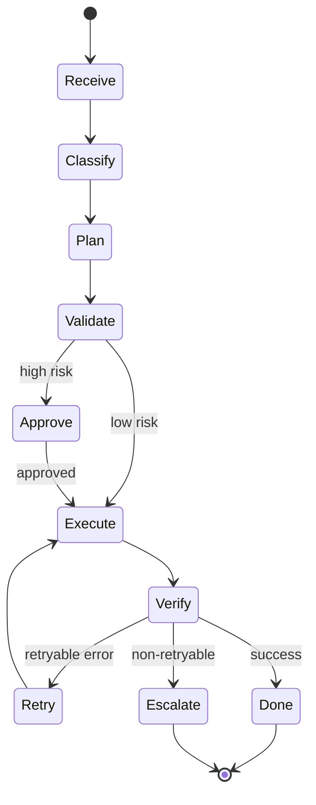

# Agentic Workflows and Tools

## Design Rule

Use hybrid control: deterministic orchestration + LLM reasoning.

## Reliability Checklist

- Schema-validated tool inputs
- Permission boundaries
- Timeout and retry policy
- Idempotency for side-effecting tools
- Human approval for high-risk actions
- Trace logging for each tool call

## Pattern

## Micro-Lab

Define one workflow with 3 tools and include:

- one retry branch
- one escalation branch
- one human-approval gate

--8<-- "_abbreviations.md"

