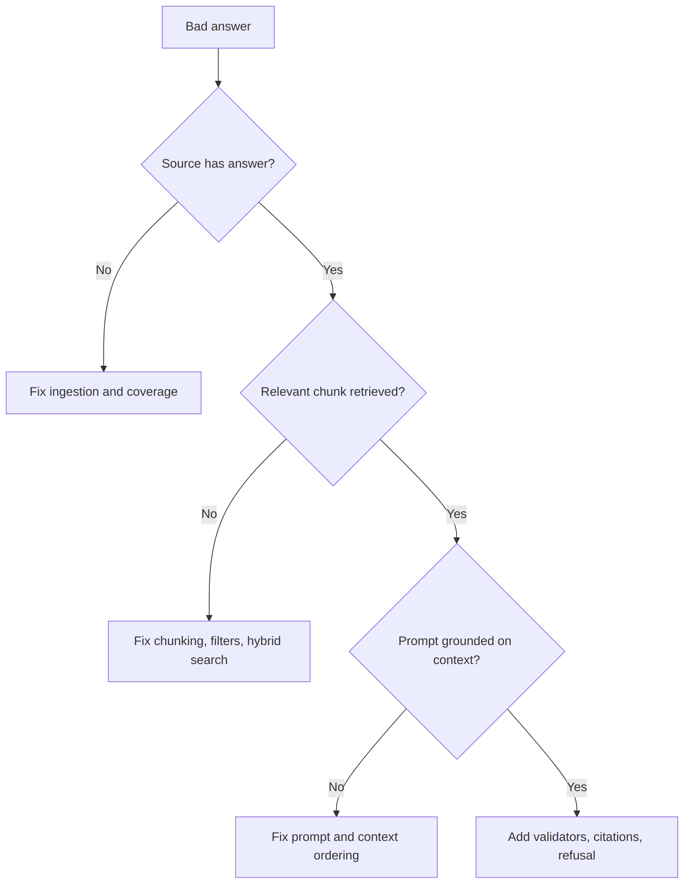

# RAG Debugging and Quality

## Pipeline-First Debugging

Treat RAG failures as staged system issues.

## Core Metrics

- Retrieval hit rate
- Context precision
- Faithfulness
- Citation accuracy
- P95 latency
- Cost per successful task

## Micro-Lab

- Pick 5 failed user questions.
- Label each root cause: `coverage`, `retrieval`, `prompt`, `validation`.
- Propose one measurable fix per failure.

--8<-- "_abbreviations.md"

