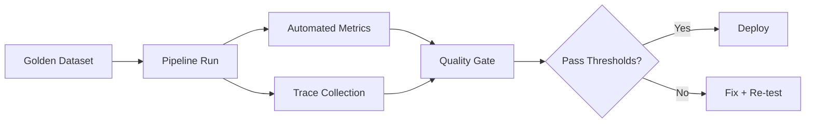

# 04 - Evals, Observability, and Production Readiness

This module converts "it works on my laptop" into a repeatable production process.

## Production Readiness Stack



## Minimum Evaluation Kit

- Golden dataset with representative and failure cases
- Regression run before each prompt/model/retriever change
- Metrics split by stage (retrieval, generation, tool use)

## Baseline Evaluation Types

1. Unit tests for deterministic logic
2. Prompt regression tests
3. Retrieval quality tests
4. LLM output quality tests
5. Agent task completion tests
6. Human review for high-risk paths
7. Online experiments when applicable

## Suggested Metrics

| Layer | Metrics |
|---|---|
| Retrieval | hit rate, context precision, MRR |
| Generation | faithfulness, relevance, citation accuracy |
| Agent | task success rate, tool-call accuracy, retry rate |
| Operations | latency p95, error rate, cost per successful task |

## Day-by-Day Alignment

| Day | Use this page for | Deliverable |
|---|---|---|
| Day 15 | Eval strategy and dataset design | JSONL eval starter set |
| Day 16 | Automated eval gates | Pass-fail gate config |
| Day 17 | Tracing and observability | Structured log sample |
| Day 18 | Safety and policy controls | Middleware checklist |
| Day 19 | SLOs and rollout rules | Deployment checklist |
| Day 20 | Postmortem and improvement loop | Incident review note |
| Day 21 | Production readiness review | Scorecard with gaps |

## Step-by-Step Production Readiness Flow

| Step | Action | Output |
|---|---|---|
| 1 | Create a small representative eval set | Baseline dataset |
| 2 | Define pass thresholds before changes | Explicit release bar |
| 3 | Log quality, latency, and cost together | Comparable run history |
| 4 | Gate deploys on measurable thresholds | Safer shipping process |
| 5 | Turn failures into backlog actions | Continuous improvement loop |

## Example Code: Tiny Eval Dataset and Gate

```python
eval_set = [
    {
        "question": "How do I reset an expired API key?",
        "expected_source": "security-runbook",
        "must_include": ["identity verification", "security portal"],
    },
    {
        "question": "When should a request be escalated?",
        "expected_source": "support-policy",
        "must_include": ["high risk", "manual review"],
    },
]


def release_gate(metrics: dict) -> bool:
    return (
        metrics["faithfulness"] >= 0.85
        and metrics["retrieval_hit_rate"] >= 0.80
        and metrics["latency_p95_ms"] <= 3500
        and metrics["cost_per_success"] <= 0.08
    )


baseline_metrics = {
    "faithfulness": 0.88,
    "retrieval_hit_rate": 0.82,
    "latency_p95_ms": 3100,
    "cost_per_success": 0.06,
}

print({"ship": release_gate(baseline_metrics), "metrics": baseline_metrics})
```

## Example Code: Structured Trace Record

```json
{
  "trace_id": "trace-1042",
  "prompt_version": "rag-v3",
  "model": "gpt-4.1-mini",
  "retrieved_chunks": ["policy-0", "runbook-1"],
  "tool_calls": [],
  "faithfulness": 0.9,
  "latency_ms": 1840,
  "status": "pass"
}
```

??? question "Interview Q: What should block an LLM release?"
    **Model Answer:**
    I block the release when key quality, safety, latency, or cost metrics miss agreed thresholds, or when high-risk cases lack review coverage. The exact gate should be explicit before the change is tested.

    **Why this matters:**
    It shows you can operationalize quality, not just observe it.

??? question "Interview Q: Why is tracing as important as evaluation?"
    **Model Answer:**
    Evaluation tells me that quality moved, but tracing tells me why it moved. Without traces of prompts, retrieved context, and tool behavior, I can detect regressions but not diagnose them quickly.

    **Why this matters:**
    Strong candidates connect observability to faster iteration and safer production support.

## Observability Tools to Know

- LangSmith and Langfuse for LLM traces
- OpenTelemetry for unified instrumentation
- MLflow or Weights and Biases for experiment tracking
- Custom dashboards for latency, cost, and failure taxonomy

## Observability Checklist

- [ ] Prompt version logged
- [ ] Model version logged
- [ ] Retrieved context logged
- [ ] Tool inputs/outputs logged
- [ ] User feedback captured
- [ ] Alerting for latency/cost spikes

## Deployment Concerns to Explain in Interviews

- Secrets management and least-privilege access
- Timeout, retry, and fallback strategy
- Config separation from code
- Rollback plan and release gates

## Baseline Reliability Checklist

- [ ] Timeout and retry policies are explicit
- [ ] Fallback model/provider is defined
- [ ] Secrets are stored in a secret manager
- [ ] Idempotency is enforced for side-effecting workflows
- [ ] Alert thresholds exist for cost and latency spikes

## Quick Lab (20 min)

<details>
<summary>Eval and observability micro-lab</summary>

- Build a tiny dataset with 10 questions.
- Define pass thresholds for 3 metrics.
- Run one baseline and one modified pipeline version.
- Decide deploy/no-deploy based on your gate.

</details>

---

Next: [05 STAR Story System](05-star-story-system.md)

--8<-- "_abbreviations.md"

