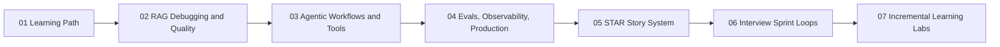

# AI Engineer Interview Playbook: Learn, Build, Explain

This playbook is the continuation layer for the baseline plan in
`01-foundations/ai_engineer_learning_revision_plan.md`.

It keeps the same intent: interview prep through production engineering practice, not prompt-only theory.

## Baseline Alignment

This track mirrors the baseline sequence:

1. LLM application architecture
2. RAG implementation and debugging
3. Agentic workflows and tool reliability
4. Evals, observability, and production readiness
5. STAR+T story conversion
6. Interview sprint and mock loop practice
7. Incremental retention labs

## Who This Is For

Use this if you are targeting AI Engineer, Agent Engineer, GenAI Engineer, or LLMOps roles where interviewers test build-debug-deploy ownership.

## Path Overview

## Recommended Order

- Start with [01 Learning Path](01-learning-path.md).
- Complete [02](02-rag-debugging-quality.md), [03](03-agentic-workflows.md), and [04](04-evals-observability-production.md) as one technical block.
- Convert technical work into interview narratives in [05](05-star-story-system.md).
- Practice delivery in [06](06-interview-sprints-and-mock-loops.md).
- Lock retention with [07](07-incremental-learning-labs.md).

## Cross-References to Core Site Modules

- Foundations: [Step-by-Step Learning Path](../01-foundations/step-by-step-learning-path.md)
- Technical depth: [RAG Debugging and Quality](../02-technical-depth/rag-debugging-and-quality.md)
- Technical depth: [Agentic Workflows and Tools](../02-technical-depth/agentic-workflows-and-tools.md)
- Technical depth: [Evals, Observability, and Production](../02-technical-depth/evals-observability-and-production.md)
- Interview practice: [Mock Loop and Answer Drills](../03-interview-system/mock-loop-and-answer-drills.md)
- Retention: [Incremental Learning Labs](../04-labs-retention/incremental-learning-labs.md)

---

--8<-- "_abbreviations.md"

