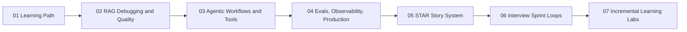

# AI Engineer Reference Modules: Build, Debug, Explain

> **Level:** Intermediate
> **Pre-reading:** [Daily Learning Plan](../01-foundations/learning-revision-plan/index.md) · [Step-by-Step Learning Path](../01-foundations/step-by-step-learning-path.md)

---

This section is the reusable reference layer for the site. The day-by-day execution now lives in the learning revision plan, while these pages hold the durable deep dives, worked examples, and reusable interview prep modules.

Use the daily plan when you want to know what to do next. Use these reference modules when you want the fuller explanation, example code, or lab pattern behind that day.

## What This Section Covers

| Module type | What you get |
|---|---|
| Technical modules | RAG, agent workflows, and production-readiness deep dives |
| Interview modules | STAR story conversion and timed mock-loop practice |
| Retention modules | Incremental labs and a day-to-material mapping table |

## Reference Module Sequence

| Step | Module | Purpose |
|---|---|---|
| 1 | [01 Learning Path Companion](01-learning-path.md) | See the high-level capability ladder behind the 4-week plan. |
| 2 | [02 RAG Debugging and Quality](02-rag-debugging-quality.md) | Build a pipeline-first debugging habit. |
| 3 | [03 Agentic Workflows](03-agentic-workflows.md) | Learn safer tool orchestration and control patterns. |
| 4 | [04 Evals, Observability, Production](04-evals-observability-production.md) | Turn experiments into measurable release decisions. |
| 5 | [05 STAR Story System](05-star-story-system.md) | Convert technical work into credible interview stories. |
| 6 | [06 Interview Sprints and Mock Loops](06-interview-sprints-and-mock-loops.md) | Rehearse delivery under time pressure. |
| 7 | [07 Incremental Learning Labs](07-incremental-learning-labs.md) | Lock retention with short build-and-explain drills. |
| 8 | [08 Daily Material Map](08-daily-material-map.md) | Map each study day to the right reference module and artifact. |

## Who This Is For

Use this if you are targeting AI Engineer, Agent Engineer, GenAI Engineer, or LLMOps roles where interviewers test build-debug-deploy ownership.

## Path Overview

## Recommended Order

| When you need... | Start here |
|---|---|
| A quick map of the whole system | [01 Learning Path Companion](01-learning-path.md) |
| A deep technical block for Weeks 1 to 3 | [02](02-rag-debugging-quality.md), then [03](03-agentic-workflows.md), then [04](04-evals-observability-production.md) |
| Interview conversion for Week 4 | [05](05-star-story-system.md), then [06](06-interview-sprints-and-mock-loops.md) |
| Reinforcement and artifact creation | [07](07-incremental-learning-labs.md) and [08](08-daily-material-map.md) |

## How This Connects to the Daily Plan

| Daily-plan layer | Best companion here |
|---|---|
| Week 1 daily pages | [02 RAG Debugging and Quality](02-rag-debugging-quality.md) |
| Week 2 daily pages | [03 Agentic Workflows](03-agentic-workflows.md) |
| Week 3 daily pages | [04 Evals, Observability, Production](04-evals-observability-production.md) |
| Week 4 daily pages | [05 STAR Story System](05-star-story-system.md) and [06 Interview Sprints and Mock Loops](06-interview-sprints-and-mock-loops.md) |
| Retention across all weeks | [07 Incremental Learning Labs](07-incremental-learning-labs.md) and [08 Daily Material Map](08-daily-material-map.md) |

---

--8<-- "_abbreviations.md"

