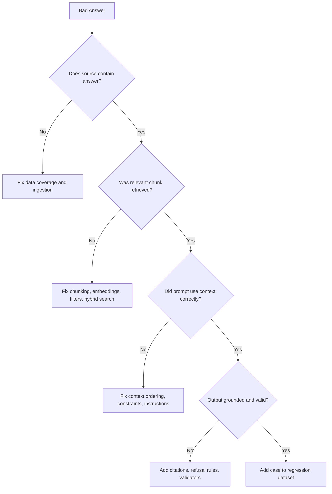

# 02 - RAG Debugging and Quality

This module follows the baseline plan: treat RAG as a full pipeline with measurable stages, not as prompt tuning only.

## Core Principle

Treat RAG issues as pipeline issues, not prompt-only issues.

## Baseline RAG Pipeline

```text
Documents
-> Parsing and cleaning
-> Chunking
-> Embedding
-> Vector index
-> Retrieval and reranking
-> Context injection
-> Grounded generation
-> Citation and validation
-> Evaluation and regression
```

## Debugging Decision Tree



## Failure Modes and Fixes

| Failure Mode | Typical Signal | First Fix |
|---|---|---|
| Missing source data | Retrieval returns irrelevant docs | Improve ingestion coverage |
| Bad chunk boundaries | Partial facts, contradictory answers | Re-chunk by semantic structure |
| Weak retrieval | Low hit rate on known questions | Add hybrid search + reranking |
| Prompt leakage | Hallucinated details | Force source-grounded output |
| No guardrails | Overconfident wrong answers | Add refusal + citation validation |

## Baseline 10-Step Debug Sequence

When asked "How do you debug a bad RAG answer?", use this exact order:

1. Check whether source data contains the answer.
2. Verify parsing and ingestion quality.
3. Check chunking boundaries and chunk size.
4. Inspect retrieved chunks before generation.
5. Review top-k, similarity scores, and metadata filters.
6. Test hybrid retrieval and/or query rewriting.
7. Add reranking where needed.
8. Strengthen grounding and citation constraints.
9. Add refusal behavior for insufficient context.
10. Add the failure to the regression dataset.

## Minimal Quality Scorecard

Track these first:

- Retrieval hit rate
- Context precision
- Context recall
- Faithfulness
- Answer relevance
- Citation accuracy
- Latency p95
- Cost per successful task

## Interview Talking Frame

Use this sequence when asked "How do you improve RAG quality?":

1. Verify data exists.
2. Inspect retrieval artifacts.
3. Separate retriever issues from generator issues.
4. Apply pipeline fixes before prompt patching.
5. Add regression test coverage.

## Quick Lab (15-20 min)

<details>
<summary>RAG quality micro-lab</summary>

- Pick 5 real questions from your project.
- For each, log top-5 chunks and final answer.
- Label each failure as: `coverage`, `retrieval`, `prompt`, or `validation`.
- Propose one fix and one metric to validate the fix.
- Add each failure to a small regression set and re-run after fixes.

</details>

---

Next: [03 Agentic Workflows and Tools](03-agentic-workflows.md)

--8<-- "_abbreviations.md"

