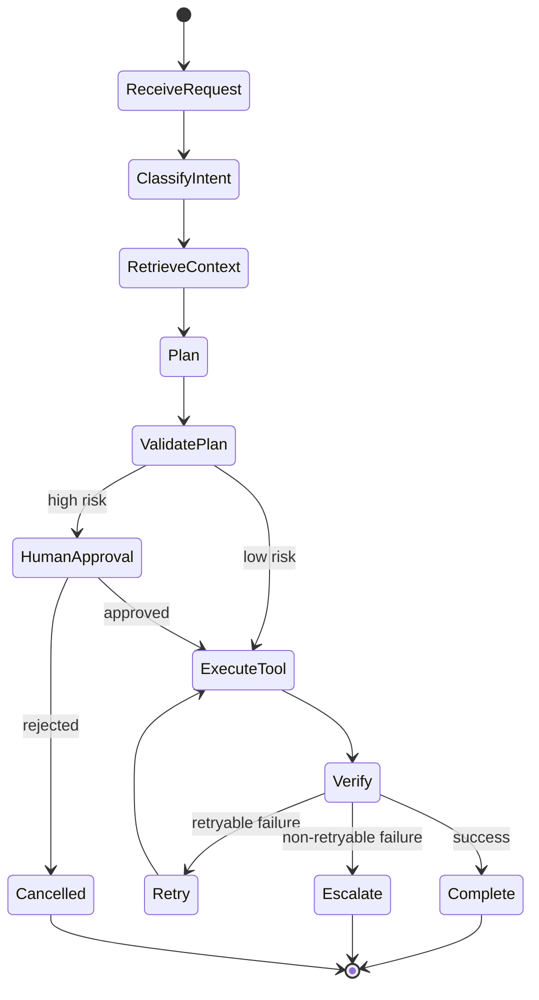

# 03 - Agentic Workflows and Tool Reliability

This module aligns to the baseline priority: hybrid systems that combine deterministic orchestration with constrained LLM reasoning.

## Baseline Position

Use this interview framing:

```text
I use deterministic code for orchestration, validation, retries, permissions, and state transitions,
and use the LLM for reasoning, extraction, generation, and planning where it adds value.
```

## Workflow vs Agent vs Hybrid

| Pattern | Best For | Risk Level | Recommendation |
|---|---|---|---|
| Deterministic workflow | Stable business logic | Low | Use by default |
| Open-ended agent | Dynamic exploration | High | Constrain strongly |
| Hybrid (recommended) | Real production systems | Medium | Deterministic control + LLM reasoning |

## Concepts to Know

- Planning-execution pattern
- ReAct pattern
- State and memory management
- Retry and fallback policies
- Idempotency for side-effecting calls
- Human-in-the-loop approvals
- Multi-agent delegation risks

## Reliability Blueprint



## Tool-Calling Guardrails

Every tool should include:

- Input schema validation
- Permission checks
- Timeouts and retries
- Idempotency key for side effects
- Structured logs with trace IDs

## Framework Priority (Baseline-Compatible)

1. LangGraph for stateful controllable workflows
2. LangChain for tools, retrievers, and ecosystem integration
3. CrewAI for role-based collaboration patterns
4. Semantic Kernel and AutoGen/ADK by environment needs

## Interview Deep-Dive Prompts

Practice answering these:

- Why not use a fully autonomous agent?
- How do you prevent tool misuse?
- How do you recover from failed tool calls?
- How do you audit and explain agent behavior?
- When should a workflow remain deterministic instead of agentic?

## Quick Lab (20-30 min)

<details>
<summary>Agent reliability micro-lab</summary>

- Choose one workflow (ticketing, billing, or support).
- Define 3 tools and their schemas.
- Add one high-risk action requiring human approval.
- Simulate one retryable and one non-retryable failure path.

</details>

---

Next: [04 Evals, Observability, and Production Readiness](04-evals-observability-production.md)

--8<-- "_abbreviations.md"

