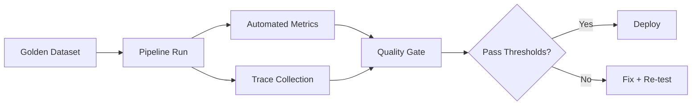

# 04 - Evals, Observability, and Production Readiness

This module converts "it works on my laptop" into a repeatable production process.

## Production Readiness Stack

## Minimum Evaluation Kit

- Golden dataset with representative and failure cases
- Regression run before each prompt/model/retriever change
- Metrics split by stage (retrieval, generation, tool use)

## Baseline Evaluation Types

1. Unit tests for deterministic logic
2. Prompt regression tests
3. Retrieval quality tests
4. LLM output quality tests
5. Agent task completion tests
6. Human review for high-risk paths
7. Online experiments when applicable

## Suggested Metrics

| Layer | Metrics |
|---|---|
| Retrieval | hit rate, context precision, MRR |
| Generation | faithfulness, relevance, citation accuracy |
| Agent | task success rate, tool-call accuracy, retry rate |
| Operations | latency p95, error rate, cost per successful task |

## Observability Tools to Know

- LangSmith and Langfuse for LLM traces
- OpenTelemetry for unified instrumentation
- MLflow or Weights and Biases for experiment tracking
- Custom dashboards for latency, cost, and failure taxonomy

## Observability Checklist

- [ ] Prompt version logged
- [ ] Model version logged
- [ ] Retrieved context logged
- [ ] Tool inputs/outputs logged
- [ ] User feedback captured
- [ ] Alerting for latency/cost spikes

## Deployment Concerns to Explain in Interviews

- Secrets management and least-privilege access
- Timeout, retry, and fallback strategy
- Config separation from code
- Rollback plan and release gates

## Baseline Reliability Checklist

- [ ] Timeout and retry policies are explicit
- [ ] Fallback model/provider is defined
- [ ] Secrets are stored in a secret manager
- [ ] Idempotency is enforced for side-effecting workflows
- [ ] Alert thresholds exist for cost and latency spikes

## Quick Lab (20 min)

Eval and observability micro-lab

- Build a tiny dataset with 10 questions.
- Define pass thresholds for 3 metrics.
- Run one baseline and one modified pipeline version.
- Decide deploy/no-deploy based on your gate.

---

Next: [05 STAR Story System](05-star-story-system.md)

--8<-- "_abbreviations.md"

