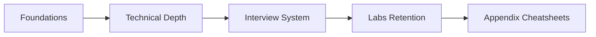

# AI Engineer Interview Playbook

This standalone site is a tutorial-style learning path built from:

- `Learning and Revision Plan for AI Engineer / Agentic AI / LLMOps Interviews`
- `STAR Stories Preparation Guide for AI Engineer / Agentic AI / LLMOps Roles`

## What You Will Get

- A practical 4-week path for technical depth and interview readiness
- Repeatable drills for retention (not one-time reading)
- STAR+T interview conversion workflows with measurable impact
- Incremental labs that map to production LLM engineering realities

## Study Flow

## Recommended Start

1. Read `01 · Foundations` in order.
2. Complete one micro-lab at the end of each technical module.
3. Build your 8-story STAR+T bank before mock interviews.
4. Run weekly sprint loops until answers are natural.

### 🎯 **Track 4: Interview and Career Readiness**
- AI Engineer / Agentic AI / LLMOps learning roadmap
- STAR+T story building with measurable impact
- Mock interview loops and retention drills
- Incremental labs for long-term recall

---

--8<-- "_abbreviations.md"

