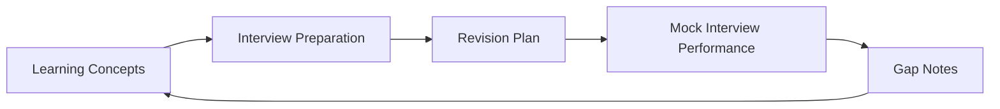

# 01 - Learning Path Companion

This page is the landing guide for your preparation.
It keeps the plan simple: first build concepts, then convert them into interview answers, then run a structured revision loop.

## Plan Up Front

| Phase | Goal | Primary Resources | Output |
|---|---|---|---|
| 1) Learning Concepts | Build technical depth in LLM apps, RAG, agents, evals, and production ops | [01 RAG Debugging and Quality](01-foundations/01-rag-debugging-quality.md) · [02 Agentic Workflows](01-foundations/02-agentic-workflows.md) · [03 Evals, Observability, and Production](01-foundations/03-evals-observability-production.md) | Clear system understanding plus working notes |
| 2) Interview Preparation | Turn technical work into concise, high-signal interview responses | [04 STAR Story System](01-foundations/04-star-story-system.md) · [05 Interview Sprints and Mock Loops](01-foundations/05-interview-sprints-and-mock-loops.md) | Story bank plus timed answers |
| 3) Revision Plan | Retain and sharpen with daily and weekly repetition | [07 Daily Material Map](01-foundations/07-daily-material-map.md) · [Week 1](02-learning-revision-plan/week-01/index.md) · [Week 2](02-learning-revision-plan/week-02/index.md) · [Week 3](02-learning-revision-plan/week-03/index.md) · [Week 4](02-learning-revision-plan/week-04/index.md) | Interview-ready recall under pressure |

## Learning Flow

## 1) Learning Concepts

Focus on understanding systems end to end before memorizing details.

| Track | Use this page | Why |
|---|---|---|
| LLM and RAG quality | [01 RAG Debugging and Quality](01-foundations/01-rag-debugging-quality.md) | Builds pipeline-first debugging habits. |
| Agent reliability and tools | [02 Agentic Workflows](01-foundations/02-agentic-workflows.md) | Teaches approval gates, retries, and safe orchestration. |
| Evals and production readiness | [03 Evals, Observability, and Production](01-foundations/03-evals-observability-production.md) | Adds measurable release criteria and observability discipline. |

| Practice layer | Resource |
|---|---|
| Weekly progression | [4-Week Daily System](02-learning-revision-plan/index.md) |
| Hands-on lab (Week 1) | [RAG Foundations Lab](03-mini-projects/01-week-1-rag-foundations-lab.md) |
| Hands-on lab (Week 2) | [Agent Reliability Lab](03-mini-projects/02-week-2-agent-reliability-lab.md) |
| Hands-on lab (Week 3) | [Eval and Ops Lab](03-mini-projects/03-week-3-eval-observability-lab.md) |

## 2) Interview Preparation

Convert concepts into communication. Prioritize clarity, structure, and tradeoff reasoning.

| Interview task | Primary resource | Target output |
|---|---|---|
| Story design | [04 STAR Story System](01-foundations/04-star-story-system.md) | 6 to 8 strong STAR stories |
| Delivery practice | [05 Interview Sprints and Mock Loops](01-foundations/05-interview-sprints-and-mock-loops.md) | 90-second and 3-minute versions |
| Reinforcement | [06 Incremental Learning Labs](01-foundations/06-incremental-learning-labs.md) | Artifact-backed talking points |

??? question "Interview Q: How do you explain a production-grade LLM system in simple terms?"
    **Model Answer:**
    Start with the request path: input, context, model call, validation, and logging. Then explain reliability controls such as retries, guardrails, and monitoring. Keep the explanation focused on how failures are detected and corrected.

    **Why this matters:**
    Clear system explanations are a strong signal of practical ownership.

??? question "Interview Q: What is your approach when RAG answers are wrong?"
    **Model Answer:**
    I separate the problem into retrieval quality and generation quality. I check source coverage, chunking, retrieval settings, and grounding prompt behavior in order. I then add the failure case to evaluation tests so the same issue is caught after future changes.

    **Why this matters:**
    Interviewers look for a repeatable debugging method, not random fixes.

??? question "Interview Q: How do you prepare quickly for mixed system-design and behavioral rounds?"
    **Model Answer:**
    I use one technical project as the anchor and map architecture, failures, fixes, and outcomes to STAR stories. Then I practice both short and long answer formats until delivery is consistent.

    **Why this matters:**
    This connects technical depth with communication quality.

## 3) Revision Plan

Use a repeatable cycle instead of random review.

| Daily loop (60 to 90 minutes) | Action |
|---|---|
| Step 1 | Concept refresh |
| Step 2 | Build or debugging task |
| Step 3 | Recall without notes |
| Step 4 | Interview translation |
| Step 5 | Gap log update |

| Weekly loop | Action |
|---|---|
| Step 1 | Run one mock session |
| Step 2 | Fix top weak answers |
| Step 3 | Refresh one project artifact (diagram, README, or eval note) |
| Step 4 | Set next-week focus using [07 Daily Material Map](01-foundations/07-daily-material-map.md) |

## Quick Navigation

| Need | Go to |
|---|---|
| Start from weekly structure | [4-Week Daily System](02-learning-revision-plan/index.md) |
| Deepen fundamentals | [Foundations Index](01-foundations/index.md) |
| Practice with code | [Mini Projects Index](03-mini-projects/index.md) |
| Run reinforcement drills | [06 Incremental Learning Labs](01-foundations/06-incremental-learning-labs.md) |

---

--8<-- "_abbreviations.md"

